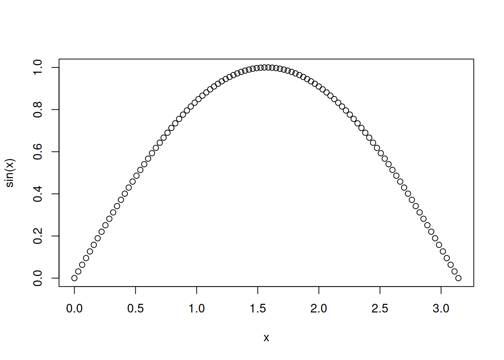

# Creating Vectors in R

r

A summary of several ways to create vectors in R.

Published

2024-06-18

Modified

2024-06-18

> **NOTE:**
>
> Original Japanese version: [Rでベクトルを作成する](../../../posts/2024-06-18-r-vector/index.llms.md)

This post summarizes several ways to create vectors in R. The functions introduced here are:

- [`c()`](https://rdrr.io/r/base/c.html)
- `:`
- [`seq()`](https://rdrr.io/r/base/seq.html)
- [`seq_len()`](https://rdrr.io/r/base/seq.html)
- [`seq_along()`](https://rdrr.io/r/base/seq.html)
- [`rep()`](https://rdrr.io/r/base/rep.html)

## `c()` and `:`

The simplest ways to create vectors in R are [`c()`](https://rdrr.io/r/base/c.html) and `:`.

If you list values separated by commas inside [`c()`](https://rdrr.io/r/base/c.html), the result is a vector. The name `c` comes from “combine.”

``` downlit
c(1, 2, 3)
```

    [1] 1 2 3

You can also create a vector by specifying a start and end point in the form `[start]:[end]`.

``` downlit
1:3
```

    [1] 1 2 3

These are used very frequently, so they are worth remembering.

## `seq()`

The [`seq()`](https://rdrr.io/r/base/seq.html) function comes from “sequence.” As the name suggests, it arranges values according to the arguments supplied inside `()`.

The most basic use is to create a vector by specifying the first and last values.

``` downlit
seq(1, 3) # seq(start, end)
```

    [1] 1 2 3

``` downlit
seq(from = 1, to = 3) # explicit form
```

    [1] 1 2 3

If you specify only one value, [`seq()`](https://rdrr.io/r/base/seq.html) creates a vector that increases by 1 from 1 to that value.

``` downlit
seq(3)
```

    [1] 1 2 3

When the sequence starts from 1, [`seq_len()`](https://rdrr.io/r/base/seq.html) is faster.

``` downlit
seq_len(5) # vector from 1 to 5
```

    [1] 1 2 3 4 5

### Creating a Vector with a Specified Step Size

By default, the value increases by 1, but you can change the step size with the `by` argument.

``` downlit
seq(from = 1, to = 3, by = 0.5) # increase by 0.5
```

    [1] 1.0 1.5 2.0 2.5 3.0

### Creating a Vector with a Specified Length

If you specify the `length.out` argument, you can create a vector with a specified length. R divides the range between the first and last values into equal intervals.

``` downlit
seq(from = 1, to = 3, length.out = 6) # vector of length 6
```

    [1] 1.0 1.4 1.8 2.2 2.6 3.0

Use [`seq_along()`](https://rdrr.io/r/base/seq.html) to create a vector with the same length as another vector.

``` downlit
x <- seq_along(c("A", "B", "C", "D", "E"))
seq_along(x)
```

    [1] 1 2 3 4 5

This is useful when writing `for` loops. It is common to write a `for` loop like this:

``` downlit
x <- c("A", "B", "C", "D", "E")
for (i in 1:length(x)) {
  print(x[i])
}
```

    [1] "A"
    [1] "B"
    [1] "C"
    [1] "D"
    [1] "E"

Using [`seq_along()`](https://rdrr.io/r/base/seq.html), it can be rewritten as follows.

``` downlit
x <- c("A", "B", "C", "D", "E")
for (i in seq_along(x)) {
  print(x[i])
}
```

    [1] "A"
    [1] "B"
    [1] "C"
    [1] "D"
    [1] "E"

There is not much visible difference, but the behavior changes when the vector used in the loop has length 0, that is, when it is an empty vector.

## `rep()`

Use the [`rep()`](https://rdrr.io/r/base/rep.html) function to create a vector by repeating the same value. The name comes from “repeat.”

``` downlit
rep(3, 5) # repeat 3 five times
```

    [1] 3 3 3 3 3

You can also repeat a vector.

``` downlit
rep(1:3, 3) # repeat 1 to 3 three times
```

    [1] 1 2 3 1 2 3 1 2 3

``` downlit
rep(1:3, times = 3) # same as above
```

    [1] 1 2 3 1 2 3 1 2 3

Each value can also be repeated as a block.

``` downlit
rep(1:3, each = 3) # repeat each value three times
```

    [1] 1 1 1 2 2 2 3 3 3

You can specify the number of repeats for each value.

``` downlit
rep(1:3, c(1, 2, 1)) # 1 once, 2 twice, 3 once
```

    [1] 1 2 2 3

You can also specify the length. Because the length takes priority, the repetition is truncated if needed.

``` downlit
rep(1:3, length.out = 5) # repeat up to length 5
```

    [1] 1 2 3 1 2

## Examples

These vector creation methods are useful when creating IDs or groups in data frames, or when interpolating points for plots. For example, if you want to assign groups A to C to rows in a data sheet, `rep(c("A", "B", "C"), each = 5)` makes that easy.

If you want to draw a function such as a sine curve, you can do it simply as follows.

``` downlit
x <- seq(from = 0, to = pi, length.out = 100)
plot(x, sin(x))
```



## Summary

Personally, I use [`c()`](https://rdrr.io/r/base/c.html) and `:` almost every day, while I use the [`seq()`](https://rdrr.io/r/base/seq.html) family and [`rep()`](https://rdrr.io/r/base/rep.html) only occasionally. Because of that, when I suddenly need a long vector, I sometimes cannot produce it immediately. It is easy to look up, but it is useful to be able to create the needed vector quickly.
