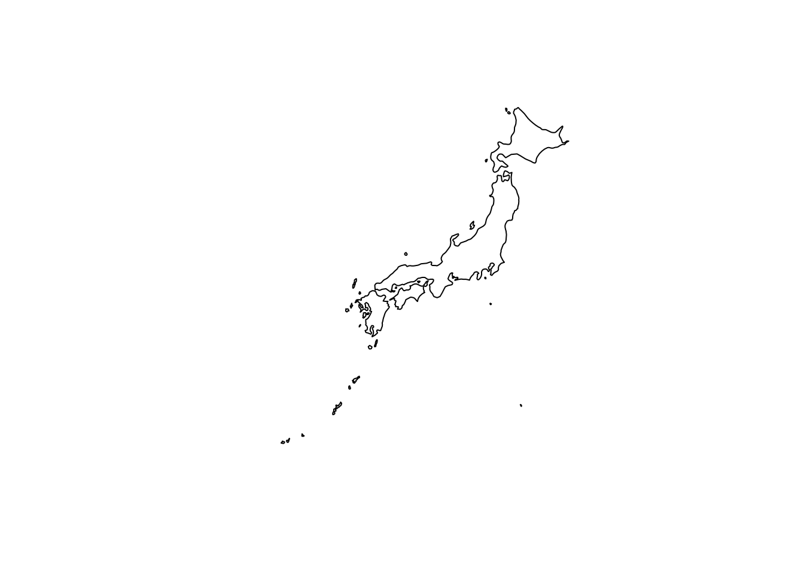
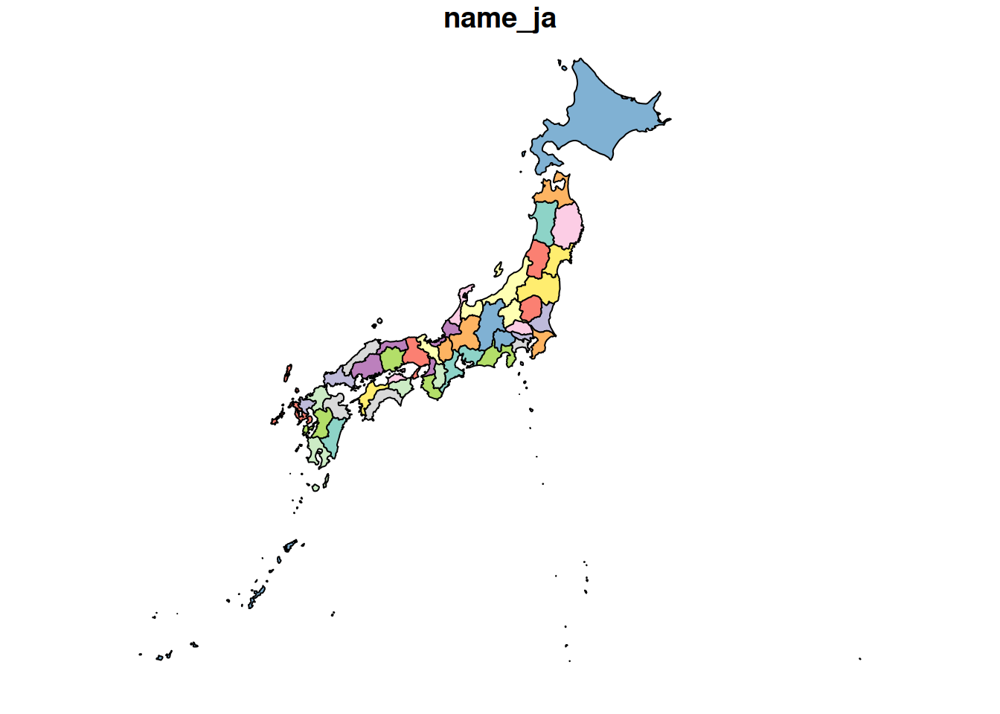

# Drawing a Map of Japan in R

r

How to draw a map of Japan in R using the rnaturalearth and rnaturalearthhires packages.

Published

2026-01-31

Modified

2026-01-31

> **NOTE:**
>
> Original Japanese version: [Rで日本地図を描く](../../../posts/2026-01-31-r-japan-map/index.llms.md)

## Installing and Loading Packages

``` downlit
install.packages("rnaturalearth")
```

If you use renv, install it with the following command.

``` downlit
renv::install("necountries")
```

Then load the package.

``` downlit
library(rnaturalearth)
```

## Drawing a Map of Japan

To draw the map, the rnaturalearthdata package is also required. The following code obtains and draws a map of Japan.

``` downlit
install.packages("rnaturalearthdata")
renv::install("rnaturalearthdata") # when using renv
```

It should work without explicitly loading the library, but I load it just in case.

``` downlit
library(rnaturalearthdata)
```


    Attaching package: 'rnaturalearthdata'

    The following object is masked from 'package:rnaturalearth':

        countries110

Use the [`ne_countries()`](https://docs.ropensci.org/rnaturalearth/reference/ne_countries.html) function to obtain map data for Japan, then draw it with [`plot()`](https://rdrr.io/r/graphics/plot.default.html).

``` downlit
japan <- ne_countries(
  scale = "medium",
  country = "Japan",
  returnclass = "sf"
)
plot(japan["geometry"])
```



The arguments are set as follows.

- `scale = "medium"`: obtains medium-resolution map data. `small` and `large` are also available.
- `country = "Japan"`: specifies map data for Japan.
- `returnclass = "sf"`: returns the map data as an sf object.

This lets you draw a map of Japan using R. Customize the map style and details as needed.

> **NOTE:**
>
> For details on the [`ne_countries()`](https://docs.ropensci.org/rnaturalearth/reference/ne_countries.html) function, see the official documentation.
>
> - [Get natural earth world country polygons - ne_countries • rnaturalearth](https://ropensci.github.io/rnaturalearth/reference/ne_countries.html)

## Drawing a Prefecture-Level Map of Japan

To draw a prefecture-level map of Japan, use the `rnaturalearthhires` package. Install it from GitHub or R-universe.

> **NOTE:**
>
> It seems that the package cannot be installed from CRAN because its size exceeds the recommended CRAN limit.

``` downlit
remotes::install_github("ropensci/rnaturalearthhires")
```

Or install it with the following code.

``` downlit
install.packages(
  "rnaturalearthhires",
  repos = "https://ropensci.r-universe.dev",
  type = "source"
)
```

If you use renv, install it with the following command.

``` downlit
renv::install("ropensci/rnaturalearthhires")
```

Load the package.

``` downlit
library(rnaturalearthhires)
```

Obtain a prefecture-level map of Japan and draw it.

``` downlit
japan_prefectures <- ne_states(
  country = "Japan",
  returnclass = "sf"
)
plot(japan_prefectures["name_ja"])
```



The coastline is drawn neatly as well.

> **NOTE:**
>
> For details on the [`ne_states()`](https://docs.ropensci.org/rnaturalearth/reference/ne_states.html) function, see the official documentation.
>
> - [Get natural earth world state (admin level 1) polygons - ne_states • rnaturalearth](https://ropensci.github.io/rnaturalearth/reference/ne_states.html)

## References

- [High Resolution World Vector Map Data from Natural Earth used in rnaturalearth • rnaturalearthhires](https://docs.ropensci.org/rnaturalearthhires/index.html)
- [rnaturalearthhires - GitHub](https://github.com/ropensci/rnaturalearthhires)
