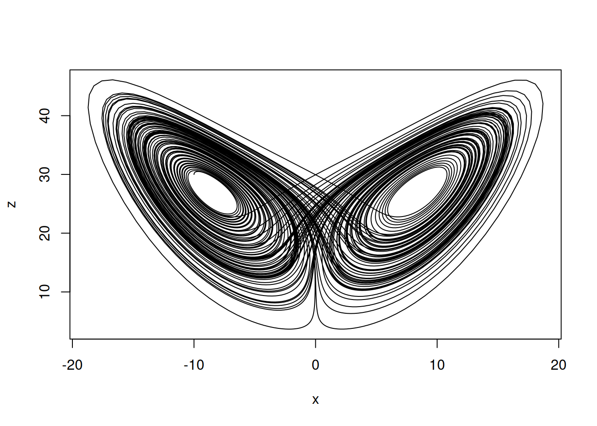
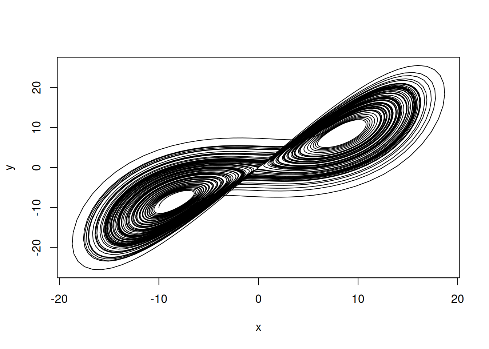
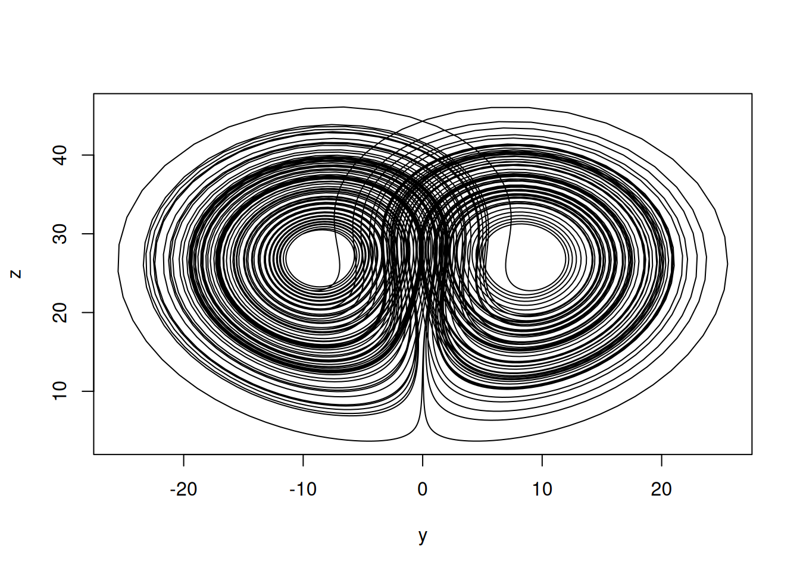
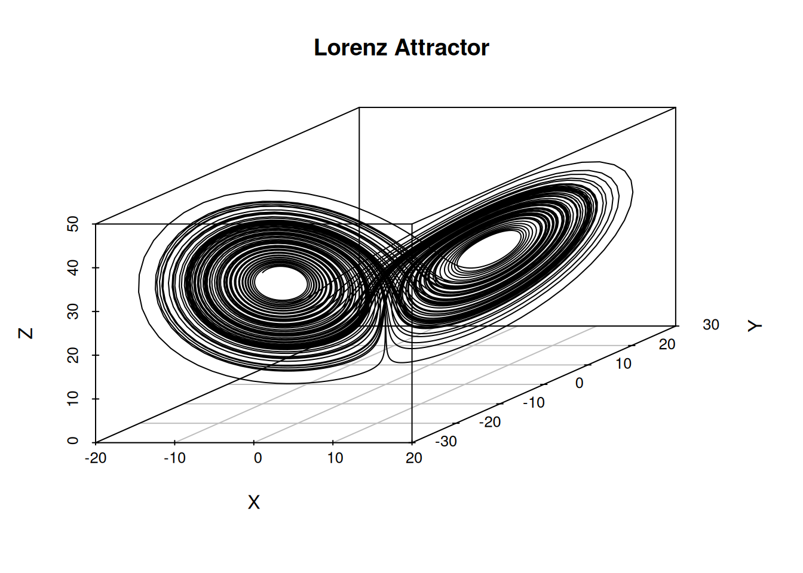
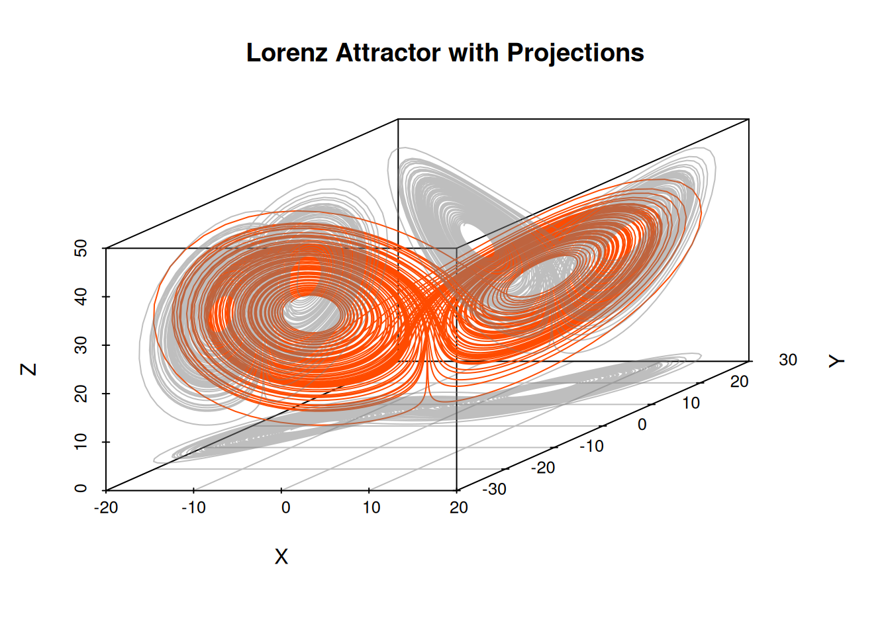

# Drawing the Lorenz Attractor in R

r

How to solve the Lorenz equations with the deSolve package and draw the Lorenz attractor. This post also shows how to create 3D plots with scatterplot3d and plotly.

Published

2026-02-02

Modified

2026-02-02

> **NOTE:**
>
> Original Japanese version: [RでLorenz attractorを描く](../../../posts/2026-02-02-r-lorenz-attractor/index.llms.md)

The Lorenz attractor is an example of chaos theory reported by [Edward Lorenz](https://www.lorenz.mit.edu/edward-n-lorenz), and it is a well-known model showing the behavior of a nonlinear dynamical system.

Below is a method for drawing the Lorenz attractor in R using the [deSolve](https://cran.r-project.org/web/packages/deSolve/index.html) package.

> **NOTE:**
>
> The difference between the Lorenz attractor and the Lorenz equations is as follows.
>
> - **Lorenz equations**: a set of nonlinear ordinary differential equations that describe the time evolution of a system based on specific parameter values.
> - **Lorenz attractor**: the set that appears as the long-term behavior of the system, showing the specific pattern toward which the solutions of the Lorenz equations evolve over time.

## Definition of the Lorenz Equations

The Lorenz equations consist of the following three ordinary differential equations.

\\ \begin{align} \frac{dx}{dt} &= \sigma (y - x) \\ \frac{dy}{dt} &= x(\rho - z) - y \\ \frac{dz}{dt} &= xy - \beta z \end{align} \\

Here, \\x\\, \\y\\, and \\z\\ are the state variables of the system, and \\\sigma\\, \\\rho\\, and \\\beta\\ are parameters. Commonly used parameter values are as follows.

- \\\sigma = 10\\
- \\\rho = 28\\
- \\\beta = \frac{8}{3}\\

## Installing and Loading the deSolve Package

First, install and load the [deSolve](https://cran.r-project.org/web/packages/deSolve/index.html) package.

``` downlit
install.packages("deSolve")  # if it is not installed yet
library(deSolve)
```

If you use the [renv](https://rstudio.github.io/renv/articles/renv.html) package, use the following.

``` downlit
renv::install("deSolve") # if it is not installed yet
```

``` downlit
library(deSolve)
```

## Implementing the Lorenz Equations

First, implement the Lorenz equations as an R function.

``` downlit
lorenz <- function(t, state, parameters) {
  with(as.list(c(state, parameters)), {
    dx <- sigma * (y - x)
    dy <- x * (rho - z) - y
    dz <- x * y - beta * z
    list(c(dx, dy, dz))
  })
}
```

Next, set the initial state, parameters, and time range.

``` downlit
state <- c(x = -10, y = -10, z = 30)
parameters <- c(sigma = 10, rho = 28, beta = 8 / 3)
times <- seq(0, 100, by = 0.01)
```

Use the [`ode()`](https://rdrr.io/pkg/deSolve/man/ode.html) function to solve the Lorenz equations.

``` downlit
out <- ode(y = state, times = times, func = lorenz, parms = parameters)
out <- as.data.frame(out)
```

## Drawing the Lorenz Attractor

First, create two-dimensional plots. Draw the x-y, x-z, and y-z planes.

``` downlit
plot(out$x, out$z, type = "l", xlab = "x", ylab = "z")
```



``` downlit
plot(out$x, out$y, type = "l", xlab = "x", ylab = "y")
```



``` downlit
plot(out$y, out$z, type = "l", xlab = "y", ylab = "z")
```



## Creating a 3D Plot

Use the [scatterplot3d](https://cran.r-project.org/web/packages/scatterplot3d/index.html) package in R to create a 3D plot.

If it is not installed yet, install it with the following command.

``` downlit
install.packages("scatterplot3d")  # if it is not installed yet
renv::install("scatterplot3d") # when using renv
```

``` downlit
library(scatterplot3d)
scatterplot3d(
  out$x,
  out$y,
  out$z,
  type = "l",
  xlab = "X",
  ylab = "Y",
  zlab = "Z",
  main = "Lorenz Attractor"
)
```



Also draw two-dimensional projections onto each plane.

``` downlit
s3d <- scatterplot3d(
  out$x,
  out$y,
  out$z,
  type = "n",
  xlab = "X",
  ylab = "Y",
  zlab = "Z",
  main = "Lorenz Attractor with Projections"
)
s3d$points3d(out$x, out$y, out$z, type = "l", col = "#FF4B00") # main Lorenz attractor
s3d$points3d(
  out$x,
  out$y,
  rep(min(out$z), nrow(out)),
  type = "l",
  col = adjustcolor("gray50", alpha.f = 0.5)
) # projection onto the x-y plane
s3d$points3d(
  out$x,
  rep(max(out$y), nrow(out)),
  out$z,
  type = "l",
  col = adjustcolor("gray50", alpha.f = 0.5)
) # projection onto the x-z plane
s3d$points3d(
  rep(min(out$x), nrow(out)),
  out$y,
  out$z,
  type = "l",
  col = adjustcolor("gray50", alpha.f = 0.5)
) # projection onto the y-z plane
```



## Interactive 3D Plot with Plotly

Use the [plotly](https://cran.r-project.org/web/packages/plotly/index.html) package in R to create an interactive 3D plot.

If it is not installed yet, install it with the following command.

``` downlit
install.packages("plotly")  # if it is not installed yet
renv::install("plotly") # when using renv
```

``` downlit
library(plotly)
```

    Loading required package: ggplot2


    Attaching package: 'plotly'

    The following object is masked from 'package:ggplot2':

        last_plot

    The following object is masked from 'package:stats':

        filter

    The following object is masked from 'package:graphics':

        layout

``` downlit
fig <- plot_ly(
  x = out$x,
  y = out$y,
  z = out$z,
  type = 'scatter3d',
  mode = 'lines'
)
fig <- fig %>%
  layout(
    title = "Lorenz Attractor",
    scene = list(
      xaxis = list(title = 'X'),
      yaxis = list(title = 'Y'),
      zaxis = list(title = 'Z')
    )
  )
fig
```

It is also possible to change color by including time.

``` downlit
fig <- plot_ly(
  data = out,
  x = ~x,
  y = ~y,
  z = ~z,
  color = ~time,
  colors = colorRamp(c("blue", "red")),
  type = 'scatter3d',
  mode = 'lines'
)
fig
```

You can also add animation by time frame. The drawing frames are thinned to make the animation lighter.

``` downlit
idx <- seq(1, nrow(out), by = 10) # thin frames to reduce the number of frames
out2 <- out[idx, ]

fig <- plot_ly() %>%
  # Static trajectory line
  add_trace(
    data = out,
    x = ~x,
    y = ~y,
    z = ~z,
    type = "scatter3d",
    mode = "lines",
    line = list(color = "gray")
  ) %>%
  # Moving point
  add_trace(
    data = out2,
    x = ~x,
    y = ~y,
    z = ~z,
    frame = ~time,
    type = "scatter3d",
    mode = "markers",
    marker = list(size = 3, color = "#FF4B00")
  ) %>%
  animation_opts(
    frame = 50, # display time per frame in milliseconds
    transition = 0 # disable interpolation animation to make it lighter
  )

fig
```

## Useful Pages

- [Lorenz system - Wikipedia](https://en.wikipedia.org/wiki/Lorenz_system)
- [CRAN: Package deSolve](https://cran.r-project.org/web/packages/deSolve/index.html)
- [Plotly r graphing library in R](https://plotly.com/r/)
