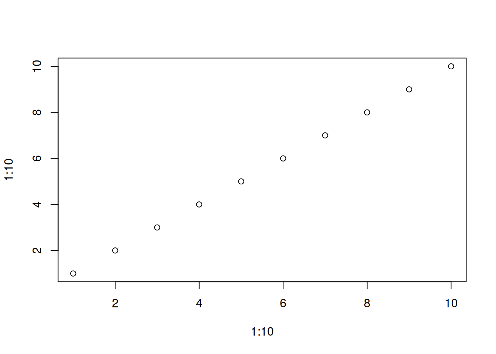
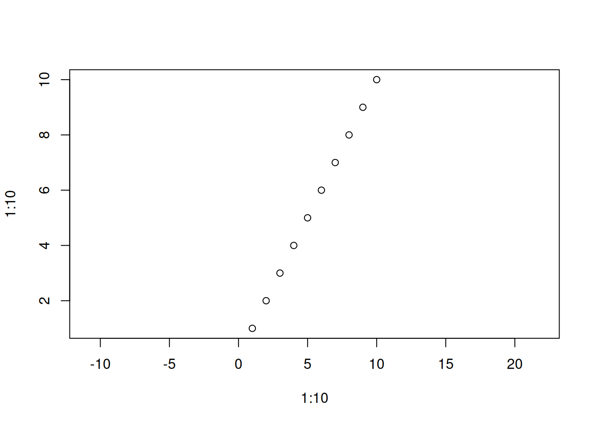
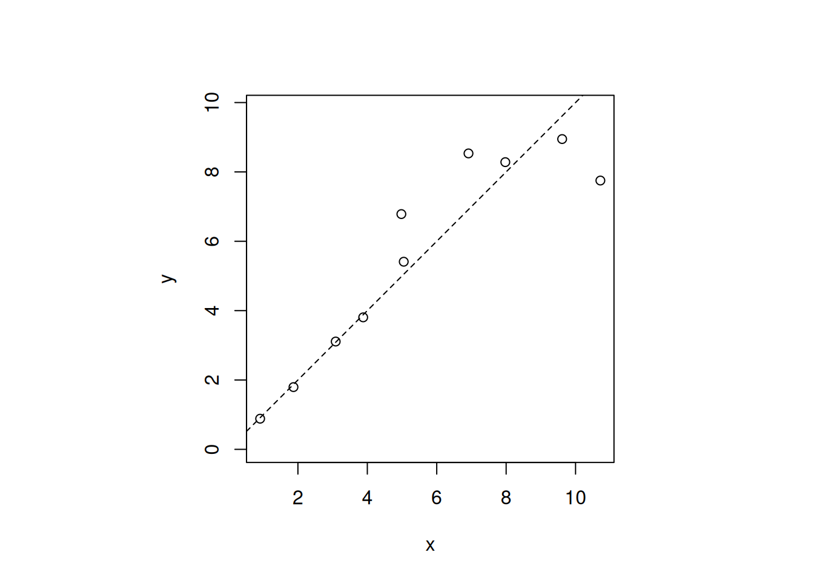

# Setting the Aspect Ratio of R Plots

r

How to adjust the aspect ratio of R plots with the `asp` parameter.

Published

2026-02-04

Modified

2026-02-04

> **NOTE:**
>
> Original Japanese version: [Rのプロットのアスペクト比を設定する方法](../../../posts/2026-02-05-r-aspect-ratio/index.llms.md)

In R plotting functions such as [`plot()`](https://rdrr.io/r/graphics/plot.default.html), the aspect ratio can be set with the `asp` parameter. The aspect ratio specifies how many times the unit length of the y-axis is relative to the unit length of the x-axis.

## Example of the `asp` Parameter

You can adjust the aspect ratio by specifying the `asp` parameter inside [`plot()`](https://rdrr.io/r/graphics/plot.default.html).

``` downlit
plot(1:10, 1:10) # default aspect ratio
```



``` downlit
plot(1:10, 1:10, asp = 1) # aspect ratio 1:1
```


In the example above, `asp = 1` is set, so the unit lengths of the x-axis and y-axis are equal. If `asp = 2` is set, the unit length of the y-axis becomes twice that of the x-axis.

``` downlit
plot(1:10, 1:10, asp = 2)
```



## Adjusting the Aspect Ratio Including the Plot Region

This is useful when making a 1:1 plot, such as when drawing a 1:1 line. Depending on the shape of the plot region, the actual display may not become square. In that case, you can also use `par(pty = "s")` to set the plot region to a square.

``` downlit
par(pty = "s") # set the plot region to a square

x <- rnorm(10, mean = 1, sd = 0.1) * 1:10
y <- rnorm(10, mean = 1, sd = 0.1) * 1:10

plot(x, y, asp = 1)
plot(x, y, asp = 1)
abline(0, 1, lty = 2)
```



``` downlit
par(pty = "m") # restore the plot region setting
```

> **NOTE:**
>
> - [`rnorm()`](https://rdrr.io/r/stats/Normal.html): generates random numbers following a normal distribution. Here it generates random numbers with mean 1 and standard deviation 0.1.
> - `abline(0, 1, lty = 2)`: draws the line y = x as a dashed line. `lty = 2` means a dashed line.
