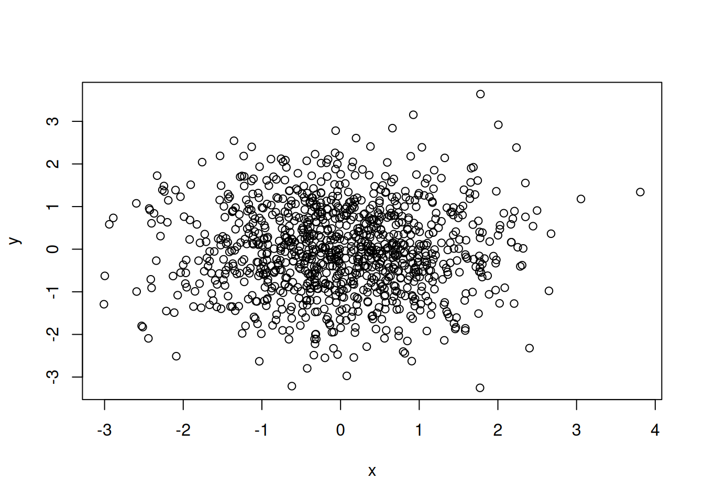
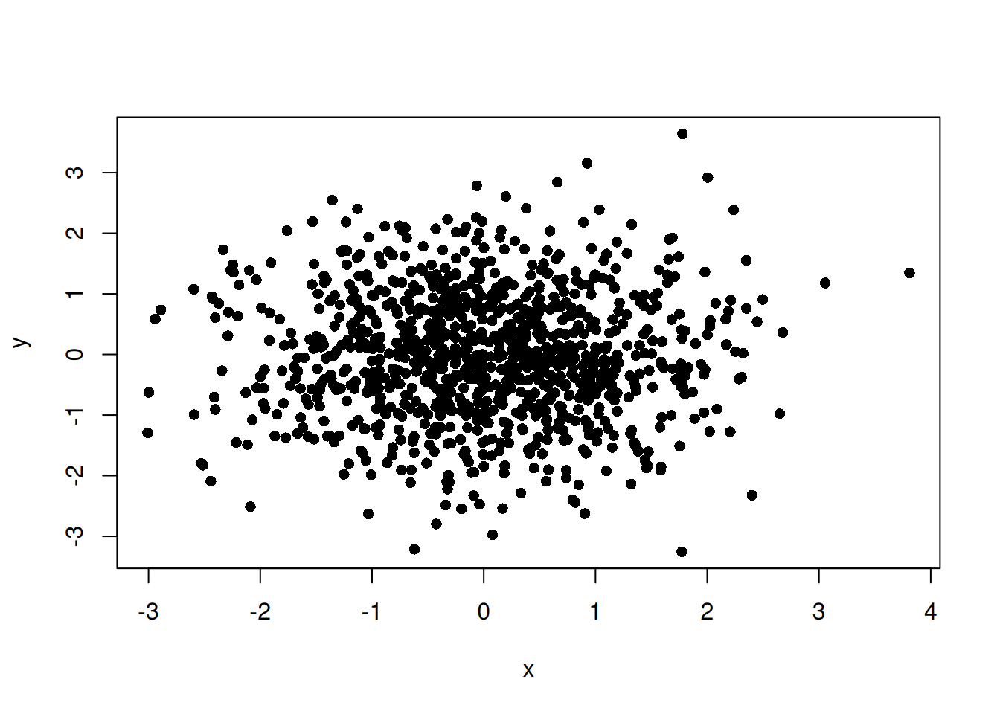
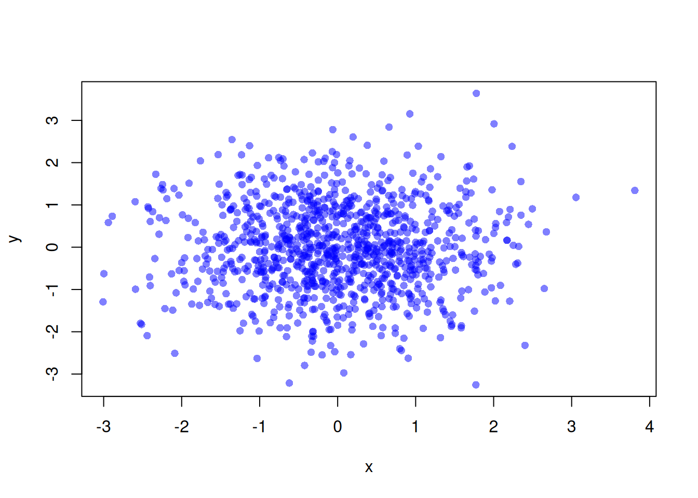
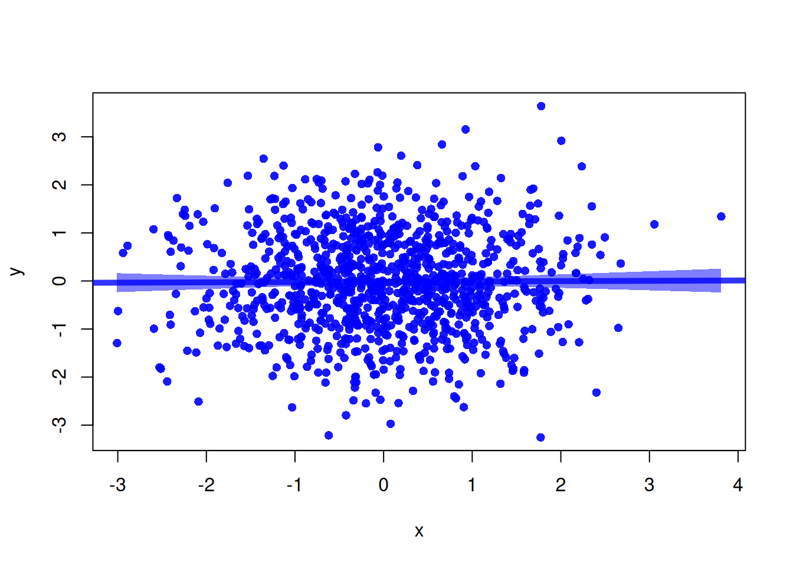
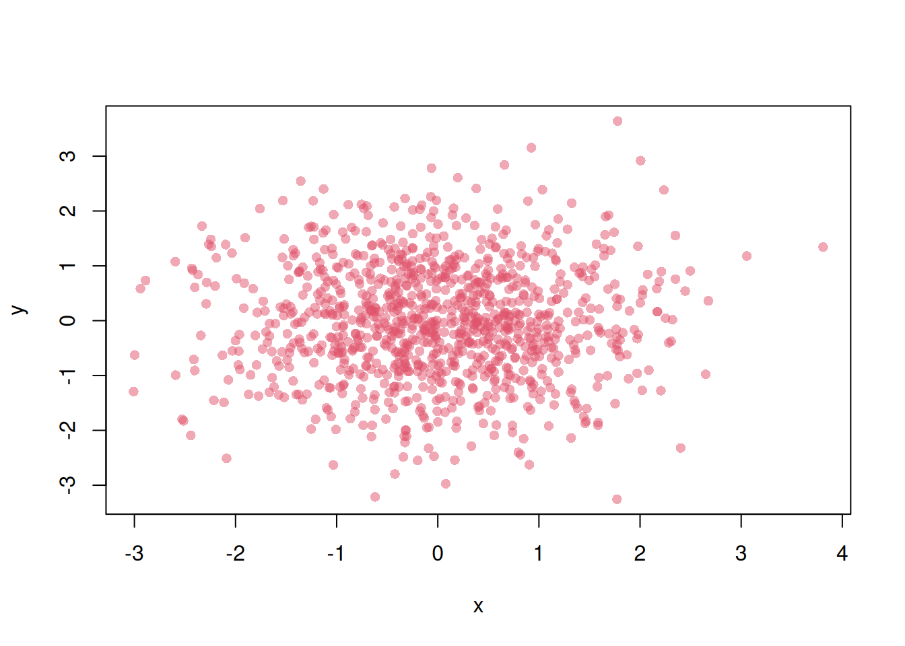

# Specifying Transparency for Colors in R Plots

r

A summary of specifying color transparency in R plots with [`adjustcolor()`](https://rdrr.io/r/grDevices/adjustcolor.html) and [`rgb()`](https://rdrr.io/r/grDevices/rgb.html).

Published

2026-02-25

Modified

2026-02-25

> **NOTE:**
>
> Original Japanese version: [Rのプロットで色に透明度を指定する方法](../../../posts/2026-02-25-r-plot-transparent/index.llms.md)

This article summarizes how to specify transparency for colors in R plots. For example, when drawing a scatter plot, it can be difficult to see where points overlap. Suppose we draw the following scatter plot.

``` downlit
set.seed(1)
x <- rnorm(1000)
y <- rnorm(1000)
plot(x, y)
```



When points are filled, overlapping areas become even harder to see.

``` downlit
plot(x, y, pch = 16)
```



When many points overlap like this, specifying transparency for the point color makes the overlapping areas easier to understand. In R, transparency can mainly be specified in the following ways.

- Add an alpha value to the end of a hexadecimal color code.
- Use [`adjustcolor()`](https://rdrr.io/r/grDevices/adjustcolor.html).
- Use [`rgb()`](https://rdrr.io/r/grDevices/rgb.html).

## Adding Transparency to a Hexadecimal Color Code

In R, transparency can be specified at the end of a hexadecimal color code. For example, in the `#RRGGBBAA` format, the `AA` part specifies transparency. You can specify transparency for point color as follows.

> **NOTE:**
>
> A color code represents a color and is usually written in the `#RRGGBB` format.
>
> - `RR` represents the red value in hexadecimal, from `00` to `FF`.
> - `GG` represents the green value in hexadecimal, from `00` to `FF`.
> - `BB` represents the blue value in hexadecimal, from `00` to `FF`.
>
> For example, `#0000FF` is the color code for blue.

``` downlit
plot(x, y, pch = 16, col = "#0000FF80")
```


## Using `adjustcolor()`

[`adjustcolor()`](https://rdrr.io/r/grDevices/adjustcolor.html) is a function for fine-tuning existing colors. Transparency can be specified with the `alpha.f` argument. For example, point color can be made transparent as follows.

``` downlit
plot(x, y, pch = 16, col = adjustcolor("blue", alpha.f = 0.5))
```



This makes the point color semi-transparent and makes overlapping areas easier to see. This method also lets you specify color names directly, so you do not need to memorize color codes. When you want to use one color with multiple transparency levels, [`adjustcolor()`](https://rdrr.io/r/grDevices/adjustcolor.html) is convenient. For example, different transparency values can be specified for point and line colors as follows.

``` downlit
plot(x, y, pch = 16, col = adjustcolor("blue", alpha.f = 0.9))

# Draw a 95% confidence interval
model <- lm(y ~ x)
ord <- order(x)
x_sorted <- x[ord]
conf <- predict(model, interval = "confidence")
conf_sorted <- conf[ord, ]

polygon(
  c(x_sorted, rev(x_sorted)),
  c(conf_sorted[, 2], rev(conf_sorted[, 3])),
  col = adjustcolor("blue", alpha.f = 0.5),
  border = NA
)

# Draw regression line
abline(model, col = adjustcolor("blue", alpha.f = 0.8), lwd = 5)
```



## Using `rgb()`

[`rgb()`](https://rdrr.io/r/grDevices/rgb.html) is a function that creates colors by specifying red, green, and blue values. Transparency can be specified with the `alpha` argument. For example, point color can be made transparent as follows.

``` downlit
plot(x, y, pch = 16, col = rgb(0, 0, 1, alpha = 0.5))
```


This makes the point color semi-transparent and makes overlapping areas easier to see. This method lets you directly specify red, green, and blue values, so fine color adjustment is possible. One thing to note is that each color value must be specified in the range from 0 to 1.

## Personal Preference

Personally, I find [`adjustcolor()`](https://rdrr.io/r/grDevices/adjustcolor.html) convenient and use it often. After that, I often use direct color codes. I have rarely used [`rgb()`](https://rdrr.io/r/grDevices/rgb.html).

When using [`adjustcolor()`](https://rdrr.io/r/grDevices/adjustcolor.html), being able to specify existing color names directly is very convenient. You can specify not only color names but also indices of the default colors.

``` downlit
plot(x, y, pch = 16, col = adjustcolor(2, alpha.f = 0.5))
```



This is useful to remember.
