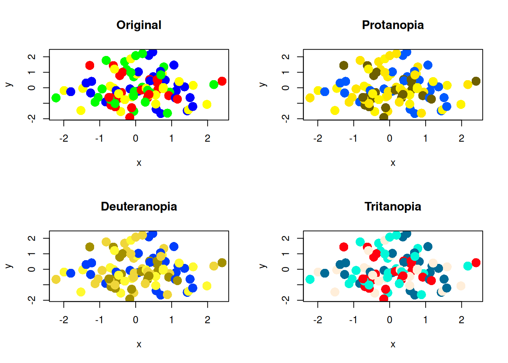
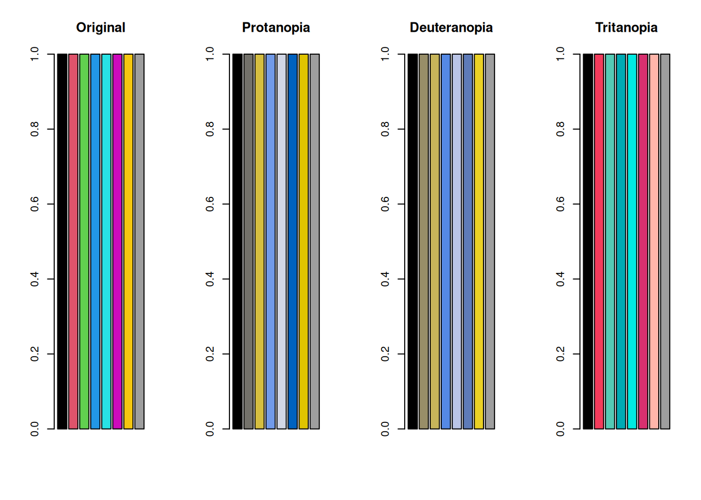
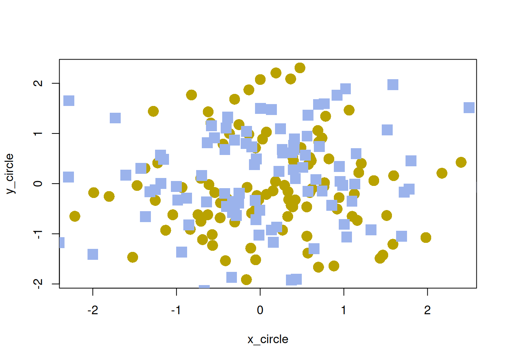
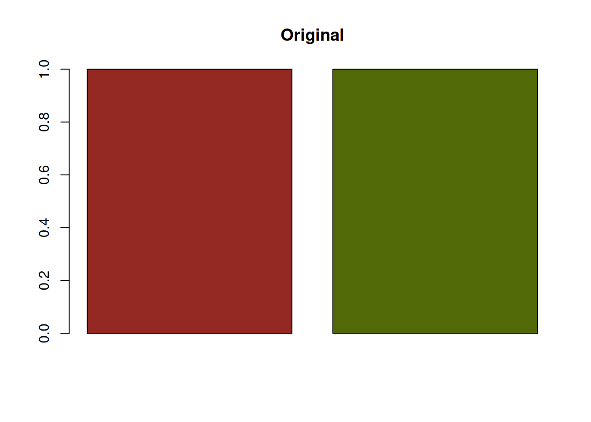
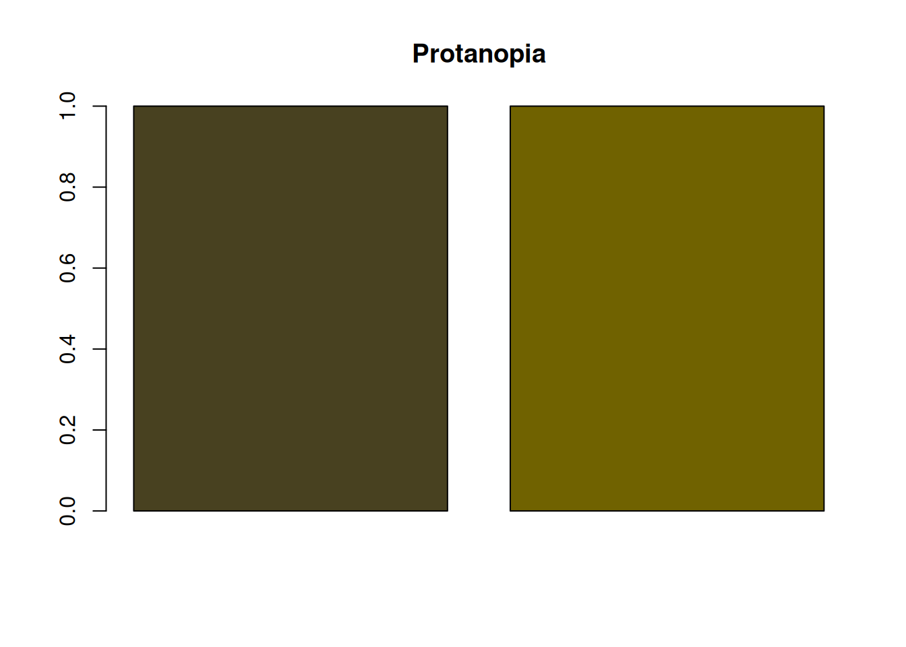
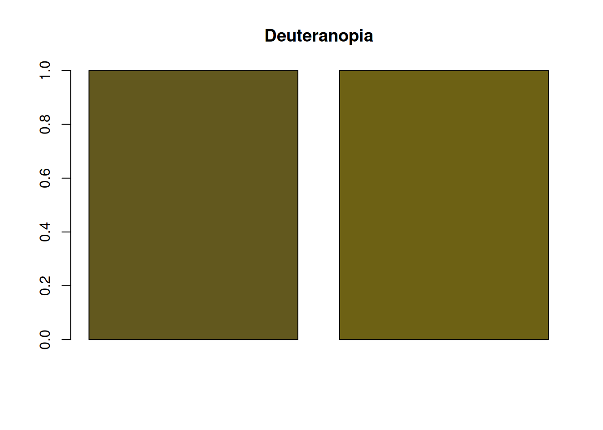
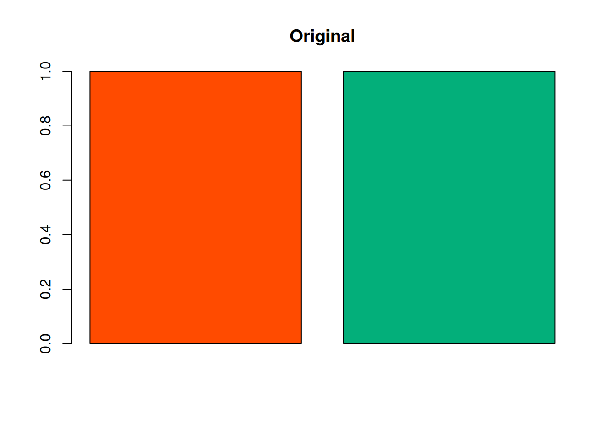

# Simulating Color Vision Deficiency in R

r

How to simulate color vision deficiency in R with the `colorspace` package.

Published

2026-03-04

Modified

2026-03-04

> **NOTE:**
>
> Original Japanese version: [Rで色覚異常のシミュレーションを行う方法](../../../posts/2026-03-04-r-color-blind/index.llms.md)

## Color Vision Diversity

People differ in how they perceive colors. Cases where color perception differs greatly from that of many people are called **color vision deficiency**.

> **NOTE:**
>
> In Japanese, color vision deficiency used to be commonly called a term equivalent to “color blindness,” but today a term closer to “color vision deficiency” is more common. This is probably because wording that literally includes “blindness” may create the misconception that no colors can be distinguished at all. “Color vision deficiency” itself seems to be a medical term, and expressions such as color vision deficiency or color vision diversity are generally preferred.
>
> It can sometimes feel as if many Japanese terms are being changed too aggressively, but it may still be important to choose expressions that do not make the listener uncomfortable.

> **NOTE:**
>
> In English, this is called “color blindness” or “color vision deficiency.” In papers, “color vision deficiency” is common, and it is often abbreviated as CVD.

## Types of Color Vision Deficiency

The main types are as follows.

- **Protanopia**: a type where cones sensitive to red, or L cones, are absent. Red appears darker, and distinguishing red from green becomes difficult.
- **Deuteranopia**: a type where cones sensitive to green, or M cones, are absent. Distinguishing red from green becomes difficult, but the change in brightness is not as large as in protanopia.
- **Tritanopia**: a type where cones sensitive to blue, or S cones, are absent. Distinguishing colors such as blue and yellow becomes difficult.

Many cases are protanopia or deuteranopia. Because these relate to distinguishing red and green, they are sometimes grouped as red-green color vision deficiency.

There is also achromatopsia, in which all cones do not function, but it is very rare.

## Simulating Color Vision Deficiency in R

With the `colorspace` package in R, color vision deficiency can be simulated easily. If it is not installed, run the following code to install it. Then load the package with [`library(colorspace)`](https://colorspace.R-Forge.R-project.org/).

``` downlit
# install.packages("colorspace") if it is not installed
# renv::install("colorspace") when using renv
library(colorspace)
```

Prepare a vector of colors, then use [`deutan()`](https://rdrr.io/pkg/colorspace/man/simulate_cvd.html) for deuteranopia, [`protan()`](https://rdrr.io/pkg/colorspace/man/simulate_cvd.html) for protanopia, and [`tritan()`](https://rdrr.io/pkg/colorspace/man/simulate_cvd.html) for tritanopia to simulate color vision deficiency.

``` downlit
colors <- c("red", "green", "blue", "yellow") # color vector: red, green, blue, yellow
colors_protan <- protan(colors) # simulation of protanopia
colors_deutan <- deutan(colors) # simulation of deuteranopia
colors_tritan <- tritan(colors) # simulation of tritanopia
```

> **NOTE:**
>
> The simulation functions have an argument called `severity`. The default is `severity = 1`, which simulates complete color vision deficiency. By adjusting this argument from 0 to 1, the degree of color vision deficiency can be simulated.

Plot the colors.

``` downlit
par(mfrow = c(1, 4))
barplot(rep(1, length(colors)), col = colors, main = "Original")
barplot(rep(1, length(colors_protan)), col = colors_protan, main = "Protanopia")
barplot(
  rep(1, length(colors_deutan)),
  col = colors_deutan,
  main = "Deuteranopia"
)
barplot(
  rep(1, length(colors_tritan)),
  col = colors_tritan,
  main = "Tritanopia"
)
```


In protanopia and deuteranopia, red and green become difficult to distinguish. Because yellow is a mixture of red and green, yellow also becomes harder to distinguish from red or green in both protanopia and deuteranopia.

Tritanopia is said to make blue and yellow difficult to distinguish, but because S cones are absent, distinctions among blue, cyan, and green may also become weaker. You can see that green and blue become harder to distinguish.

This may still be hard to see in a bar plot, but when there are many plotted points, it can become a serious problem.

``` downlit
set.seed(1)
x <- rnorm(100)
y <- rnorm(100)
par(mfrow = c(2, 2))
plot(x, y, col = colors, pch = 16, cex = 2, main = "Original")
plot(x, y, col = colors_protan, pch = 16, cex = 2, main = "Protanopia")
plot(x, y, col = colors_deutan, pch = 16, cex = 2, main = "Deuteranopia")
plot(x, y, col = colors_tritan, pch = 16, cex = 2, main = "Tritanopia")
```



Now test the default color palette from R version 4 and later.

``` downlit
colors_default <- palette() # R's default color palette
colors_default_protan <- protan(colors_default)
colors_default_deutan <- deutan(colors_default)
colors_default_tritan <- tritan(colors_default)

par(mfrow = c(1, 4))
barplot(rep(1, length(colors_default)), col = colors_default, main = "Original")
barplot(
  rep(1, length(colors_default_protan)),
  col = colors_default_protan,
  main = "Protanopia"
)
barplot(
  rep(1, length(colors_default_deutan)),
  col = colors_default_deutan,
  main = "Deuteranopia"
)
barplot(
  rep(1, length(colors_default_tritan)),
  col = colors_default_tritan,
  main = "Tritanopia"
)
```



``` downlit
par(mfrow = c(2, 2))
plot(x, y, col = colors_default, pch = 16, cex = 2, main = "Original")
plot(x, y, col = colors_default_protan, pch = 16, cex = 2, main = "Protanopia")
plot(
  x,
  y,
  col = colors_default_deutan,
  pch = 16,
  cex = 2,
  main = "Deuteranopia"
)
plot(
  x,
  y,
  col = colors_default_tritan,
  pch = 16,
  cex = 2,
  main = "Tritanopia"
)
```


## Considering Color Vision Diversity

### Points to Note When Choosing a Color Palette

For people with color vision deficiency, certain color combinations can be difficult to distinguish. To avoid this problem, it is important to choose color palettes that are easy to distinguish even for people with color vision deficiency. The easiest method is to use a palette such as `palette("Okabe-Ito")`, which is designed to be distinguishable for people with color vision deficiency. This palette uses color combinations that are easy to distinguish.

``` downlit
colors_okabe_ito <- palette("Okabe-Ito")
colors_okabe_ito_protan <- protan(colors_okabe_ito)
colors_okabe_ito_deutan <- deutan(colors_okabe_ito)
colors_okabe_ito_tritan <- tritan(colors_okabe_ito)
par(mfrow = c(1, 4))
barplot(
  rep(1, length(colors_okabe_ito)),
  col = colors_okabe_ito,
  main = "Original"
)
barplot(
  rep(1, length(colors_okabe_ito_protan)),
  col = colors_okabe_ito_protan,
  main = "Protanopia"
)
barplot(
  rep(1, length(colors_okabe_ito_deutan)),
  col = colors_okabe_ito_deutan,
  main = "Deuteranopia"
)
barplot(
  rep(1, length(colors_okabe_ito_tritan)),
  col = colors_okabe_ito_tritan,
  main = "Tritanopia"
)
```


The scatter plots are as follows.

``` downlit
par(mfrow = c(2, 2))
plot(x, y, col = colors_okabe_ito, pch = 16, cex = 2, main = "Original")
plot(
  x,
  y,
  col = colors_okabe_ito_protan,
  pch = 16,
  cex = 2,
  main = "Protanopia"
)
plot(
  x,
  y,
  col = colors_okabe_ito_deutan,
  pch = 16,
  cex = 2,
  main = "Deuteranopia"
)
plot(
  x,
  y,
  col = colors_okabe_ito_tritan,
  pch = 16,
  cex = 2,
  main = "Tritanopia"
)
```


### Convey Important Information with Methods Other Than Color

For people with color vision deficiency, conveying information only with color can be difficult. Therefore, it is also important to communicate important information through methods other than color.

Examples include changing point shapes in graphs, changing line types, and adding text explanations. Personally, I often use the `pch` argument to change point shapes because it is easy and effective.

``` downlit
set.seed(1)
x_circle <- rnorm(100)
y_circle <- rnorm(100)
x_square <- rnorm(100)
y_square <- rnorm(100)
par(mfrow = c(1, 1))
plot(
  x_circle,
  y_circle,
  col = protan(2),
  pch = 16,
  cex = 2
)
points(
  x_square,
  y_square,
  col = protan(3),
  pch = 15,
  cex = 2
)
```



## Ensure Sufficient Brightness Contrast

Even when red and green are difficult to distinguish, sufficient brightness contrast can make them easier to tell apart. For example, the following red and green combination has little brightness contrast, so it is difficult for people with protanopia or deuteranopia to distinguish.

``` downlit
colors <- c("#932922", "#526907")
colors_protan <- protan(colors)
colors_deutan <- deutan(colors)
barplot(rep(1, length(colors)), col = colors, main = "Original")
```



``` downlit
barplot(rep(1, length(colors_protan)), col = colors_protan, main = "Protanopia")
```



``` downlit
barplot(
  rep(1, length(colors_deutan)),
  col = colors_deutan,
  main = "Deuteranopia"
)
```



On the other hand, the following red and green combination has a large brightness difference, making it easier for people with protanopia or deuteranopia to distinguish.

``` downlit
colors <- c("#FF4B00", "#03AF7A")
colors_protan <- protan(colors)
colors_deutan <- deutan(colors)
barplot(rep(1, length(colors)), col = colors, main = "Original")
```



``` downlit
barplot(rep(1, length(colors_protan)), col = colors_protan, main = "Protanopia")
```


``` downlit
barplot(
  rep(1, length(colors_deutan)),
  col = colors_deutan,
  main = "Deuteranopia"
)
```


Even so, people with color vision deficiency may still find the colors harder to distinguish than many other people do. Therefore, it is important not to rely only on brightness contrast, but also to use methods other than color.

Maintaining brightness contrast is also important for grayscale printing. When brightness contrast is small, it becomes difficult to distinguish elements in grayscale printing regardless of color vision diversity. In that sense as well, paying attention to brightness contrast is important.
