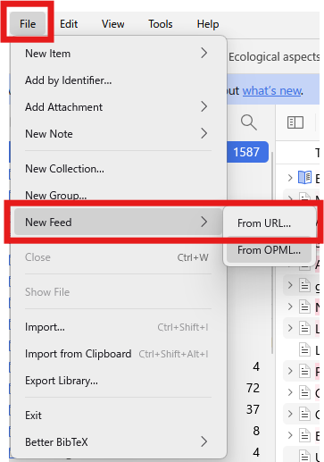
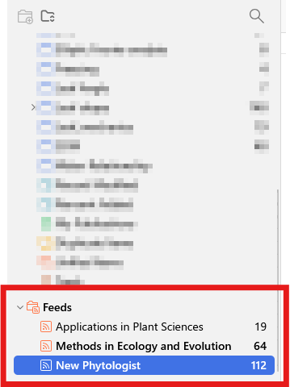
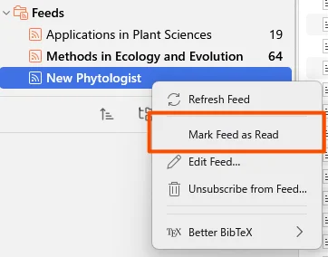

# Creating RSS Feeds in Zotero

zotero

How to create journal RSS feeds with Zotero.

Published

2026-03-10

Modified

2026-03-10

> **NOTE:**
>
> Original Japanese version: [ZoteroでRSSフィードを作成する方法](../../../posts/2026-03-10-zotero-rss/index.llms.md)

## What Is Zotero?

Zotero is a reference management tool widely used for organizing information about papers, books, and other sources.

## What Is an RSS Feed?

An RSS feed is a format for distributing update information from websites. It allows users to receive updates from specific websites. In this case, by creating RSS feeds for academic journals, you can receive notifications when new papers are published.

## Method

### Find the Journal’s RSS Feed

Many journals provide RSS feeds on their websites. As an example, go to the homepage of [New Phytologist](https://nph.onlinelibrary.wiley.com/journal/14698137).

There is an RSS feed icon on the right side, so right-click it.

RSS feed icon

A right-click menu, or context menu, appears. Select “Copy link address.”

Context menu

## Subscribe to the RSS Feed in Zotero

Open Zotero and select \[File\] \> \[New Feed\] \> \[From URL…\].

Create a new feed in Zotero

Paste the RSS feed URL copied earlier into the URL field of the dialog that appears. If the RSS feed URL is correct, the journal name is automatically entered in the Title field.

The Advanced Options section contains the following settings.

- Feed update frequency; the default is 168 hours, or one week
- Interval for deleting read feed items; the default is 3 days
- Interval for deleting unread feed items; the default is 30 days

Zotero feed settings

I changed the settings as follows.

- Title: New Phytologist, using only the journal name
- Feed update frequency: 24 hours, so updates are checked daily

I left the other settings at their defaults.

After completing the settings, click \[OK\].

If a Feeds section appears in the left sidebar and a feed named New Phytologist has been added inside it, the setup was successful.

Zotero sidebar

## Check Feed Items

From the Feeds section, select the journal whose feed items you want to check. A list of feed items appears in the center pane.

When you move the cursor over an item, it becomes Read, and the row font changes from bold to normal. Double-clicking an item opens the journal website.

In the right pane, you can check bibliographic information. You can also click \[Mark As Unread\] or \[Mark As Read\] to switch the item between unread and read. Clicking \[Add to “My Library…”\] lets you add the item to any library.

Zotero feed item

If you want to mark all items in a journal feed as read at once, right-click the journal name in the Feeds section and select **\[Mark Feed as Read\]**.

Mark a Zotero feed as read

## Summary

This article summarized how to subscribe to journal RSS feeds with Zotero. Until now, I had used an RSS reader to check journal updates, but using Zotero makes it easy to add feed items to the library and manage bibliographic information.

If I notice any missing features, I will add them later.
