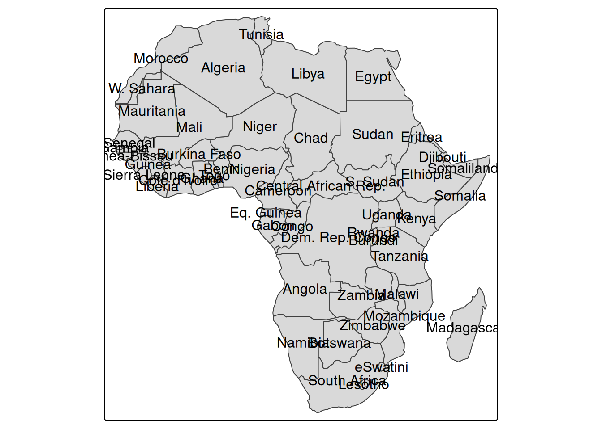
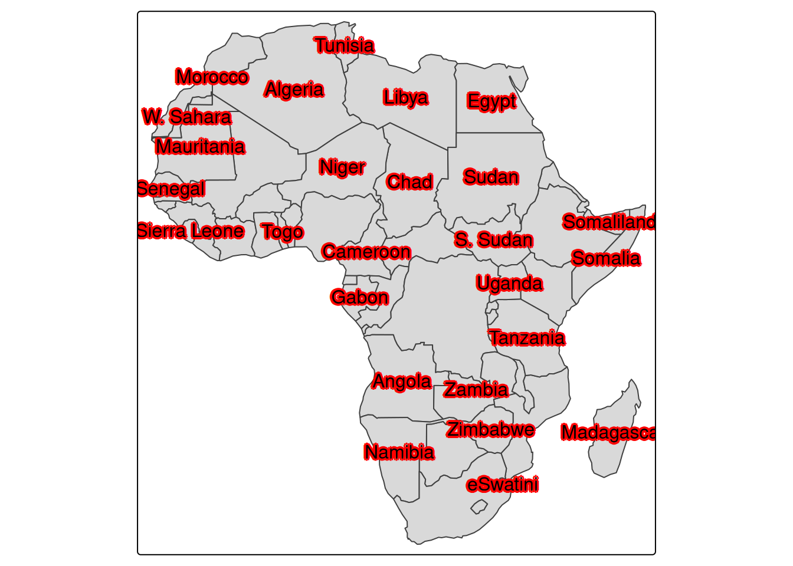
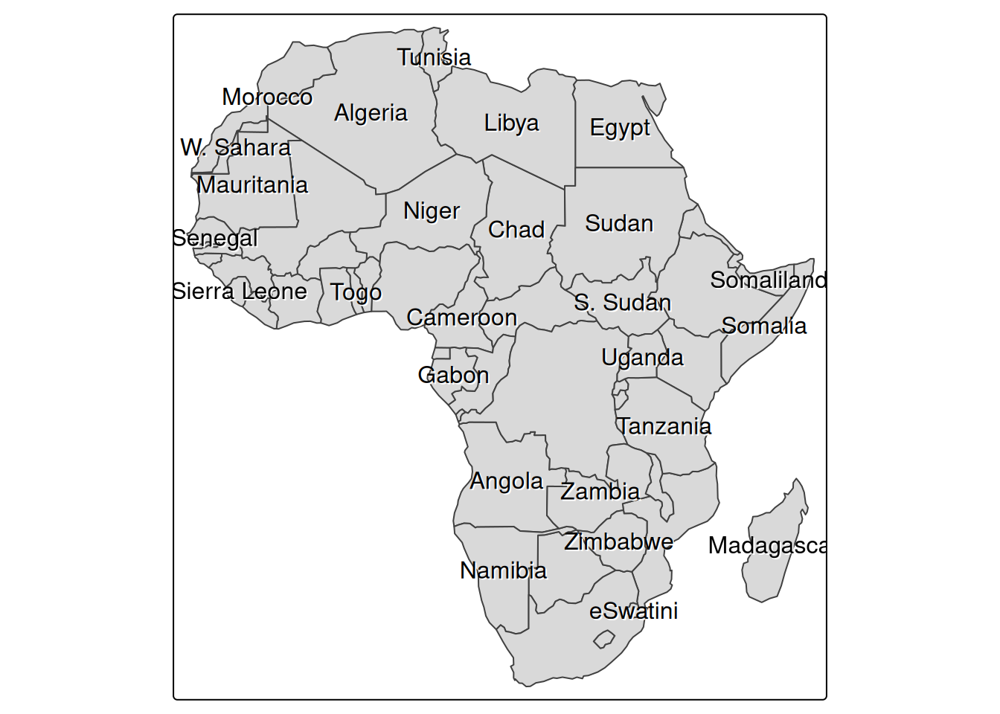
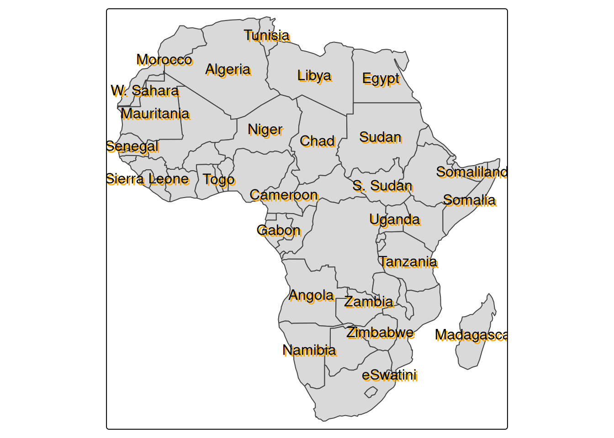

# Displaying Haloed Text on Maps with the R Package tmap

r

Starting with `tmap` 4.3, `tm_text` supports decorations such as text halos.

Published

2026-04-14

Modified

2026-04-14

> **NOTE:**
>
> Original Japanese version: [Rの`tmap`パッケージで地図の上に縁取り文字を表示する方法](../../../posts/2026-04-14-r-tmap-halo/index.llms.md)

This article introduces how to display haloed text on maps with the [`tmap` package](https://r-tmap.github.io/tmap/index.html) in R. According to the `tmap` package [Changelog](https://r-tmap.github.io/tmap/news/index.html), decorations such as text halos seem to have been implemented in the `tm_text` function starting from version 4.3.

I tried it right away.

## Installing the Development Version of `tmap`

As of April 14, 2026, the CRAN version of `tmap` was not yet 4.3, so the development version needed to be installed. If you use renv, install it as follows.

``` downlit
renv::install("r-tmap/tmap")
```

Then load it with [`library()`](https://rdrr.io/r/base/library.html) and check the version.

``` downlit
library(tmap)
packageVersion("tmap")
```

    [1] '4.3'

## Displaying Haloed Text

Display country names in Africa. First, here is the map without halos.

``` downlit
Africa <- World[World$continent == "Africa", ]
tm_shape(Africa) +
  tm_polygons() +
  tm_text("name")
```



Because there is a lot of overlap, specify `remove_overlap = TRUE` to remove overlaps. I feel bad for the countries that disappear, but the map becomes easier to read.

``` downlit
tm_shape(Africa) +
  tm_polygons() +
  tm_text("name", options = opt_tm_text(remove_overlap = TRUE))
```


Now add halos to the text. Specify `halo = TRUE` in the arguments of `opt_tm_text`.

``` downlit
tm_shape(Africa) +
  tm_polygons() +
  tm_text("name", options = opt_tm_text(halo = TRUE, remove_overlap = TRUE))
```


White halos are added, making the text easier to read even on a filled map. The options include the following.

- `halo`: specifies whether to enable halos. The default is `FALSE`.
- `halo.col`: specifies the halo color. The default is `NA`.
- `halo.width`: specifies the halo width. The default is `0.05`.
- `halo.blur`: specifies the amount of halo blur. The default is `0`.
- `halo.alpha`: specifies the halo transparency. The default is `0.8`.

For example, add red halos.

``` downlit
tm_shape(Africa) +
  tm_polygons() +
  tm_text(
    "name",
    options = opt_tm_text(
      halo = TRUE,
      halo.col = "red",
      halo.width = 0.1,
      halo.blur = 0.05,
      halo.alpha = 0.9,
      remove_overlap = TRUE
    )
  )
```



> **NOTE:**
>
> A halo is an option that makes text easier to read on a map by drawing a line around the text. In ArcGIS it is called a “halo” as-is ([reference](https://www.esri.com/about/newsroom/arcuser/polishing-your-halo)), while in QGIS it is called a “buffer” ([reference](https://qgis-in-mineral-exploration.readthedocs.io/en/latest/source/geological_data/labelling.html)).
>
> The word may be unfamiliar in Japanese. Translated into Japanese, it means something like a glow or ring of light, and the corresponding kanji appears to be **暈** ([reference](https://ja.wikipedia.org/wiki/%E6%9A%88)). The image is that light is shining around the text.

## Adding Shadows to Text

The `halo` option adds outlines, while the `shadow` option adds shadows to text.

``` downlit
tm_shape(Africa) +
  tm_polygons() +
  tm_text("name", options = opt_tm_text(shadow = TRUE, remove_overlap = TRUE))
```



The difference is a little hard to see, but a shadow is added below the text, making it easier to read on the map. The arguments for the `shadow` option are as follows.

- `shadow`: specifies whether to enable the shadow. The default is `FALSE`.
- `shadow.col`: specifies the shadow color. The default is `NA`.
- `shadow.offset.x`: specifies the horizontal offset of the shadow. The default is `0.05`.
- `shadow.offset.y`: specifies the vertical offset of the shadow. The default is `0.05`.

To make the shadow effect easier to see, add a slightly exaggerated shadow.

``` downlit
tm_shape(Africa) +
  tm_polygons() +
  tm_text(
    "name",
    options = opt_tm_text(
      shadow = TRUE,
      shadow.col = "orange",
      shadow.offset.x = 0.1,
      shadow.offset.y = 0.1,
      remove_overlap = TRUE
    )
  )
```



A halo draws a line around the text, whereas a shadow gives the impression of another copy of the text displayed underneath. Both options make text easier to read on a map, and it seems useful to choose between them depending on preference and map design.

## References

- [Changelog • tmap](https://r-tmap.github.io/tmap/news/index.html)
- [Map layer: text - tm_text • tmap](https://r-tmap.github.io/tmap/reference/tm_text.html)
- [Use halos to make maps more readable](https://www.esri.com/about/newsroom/arcuser/polishing-your-halo)
- [6.8. Labelling Features - QGIS in Mineral Exploration 1.1 documentation](https://qgis-in-mineral-exploration.readthedocs.io/en/latest/source/geological_data/labelling.html)
- [暈 - Wikipedia](https://ja.wikipedia.org/wiki/%E6%9A%88)
