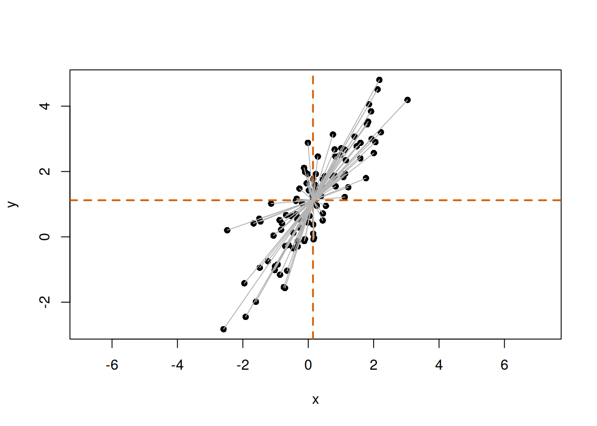
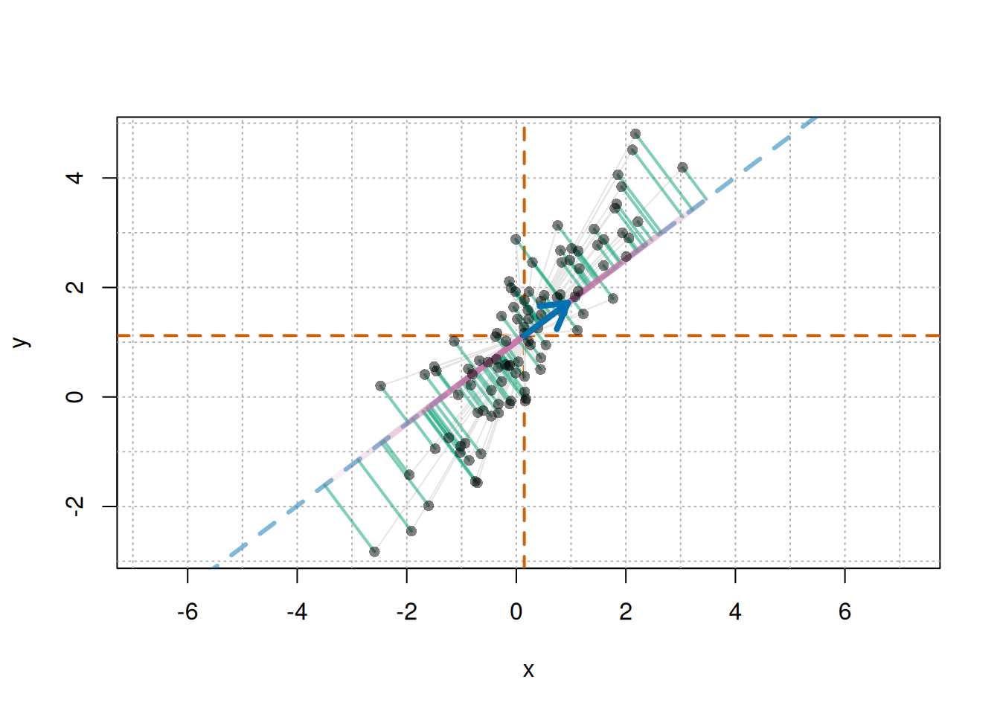
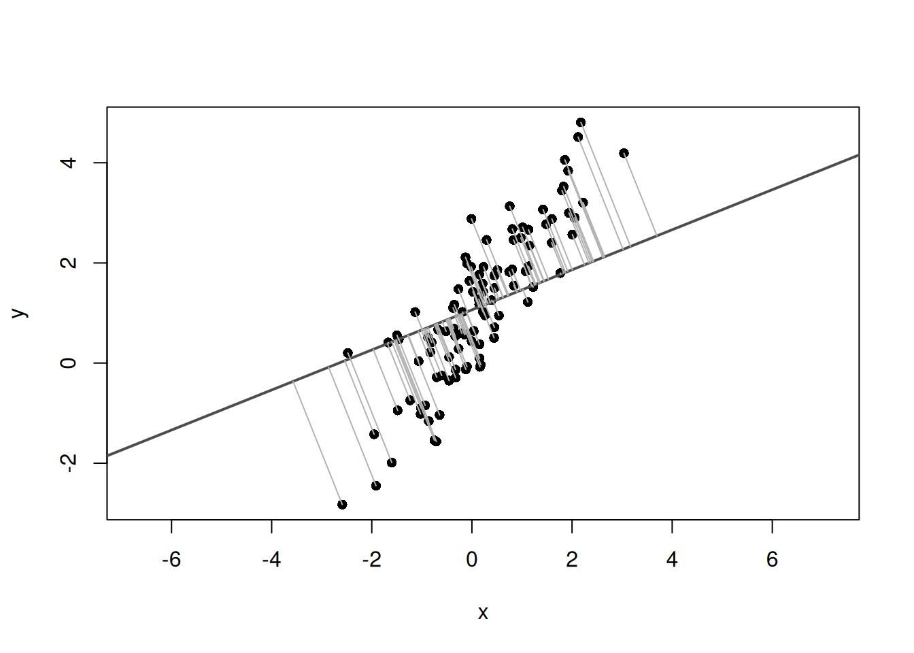
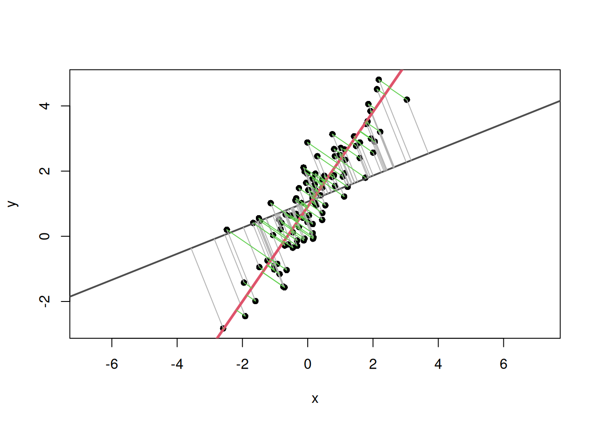

# Understanding the Basics of Bivariate PCA and Principal Axis Regression in R

r

Finding the principal axis of bivariate data from the covariance matrix, eigenvalues, and eigenvectors.

Published

2026-05-26

Modified

2026-05-30

> **NOTE:**
>
> Original Japanese version: [Rで2変量PCAとPrincipal axis regressionの基礎を理解する](../../../posts/2026-05-26-r-principle-axis-regression/index.llms.md)

**Principal axis regression** (PAR) is used to describe the main direction of variation in bivariate data as a line, using an idea similar to principal component analysis (PCA). In the literature, related bivariate line-fitting methods are often discussed as major axis (MA) or standardised major axis (SMA) methods ([Warton et al. 2006](#ref-warton2006)). This article focuses on an MA-like approach that uses the first eigenvector of the covariance matrix as the principal axis.

This article implements a method close to major axis regression, using the first eigenvector of the covariance matrix as the principal axis. Below, I implement principal axis regression in R.

## Overview of Principal Axis Regression

Principal axis regression identifies the main direction of variation in data by calculating the **covariance matrix** and then obtaining its **eigenvalues** and **eigenvectors**. The **first eigenvector represents the direction with the largest variance**, while the **second eigenvector represents the direction orthogonal to it**.

In ordinary least squares regression (OLS), the response variable and explanatory variable are separated, and a line is fitted so that errors in the response-variable direction become small. In contrast, PAR does not fix one variable as the response. Instead, it finds a line representing the overall direction of variation in the bivariate point cloud.

## Implementation in R

To implement principal axis regression in R, the following steps are needed.

1.  Prepare data
2.  Calculate the covariance matrix
3.  Calculate eigenvalues and eigenvectors
4.  Calculate the slope and intercept of the principal axis
5.  Visualize the result

Here, \\x\\ and \\y\\ are treated as simulated data on the same scale. For real data where the two variables have very different units or scales, consider applying log transformation or standardization, or using a correlation matrix instead of a covariance matrix. The estimated axis direction can differ between covariance-matrix and correlation-matrix approaches.

> **NOTE:**
>
> In the R implementation section, detailed mathematical explanation is omitted and the focus is on code. The mechanism using equations is explained in the next section.

### Preparing Data

First, prepare an appropriate dataset. Here, random data are generated with the [`rnorm()`](https://rdrr.io/r/stats/Normal.html) function. The data are generated by defining the principal axis as \\y = \alpha + \beta x\\ and adding noise.

``` downlit
set.seed(123)
n <- 100
beta <- 1.5
alpha <- 1

# Scores along the principal-axis direction
t <- rnorm(n, mean = 0, sd = 2)

# Noise orthogonal to the principal axis
e <- rnorm(n, mean = 0, sd = 0.5)

# Direction vector for the principal axis and the orthogonal direction
v1 <- c(1, beta) / sqrt(1 + beta^2)
v2 <- c(-beta, 1) / sqrt(1 + beta^2)

x <- t * v1[1] + e * v2[1]
y <- alpha + t * v1[2] + e * v2[2]

plot(x, y, asp = 1, pch = 16)
```


### Calculating the Covariance Matrix

The covariance matrix is written as follows.

\\ \Sigma = \begin{bmatrix}\sigma\_{xx} & \sigma\_{xy} \\ \sigma\_{yx} & \sigma\_{yy}\end{bmatrix} \\

Here, \\\sigma\_{xx}\\ is the variance of \\x\\, \\\sigma\_{yy}\\ is the variance of \\y\\, and \\\sigma\_{xy}\\ is the covariance between \\x\\ and \\y\\. Covariance is an index of how strongly two variables vary together. It is calculated as follows.

\\ \sigma\_{xy} = \frac{1}{n-1} \sum\_{i=1}^{n} (x_i - \bar{x})(y_i - \bar{y}) \\

In R, the covariance matrix can be calculated easily with the [`cov()`](https://rdrr.io/r/stats/cor.html) function.

``` downlit
cov_matrix <- cov(cbind(x, y))
cov_matrix
```

             x        y
    x 1.227713 1.447200
    y 1.447200 2.338984

### Calculating Eigenvalues and Eigenvectors

Use the [`eigen()`](https://rdrr.io/r/base/eigen.html) function to calculate the eigenvalues and eigenvectors of the covariance matrix. Eigenvalues represent the magnitude of data variation, and eigenvectors represent the directions of that variation. R’s [`eigen()`](https://rdrr.io/r/base/eigen.html) returns eigenvalues in descending order, so the first column of `vectors` corresponds to the first principal axis, and the second column corresponds to the second principal axis.

``` downlit
eigen_result <- eigen(cov_matrix, symmetric = TRUE)
eigen_result
```

    eigen() decomposition
    $values
    [1] 3.3335480 0.2331491

    $vectors
              [,1]       [,2]
    [1,] 0.5663796 -0.8241445
    [2,] 0.8241445  0.5663796

The [`eigen()`](https://rdrr.io/r/base/eigen.html) function returns eigenvalues and eigenvectors as a list. Eigenvalues are stored in `values`, and eigenvectors are stored in `vectors`. For two-dimensional data with \\x\\ and \\y\\, two eigenvalues and their corresponding eigenvectors are obtained.

``` downlit
eigen_values <- eigen_result$values
eigen_vectors <- eigen_result$vectors

print(paste("Eigenvalue of the first principal axis:", eigen_values[1]))
```

    [1] "Eigenvalue of the first principal axis: 3.33354798737934"

``` downlit
print(paste("Eigenvalue of the second principal axis:", eigen_values[2]))
```

    [1] "Eigenvalue of the second principal axis: 0.233149107828597"

``` downlit
print(paste(
  "Eigenvector of the first principal axis: (",
  eigen_vectors[1, 1],
  ", ",
  eigen_vectors[2, 1],
  ")",
  sep = ""
))
```

    [1] "Eigenvector of the first principal axis: (0.566379566968877, 0.824144517739545)"

``` downlit
print(paste(
  "Eigenvector of the second principal axis: (",
  eigen_vectors[1, 2],
  ", ",
  eigen_vectors[2, 2],
  ")",
  sep = ""
))
```

    [1] "Eigenvector of the second principal axis: (-0.824144517739545, 0.566379566968877)"

> **NOTE:**
>
> The sign of an eigenvector is arbitrary. For example, \\(u_x, u_y)\\ and \\(-u_x, -u_y)\\ represent the same axis direction. Therefore, the line slope \\u_y/u_x\\ does not change, but this sign arbitrariness matters when calculating the angle between axes, which is covered in the next article.

### Visualization

Plot the eigenvectors, or the main directions of variation, together with the data points. The vectors should pass through the center of the data. That is, when the line is \\y = a + bx\\, \\a\\ and \\b\\ are calculated as follows.

\\ a = \bar{y} - b \bar{x} \\

Here, \\\bar{x}\\ and \\\bar{y}\\ are the means of \\x\\ and \\y\\. The slope \\b\\ is calculated from the ratio of the eigenvector components. Draw the first principal axis in red and the second principal axis in blue.

``` downlit
# Slopes of the first and second principal axes
major_axis_slope <- eigen_vectors[2, 1] / eigen_vectors[1, 1]
minor_axis_slope <- eigen_vectors[2, 2] / eigen_vectors[1, 2]

# Calculate intercepts so that the lines pass through the data center
major_axis_intercept <- mean(y) - major_axis_slope * mean(x)
minor_axis_intercept <- mean(y) - minor_axis_slope * mean(x)

# Plot data points and the main directions of variation
plot(x, y, asp = 1, pch = 16, main = "Principal Axis Regression")

# Add the first principal axis
abline(
  a = major_axis_intercept,
  b = major_axis_slope,
  col = 2,
  lwd = 3
)

# Add the second principal axis
abline(
  a = minor_axis_intercept,
  b = minor_axis_slope,
  col = 4,
  lwd = 3
)
```


## Relationship with PCA

The calculation performed here is the same as PCA for bivariate data. In PCA, eigenvalues and eigenvectors of the covariance matrix are obtained, and new axes are defined in order from the direction with the largest data variation.

In this example, the original axes are \\x\\ and \\y\\, while the axes newly obtained by eigendecomposition are the first and second principal axes.

- First principal axis: the direction where the data vary most
- Second principal axis: the direction orthogonal to the first principal axis
- First eigenvalue: variance along the first principal-axis direction
- Second eigenvalue: variance along the second principal-axis direction

Therefore, principal axis regression or major axis regression can be understood as interpreting the first principal axis from bivariate PCA as a line summarizing bivariate data.

## What the Covariance Matrix, Eigenvalues, and Eigenvectors Mean

So far, the main direction of variation in the data has been obtained using eigenvalues and eigenvectors of the covariance matrix. Here, I examine more carefully why this procedure gives the principal axis.

Intuitively, the principal axis is **a line passing through the center of the scatter plot and representing the direction in which the point cloud is elongated**.

This line can be understood in two ways. The first view focuses on the perpendicular distance from each point to the line. If a line is drawn through the scatter plot and perpendiculars are dropped from each point to that line, the distance from each point to the line can be measured. The more a line follows the flow of the point cloud, the smaller these deviations become overall.

The second view focuses on variation along the direction of the line. If a line is chosen along the point cloud, the points spread widely along that line. Conversely, if a direction that does not match the point cloud is chosen, the spread along the line is small and deviations away from the line become large.

Therefore, the principal axis can be understood as **the direction in which the data have the largest variation after projection**.

The **covariance matrix** is used to calculate this variation after projection onto a given direction.

For each point in bivariate data, write the mean-centered coordinates as

\\ x_i - \bar{x}, \quad y_i - \bar{y} \\

This operation rewrites each point as coordinates relative to the data mean and is called mean centering. Define the mean-centered coordinate vector \\\mathbf{z}\_i\\ as follows.

\\ \mathbf{z}\_i = \begin{bmatrix} x_i - \bar{x} \\ y_i - \bar{y} \end{bmatrix} \\

Visually, \\\mathbf{z}\_i\\ can be represented as follows.

``` downlit
# Mean-centered coordinates
z <- scale(cbind(x, y), center = TRUE, scale = FALSE)
plot(x, y, asp = 1, pch = 16)
abline(h = mean(y), v = mean(x), col = "#D55E00", lwd = 2, lty = 2)
# Draw vectors from the mean point to each point
for (i in 1:n) {
  segments(mean(x), mean(y), x[i], y[i], col = "gray70")
}
```



The gray lines represent vectors from the mean point to each point. These are \\\mathbf{z}\_i\\.

Now define a vector \\\mathbf{u}\\ representing a direction as follows.

\\ \mathbf{u} = \begin{bmatrix} u_x \\ u_y \end{bmatrix} \\

This vector represents the direction of a line. Because only direction is considered here, the vector length is normalized to 1. Such a vector is called a unit vector. That is, \\\\\mathbf{u}\\ = 1\\. In equation form:

\\ \mathbf{u}^T\mathbf{u} = u_x^2 + u_y^2 = 1 \\

How far each point lies along this direction can be calculated using the inner product.

\\ s_i = \mathbf{u}^T \mathbf{z}\_i = u_x (x_i - \bar{x}) + u_y (y_i - \bar{y}) \\

Here, \\s_i\\ is the coordinate obtained by projecting point \\i\\ onto direction \\\mathbf{u}\\. If the mean point is treated as the origin, \\s_i\\ can be viewed as a signed value indicating how far point \\i\\ has moved in the direction of \\\mathbf{u}\\. The larger the variation in \\s_i\\, the more widely the data spread along that line direction.

In a figure, draw a line in direction \\\mathbf{u}\\ and drop perpendiculars from each point to that line. The intersections are the projected positions of the points on the line in direction \\\mathbf{u}\\. \\s_i\\ represents the distance from the data mean to each projected point along direction \\\mathbf{u}\\.

Visually, this is as follows.

``` downlit
# Mean-centered coordinates
z <- scale(cbind(x, y), center = TRUE, scale = FALSE)

# Mean point
mx <- mean(x)
my <- mean(y)

u <- c(0.8, 0.6) # direction vector u
u <- u / sqrt(sum(u^2)) # normalize to a unit vector just in case

# Projection scalar s_i for each point in direction u
s <- as.vector(z %*% u)
# Projected point: mean point + s_i u
proj_x <- mx + s * u[1]
proj_y <- my + s * u[2]

# Draw
plot(x, y, asp = 1, pch = 16, type = "n")
usr <- par("usr") # plotting range

# Grid with spacing of 1
abline(
  v = seq(floor(usr[1]), ceiling(usr[2]), by = 1),
  col = "gray70",
  lty = "dotted"
)
abline(
  h = seq(floor(usr[3]), ceiling(usr[4]), by = 1),
  col = "gray70",
  lty = "dotted"
)

# Vertical and horizontal lines through the mean
abline(h = my, v = mx, col = "#D55E00", lwd = 2, lty = 2)

# Line representing direction u
if (abs(u[1]) < .Machine$double.eps) {
  abline(
    v = mx,
    col = adjustcolor("#0072B2", alpha.f = 0.5),
    lwd = 3,
    lty = "dashed"
  )
} else {
  abline(
    a = my - (u[2] / u[1]) * mx,
    b = u[2] / u[1],
    col = adjustcolor("#0072B2", alpha.f = 0.5),
    lwd = 3,
    lty = "dashed"
  )
}

# Mean-centered vector z_i for each point
for (i in seq_along(x)) {
  segments(mx, my, x[i], y[i], col = "gray90")
}

# Perpendicular from each point to the projection point:
# residual not explained by direction u
for (i in seq_along(x)) {
  segments(
    x[i],
    y[i],
    proj_x[i],
    proj_y[i],
    col = adjustcolor("#009E73", alpha.f = 0.5),
    lwd = 2
  )
}

# From mean point to projected point: s_i u
for (i in seq_along(x)) {
  segments(
    mx,
    my,
    proj_x[i],
    proj_y[i],
    col = adjustcolor("#CC79A7", alpha.f = 0.1),
    lwd = 4
  )
}

# Original points
points(x, y, pch = 16, col = adjustcolor("black", alpha.f = 0.5))

# Arrow for direction vector u
arrows(
  mx,
  my,
  mx + u[1],
  my + u[2],
  col = "#0072B2",
  lwd = 4,
  length = 0.2
)
```



The blue arrow represents direction \\\mathbf{u}\\. The blue dashed line is the line passing through the mean point in that direction. The green lines are perpendiculars from each point to this line, representing deviations that cannot be explained by direction \\\mathbf{u}\\ alone. The pink lines represent positions from the mean point to the projected points. The signed value representing each of these positions is \\s_i\\. The larger the variation in \\s_i\\, the more widely the points spread along direction \\\mathbf{u}\\. Therefore, **the larger this variation is, the closer direction \\\mathbf{u}\\ is to the main direction of variation in the data**.

### Covariance Matrix for Calculating Variation

To calculate variation along direction \\\mathbf{u}\\, use the covariance matrix. The covariance matrix \\\Sigma\\ summarizes the variation of each variable and the extent to which variables vary together. If \\s_i\\ is the score obtained by projecting mean-centered data onto direction \\\mathbf{u}\\, its variance is calculated as follows.

\\ \text{Var}(s) = \mathbf{u}^T \Sigma \mathbf{u} \\

The covariance matrix \\\Sigma\\ for bivariate data is written as follows.

\\ \Sigma = \begin{bmatrix}\sigma\_{xx} & \sigma\_{xy} \\ \sigma\_{yx} & \sigma\_{yy}\end{bmatrix} \\

Here, \\\sigma\_{xx}\\ is the variance of \\x\\, \\\sigma\_{yy}\\ is the variance of \\y\\, and \\\sigma\_{xy}\\ is the covariance between \\x\\ and \\y\\. Variance measures how widely data spread from the mean. Covariance measures the extent to which two variables increase or decrease together.

Variance is calculated as follows.

\\ \sigma_x^2 = \frac{1}{n-1} \sum\_{i=1}^{n} (x_i - \bar{x})^2 \\

Covariance is calculated as follows.

\\ \sigma\_{xy} = \frac{1}{n-1} \sum\_{i=1}^{n} (x_i - \bar{x})(y_i - \bar{y}) \\

In other words, the covariance matrix can be understood as containing the information needed to calculate **how much variation there is when data are projected onto any direction \\\mathbf{u}\\**.

> **NOTE:**
>
> Let the mean-centered point be
>
> \\ \mathbf{z}\_i = \begin{bmatrix} x_i-\bar{x} \\ y_i-\bar{y} \end{bmatrix} \\
>
> and define the projection score onto direction \\\mathbf{u}\\ as
>
> \\ s_i = \mathbf{u}^{\mathrm{T}}\mathbf{z}\_i \\
>
> Because the data are mean-centered, \\\bar{s}=0\\. Therefore, the variance of the projection scores can be written as
>
> \\ \mathrm{Var}(s) = \frac{1}{n-1}\sum\_{i=1}^{n}s_i^2 \\
>
> Substituting \\s_i=\mathbf{u}^{\mathrm{T}}\mathbf{z}\_i\\ gives
>
> \\ \mathrm{Var}(s) = \frac{1}{n-1} \sum\_{i=1}^{n} (\mathbf{u}^{\mathrm{T}}\mathbf{z}\_i)^2 \\
>
> The square of the inner product can be written as
>
> \\ (\mathbf{u}^{\mathrm{T}}\mathbf{z}\_i)^2 = \mathbf{u}^{\mathrm{T}} \mathbf{z}\_i \mathbf{z}\_i^{\mathrm{T}} \mathbf{u} \\
>
> so
>
> \\ \mathrm{Var}(s) = \mathbf{u}^{\mathrm{T}} \left( \frac{1}{n-1} \sum\_{i=1}^{n} \mathbf{z}\_i\mathbf{z}\_i^{\mathrm{T}} \right) \mathbf{u} \\
>
> The term in parentheses is the covariance matrix \\\Sigma\\, so
>
> \\ \mathrm{Var}(s) = \mathbf{u}^{\mathrm{T}}\Sigma\mathbf{u} \\
>
> holds.

### Finding the Direction That Maximizes Variation

Which direction \\\mathbf{u}\\ should be chosen to maximize the variation of the projected scores?

Let the unit vector representing a direction be

\\ \mathbf{u} = \begin{bmatrix} u_x \\ u_y \end{bmatrix} \\

The variation of the data along this direction can be written using the covariance matrix \\\Sigma\\ as

\\ \mathbf{u}^{\mathrm{T}} \Sigma \mathbf{u} \\

Here, \\\mathbf{u}^{\mathrm{T}} \Sigma \mathbf{u}\\ is a single value. The larger this value is, the more widely the data vary when projected onto direction \\\mathbf{u}\\.

Therefore, finding the principal axis corresponds to finding the direction \\\mathbf{u}\\ that maximizes

\\ \mathbf{u}^{\mathrm{T}} \Sigma \mathbf{u} \\

However, because only direction is considered, the length of \\\mathbf{u}\\ is fixed to 1. If the length were free, the value could be made larger simply by lengthening the vector, even in the same direction.

\\ \mathbf{u}^{\mathrm{T}}\mathbf{u} = 1 \\

Solving the problem of maximizing \\\mathbf{u}^{\mathrm{T}} \Sigma \mathbf{u}\\ under this constraint gives an equation of the following form.

\\ \Sigma \mathbf{u} = \lambda \mathbf{u} \\

This is the equation for eigenvalues and eigenvectors of the covariance matrix \\\Sigma\\. Here, \\\mathbf{u}\\ is an eigenvector and \\\lambda\\ is an eigenvalue. An eigenvector is a special direction whose orientation does not change when the covariance matrix is applied. The eigenvalue corresponds to the magnitude of variation in that direction.

> **NOTE:**
>
> This equation is called an eigenvalue problem in linear algebra. This relationship is commonly derived by solving a constrained maximization problem with the method of Lagrange multipliers. However, the actual calculation is performed by R’s [`eigen()`](https://rdrr.io/r/base/eigen.html), so the detailed derivation is omitted here.

Thus, eigenvectors of the covariance matrix represent the directions of axes along which variation is evaluated, while eigenvalues represent how much variation there is along those directions.

In particular, the eigenvector corresponding to the largest eigenvalue is the direction in which data variation is maximized. This is the first principal axis.

In short:

- **Covariance matrix**: summarizes how the data vary
- **Eigenvectors**: directions of axes along which variation is evaluated
- **Eigenvalues**: magnitude of variation along those directions

For bivariate data, two eigenvectors are obtained from the covariance matrix.

- **First eigenvector**: direction with the largest variation
- **Second eigenvector**: direction orthogonal to the first eigenvector

In principal axis regression, the line passing through the data center in the direction of the first eigenvector is the principal axis.

## Visual Understanding with R

Use the simulated data from this article to check the explanation above visually. First, display the initial scatter plot again.

``` downlit
set.seed(123)
n <- 100
beta <- 1.5
alpha <- 1
t <- rnorm(n, mean = 0, sd = 2)
e <- rnorm(n, mean = 0, sd = 0.5)
v1 <- c(1, beta) / sqrt(1 + beta^2)
v2 <- c(-beta, 1) / sqrt(1 + beta^2)
x <- t * v1[1] + e * v2[1]
y <- alpha + t * v1[2] + e * v2[2]
plot(x, y, asp = 1, pch = 16)
```


Next, calculate the covariance matrix and obtain eigenvalues and eigenvectors. Because the sign of an eigenvector is arbitrary, align the first principal axis so that its \\x\\ component is positive.

``` downlit
# Covariance matrix and eigenvectors
S <- cov(cbind(x, y))
eg <- eigen(S, symmetric = TRUE)

# Direction of the first principal axis
u1 <- eg$vectors[, 1]
if (u1[1] < 0) {
  u1 <- -u1
}
```

> **NOTE:**
>
> 固有値や固有ベクトルは英語ではeigenvalueやeigenvectorと呼ばれます。 このため、Rの関数も[`eigen()`](https://rdrr.io/r/base/eigen.html)という名前になっています。

Next, prepare one comparison direction and calculate the projected points on the line for each direction. The direction vector is normalized to a unit vector so that it represents direction only.

``` downlit
# Data center
center <- c(mean(x), mean(y))

u0 <- c(1, 0.4) # comparison direction vector
u0 <- u0 / sqrt(sum(u0^2)) # normalize to a unit vector

# Function to calculate projected points on the line
get_foot_points <- function(x, y, u, center) {
  X <- cbind(x - center[1], y - center[2])
  score <- as.vector(X %*% u) # calculate projection scores for each point
  foot_centered <- outer(score, u) # calculate projected points from the scores
  foot <- sweep(foot_centered, 2, center, "+") # add the center
  foot
}

# Calculate projected points for each point
foot0 <- get_foot_points(x, y, u0, center)
foot1 <- get_foot_points(x, y, u1, center)
```

Plot the comparison line and the projected points from each point onto that line.

``` downlit
plot(x, y, asp = 1, pch = 16, xlab = "x", ylab = "y")
abline(
  a = center[2] - (u0[2] / u0[1]) * center[1],
  b = u0[2] / u0[1],
  col = "gray30",
  lwd = 2
)
segments(x, y, foot0[, 1], foot0[, 2], col = "gray70")
```



Next, add the first principal axis line and the projected points from each point to the first principal axis.

``` downlit
plot(x, y, asp = 1, pch = 16, xlab = "x", ylab = "y")
# Line and distances for the comparison direction
abline(
  a = center[2] - (u0[2] / u0[1]) * center[1],
  b = u0[2] / u0[1],
  col = "gray30",
  lwd = 2
)
segments(x, y, foot0[, 1], foot0[, 2], col = "gray70")

# Line and distances for the first principal-axis direction
abline(
  a = center[2] - (u1[2] / u1[1]) * center[1],
  b = u1[2] / u1[1],
  col = 2,
  lwd = 3
)
segments(x, y, foot1[, 1], foot1[, 2], col = 3)
```



Calculate and compare the sum of squared distances from each point to each line.

``` downlit
# Sum of squared distances from the line for the comparison direction
sum(rowSums((cbind(x, y) - foot0)^2))
```

    [1] 117.576

``` downlit
# Sum of squared distances from the line for the first principal-axis direction
sum(rowSums((cbind(x, y) - foot1)^2))
```

    [1] 23.08176

The sum of squared distances from points to the line is smaller for the first principal axis than for the comparison direction. In other words, when a line along the direction of data variation is chosen, deviations away from the line become smaller overall. The first principal axis is the direction that maximizes variation along the line and reduces deviations in the orthogonal direction.

Plot the second principal axis in the same way.

``` downlit
u2 <- eigen_vectors[, 2]
if (u2[1] < 0) {
  u2 <- -u2
}

plot(x, y, asp = 1, pch = 16, xlab = "x", ylab = "y")
# First principal-axis line
abline(
  a = center[2] - (u1[2] / u1[1]) * center[1],
  b = u1[2] / u1[1],
  col = 2,
  lwd = 3
)
# Second principal-axis line
abline(
  a = center[2] - (u2[2] / u2[1]) * center[1],
  b = u2[2] / u2[1],
  col = 4,
  lwd = 3
)
```


The first principal axis represents the direction with the largest data variation, and the second principal axis represents the direction orthogonal to it.

## Summary

- Principal axis regression is a method for describing the main direction of variation in bivariate data as a line.
- The first eigenvector of the covariance matrix represents the direction with the largest variation after projecting the data, and this becomes the principal axis.
- In R, the covariance matrix can be calculated with [`cov()`](https://rdrr.io/r/stats/cor.html), and eigenvalues and eigenvectors can be obtained with [`eigen()`](https://rdrr.io/r/base/eigen.html).
- Overlaying the principal axis on a scatter plot makes it possible to visually check the direction in which the point cloud is elongated.
- PCA and principal axis regression share the idea of obtaining the main direction of variation from eigenvalues and eigenvectors of the covariance matrix.

This article reviewed the basic idea of finding one principal axis from bivariate data. In the next article, this first eigenvector is used to examine the difference between the principal axis obtained from representative values for each species and the principal axis obtained when intraspecific variation is included.

- [Applying Principal Axis Regression to Trait-Space Rotation in R](../2026-05-27-r-principle-axis-regression_example/)

## References

Warton, David I., Ian J. Wright, Daniel S. Falster, and Mark Westoby. 2006. “Bivariate Line-Fitting Methods for Allometry.” *Biological Reviews* 81 (2): 259–91. <https://doi.org/10.1017/S1464793106007007>.
