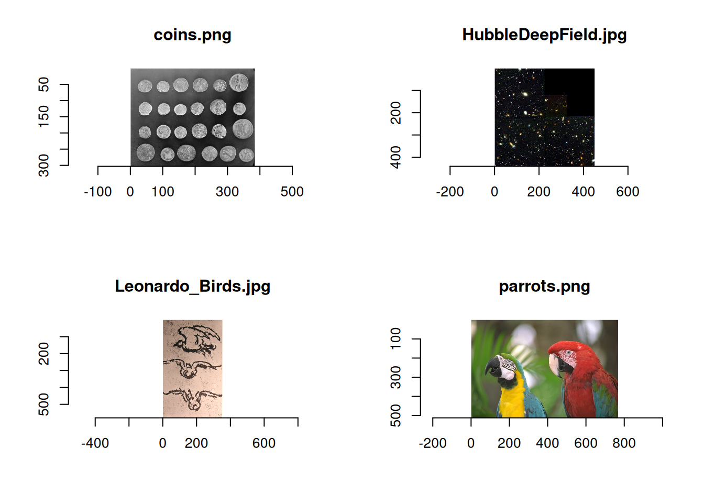
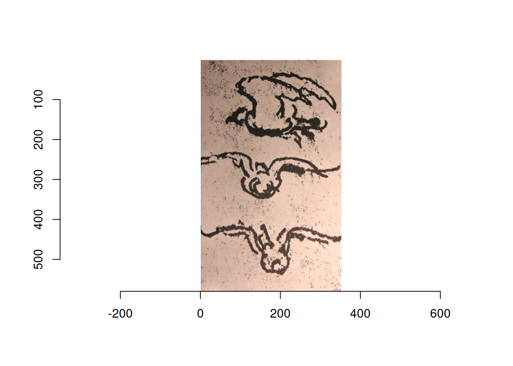
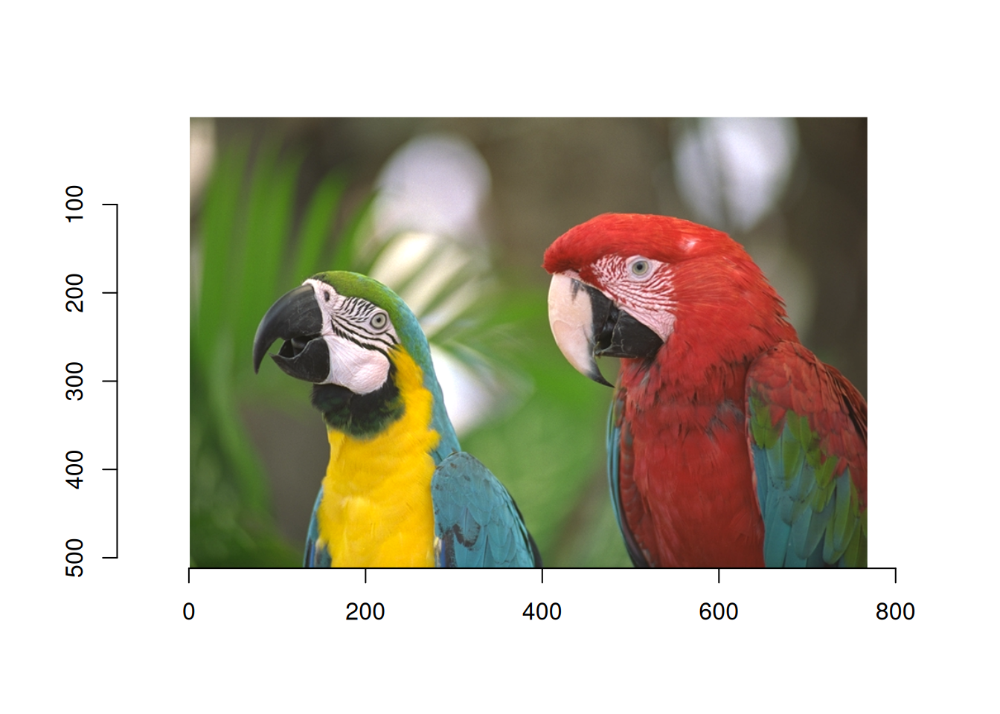
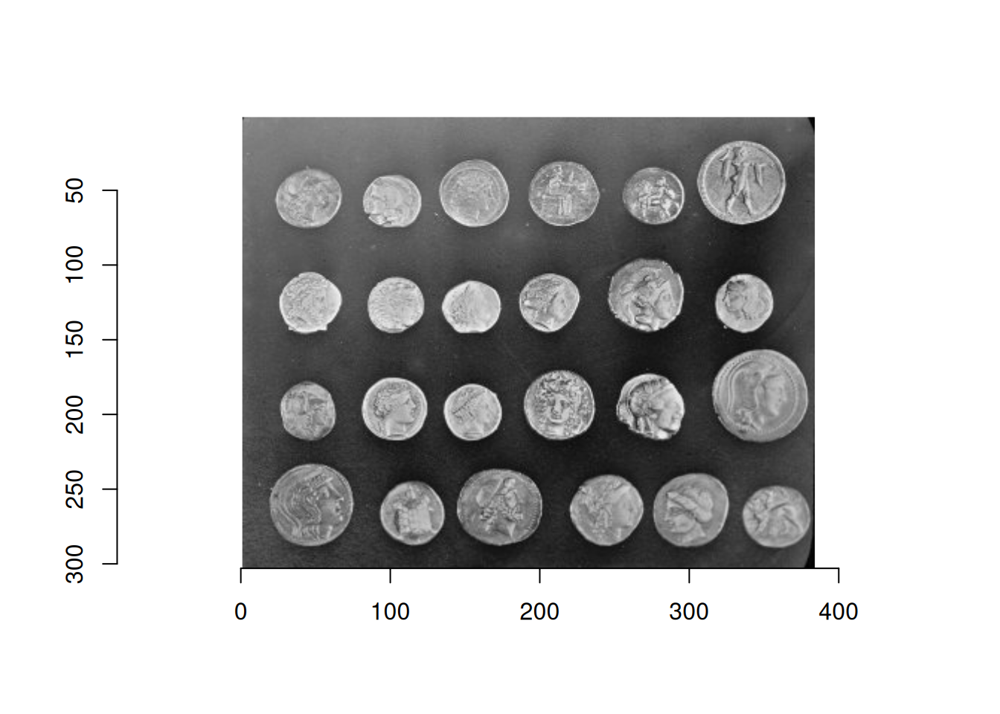
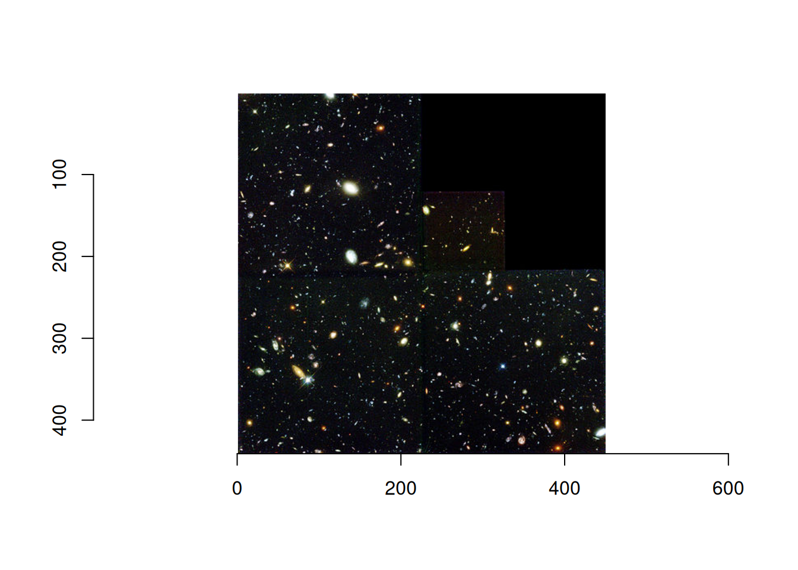
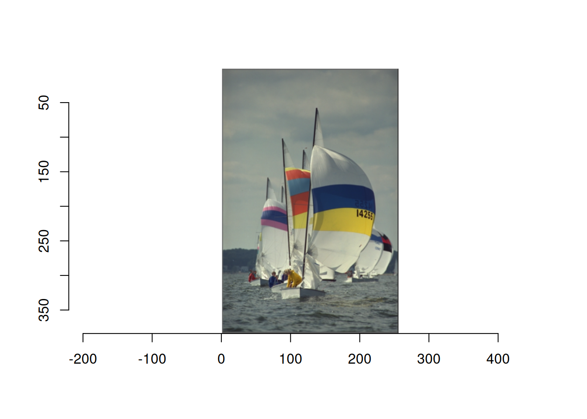
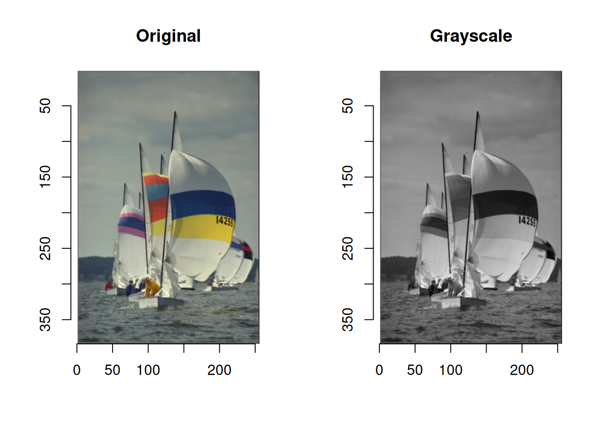

# 画像処理のためのRパッケージimagerの使い方

r

imagerパッケージについての基本的な使い方の紹介です

Published

2026-01-01

Modified

2026-01-01

# 概要

Rで画像解析をしたいとなったときに、[imager](https://asgr.github.io/imager/)というパッケージがあることを知った。 いろいろと試した結果を記す。

# パッケージの読み込み

インストールは普通に[`install.packages()`](https://rdrr.io/r/utils/install.packages.html)でOK。

``` downlit
install.packages("imager")
```

読み込みは以下のようにする。

``` downlit
library("imager")
```

# 画像の読み込みと表示

画像の読み込みには[`load.image()`](https://rdrr.io/pkg/imager/man/load.image.html)を使う。 サンプル画像が5枚(動画が1つ)用意されている。 サンプルの確認は以下のようにする。

``` downlit
list.files(system.file('extdata', package = 'imager'))
```

    [1] "coins.png"           "HubbleDeepField.jpg" "Leonardo_Birds.jpg" 
    [4] "parrots.png"         "tennis_sif.mp4"     

ボートのサンプル画像もあるのだが、ここには保存されていないようだ。

ちなみに、[`system.file()`](https://rdrr.io/r/base/system.file.html)は、指定したパッケージがパソコンのどこに保存されているかを返す関数らしい。`package='imager`でパッケージを指定して、第1引数の`extdata`でextra dataの保存場所を指定する。

今回はオウムのサンプル画像を読み込み、それを表示させる。 表示は通常の[`plot()`](https://rdrr.io/r/graphics/plot.default.html)でOK。

``` downlit
file <- system.file('extdata/parrots.png', package = 'imager')
img <- load.image(file)
plot(img)
```


複数枚の画像をまとめて読み込むには、[`load.dir()`](https://rdrr.io/pkg/imager/man/load.dir.html)を使う。

``` downlit
dir <- system.file('extdata/', package = 'imager')
list_img <- load.dir(dir)
plot(list_img)
```



サンプルではなく、自分の画像を表示させるときは、適切なパスを指定すればちゃんと読み込める。 [`load.dir()`](https://rdrr.io/pkg/imager/man/load.dir.html)の場合も同様。

``` downlit
file <- "/imagefile/hoge.jpg"
img <- load.image(file)
```

また、サンプルを読み込むときは、専用の関数がある。

``` downlit
# sketch of birds by Leonardo, from Wikimedia
plot(load.example("birds"))
```



``` downlit
# Parotts from Kodak
plot(load.example("parrots"))
```



``` downlit
# The "coins" image comes from scikit-image.
plot(load.example("coins"))
```



``` downlit
# The Hubble Deep field (hubble) is from Wikimedia.
plot(load.example("hubble"))
```



``` downlit
# Boats from Kodak
plot(boats)
```



ボートだけはそのまま読み込める。 なにか適当に試したいときはboatsが便利。

# 画像の情報確認

画像はcimgという形式で保存される。 コンソールにそのままオブジェクトを入力すると、基本情報が出力される。

``` downlit
boats
```

    Image. Width: 256 pix Height: 384 pix Depth: 1 Colour channels: 3 

`boats`は通常の画像形式で、幅256ピクセル、高さ384ピクセル、深さ1、チャンネル数が3となる。

ここで、深さはフレームのことであり、動画の場合は画像が連続するため、深さがフレーム数ということになる。

チャンネル数は色付き画像ならRGBの3になり、グレースケールなら1チャンネルとなる。

# グレースケール変換

グレースケール変換は[`grayscale()`](https://rdrr.io/pkg/imager/man/grayscale.html)で簡単にできる。

第2引数に`method`がある。 デフォルトは`"Luma"`となっており、この場合は輝度の線形近似によりグレースケール変換をおこなう。 他には`"XYZ"`をとることができるが、この場合は画像がsRGB色空間にあると想定され、CIE輝度 CIE luminanceが使われるとのこと。 特にこだわりがなければ、省略する。

意外と大事になるのが第3引数。 `drop=TRUE`となっている。 `TRUE`の場合は画像が1チャンネルで出力される。 `FALSE`の場合は3チャンネルが保持されたままグレースケールに変換される。 あとで色をつけたいときは`FALSE`にしておくと良いかもしれない。 基本的にはデフォルトのままにしておくと良いと思う。

``` downlit
img_gray <- grayscale(boats)
layout(matrix(c(1, 2), 1, 2, byrow = TRUE))
plot(boats, main = "Original")
plot(img_gray, main = "Grayscale")
```


