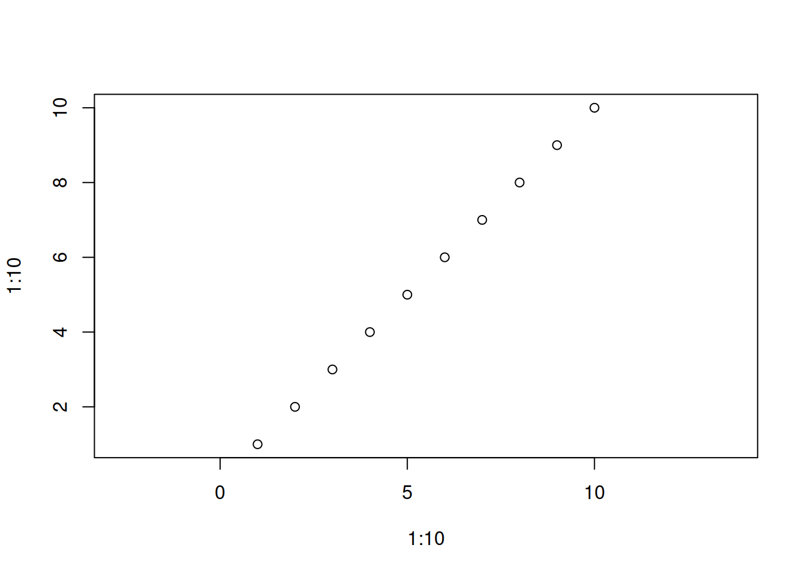
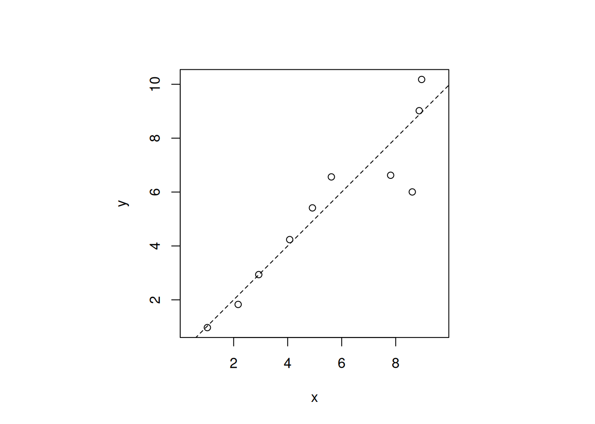

# Rのプロットのアスペクト比を設定する方法

r

`asp`パラメータを使ってRのプロットのアスペクト比を調整する方法についてです。

Published

2026-02-04

Modified

2026-02-04

Rのプロット関数(例えば[`plot()`](https://rdrr.io/r/graphics/plot.default.html))では、`asp`パラメータを使用してアスペクト比を設定できます。 アスペクト比は、y軸の単位長さがx軸の単位長さの何倍であるかを指定します。

## `asp`パラメータの使用例

[`plot()`](https://rdrr.io/r/graphics/plot.default.html)内に`asp`パラメータを指定することで、アスペクト比を調整できます。

``` downlit
plot(1:10, 1:10) # デフォルトのアスペクト比
```


``` downlit
plot(1:10, 1:10, asp = 1) # アスペクト比1:1
```



上記の例では、`asp = 1`と設定しているため、x軸とy軸の単位長さが等しくなります。 もし`asp = 2`と設定すると、y軸の単位長さがx軸の単位長さの2倍になります。

``` downlit
plot(1:10, 1:10, asp = 2)
```


## プロット領域も含めたアスペクト比の調整

これは、1:1プロットを作るときに便利です。 1:1の線を描画したい場合などに使用します。 このとき、プロット領域の形状によっては、実際の表示が正方形にならないことがあります。 その場合は、`par(pty = "s")`を使用してプロット領域を正方形に設定することもできます。

``` downlit
par(pty = "s") # プロット領域を正方形に設定

x <- rnorm(10, mean = 1, sd = 0.1) * 1:10
y <- rnorm(10, mean = 1, sd = 0.1) * 1:10

plot(x, y, asp = 1)
plot(x, y, asp = 1)
abline(0, 1, lty = 2)
```



``` downlit
par(pty = "m") # プロット領域を元に戻す
```

> **NOTE:**
>
> - [`rnorm()`](https://rdrr.io/r/stats/Normal.html): 正規分布に従う乱数を生成する関数です。ここでは、平均1、標準偏差0.1の乱数を生成しています。
> - `abline(0, 1, lty = 2)`: y = xの直線を破線で描画しています。`lty = 2`は破線を意味します。
