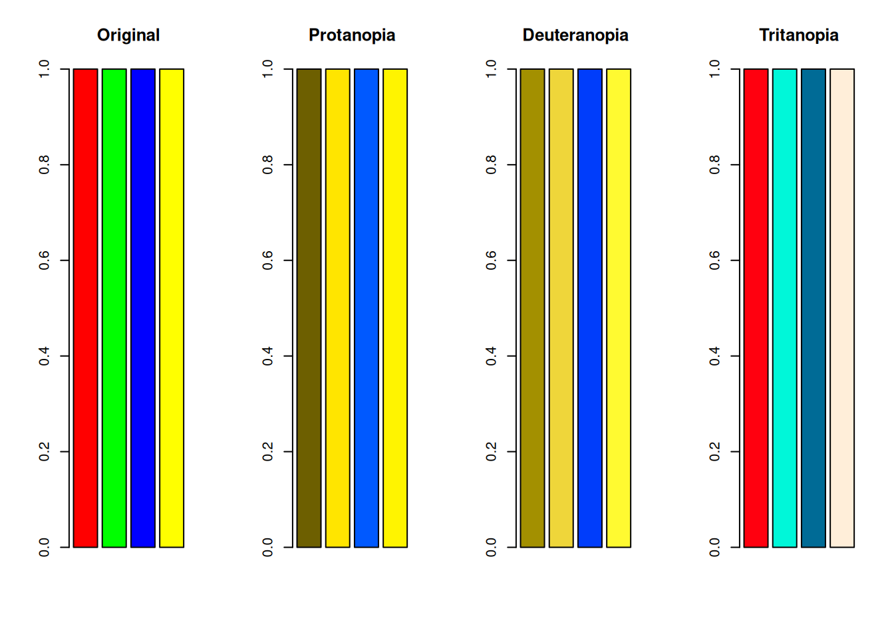
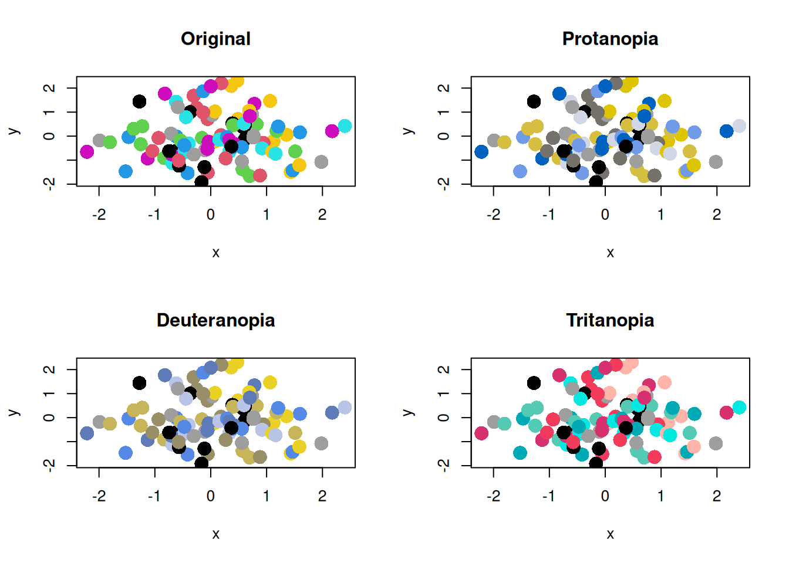
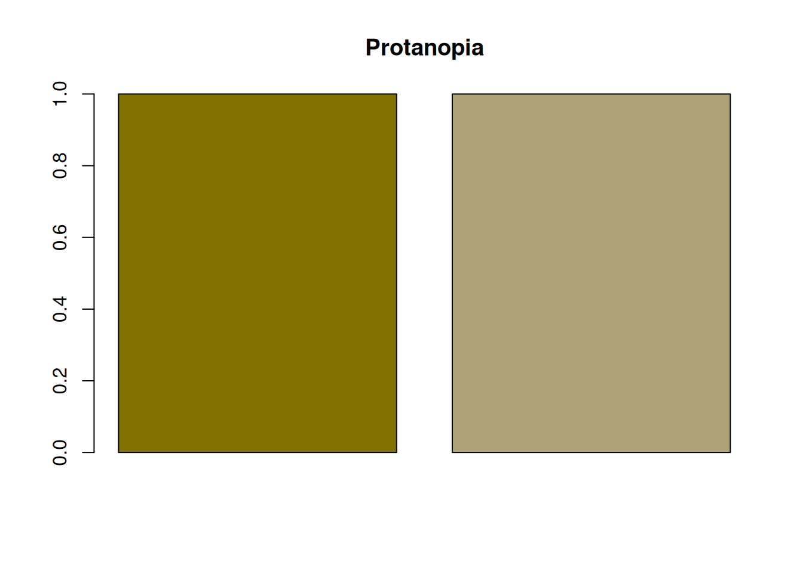
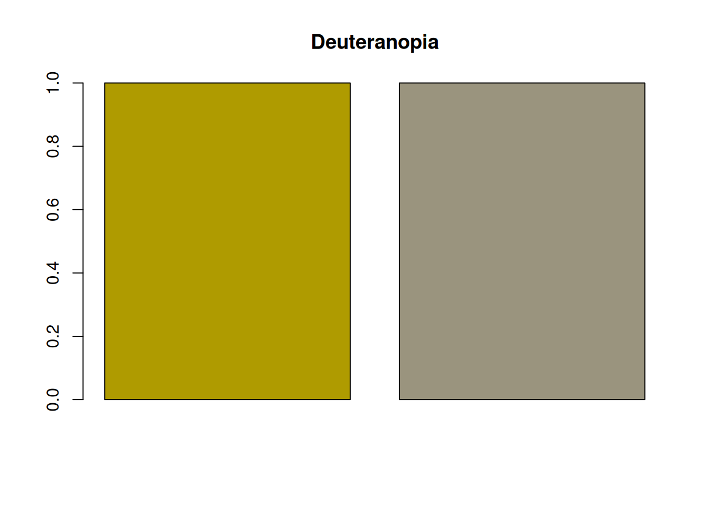

# Rで色覚異常のシミュレーションを行う方法

r

Rで`colorspace`パッケージを使って色覚異常のシミュレーションをする方法をまとめます

Published

2026-03-04

Modified

2026-03-04

## 色覚多様性

色の見え方には個人差があります。 特に、多くの人と大きく異なる見え方をする場合を「**色覚異常**」と呼びます。

> **NOTE:**
>
> かつては色覚異常は「色盲」と呼ばれていましたが、現在では「色覚異常」という呼び方が一般的になっています。 「盲」という字を使うことで、まったく色を識別できないという誤解を生む可能性があるためだと考えられます。 「色覚異常」自体は医学用語のようで、基本的には「色覚異常」や「色覚多様性」といった表現が好まれます。
>
> 様々な日本語が言葉狩りのように変わっているようにも思えますが、少なくとも聞いた相手が不快に感じないような表現を選ぶことは大切かもしれません。

> **NOTE:**
>
> 英語では、色覚異常は「color blindness」や「color vision deficiency」と呼ばれます。 論文などでは「color vision deficiency」という表現が一般的で、それぞれの単語をとってCVDと略されることが多いです。

## 色覚異常のタイプ

色覚異常には、主に以下のようなタイプがあります。

- **1型色覚** (Protanopia): 赤に感度をもつ錐体（L錐体）が欠けているタイプ。赤が暗く見え、赤と緑の区別が難しくなる。
- **2型色覚** (Deuteranopia): 緑に感度をもつ錐体（M錐体）が欠けているタイプ。赤と緑の区別が難しくなるが、明るさの変化は1型ほど大きくない。
- **3型色覚** (Tritanopia): 青に感度をもつ錐体（S錐体）が欠けているタイプ。 青と黄色などの区別が難しくなる。

色覚異常の多くは1型と2型であり、これらは赤と緑の識別に関係するため、 まとめて「赤緑色覚異常」と呼ばれることもあります。

また、すべての錐体が機能しない「全色盲（achromatopsia）」というタイプもありますが、これは非常に稀です。

## Rで色覚異常のシミュレーションを行う方法

Rの`colorspace`パッケージを使うと、色覚異常のシミュレーションを簡単に行うことができます。 インストールされていなかったら、以下のコードを実行してインストールしてください。 その後、`library(colorspace)`でパッケージを読み込みます。

``` r
# install.packages("colorspace") もしインストールされていなかったら
# renv::install("colorspace") renvを使っている場合
library(colorspace)
```

色のベクトルを用意し、`deutan()` (2型色覚), `protan()` (1型色覚), `tritan()` (3型色覚)を使って、色覚異常のシミュレーションを行います。

``` r
colors <- c("red", "green", "blue", "yellow") # 赤、緑、青、黄の色ベクトル
colors_protan <- protan(colors) # 1型色覚のシミュレーション
colors_deutan <- deutan(colors) # 2型色覚のシミュレーション
colors_tritan <- tritan(colors) # 3型色覚のシミュレーション
```

> **NOTE:**
>
> シミュレーションの関数には、`severity`という引数があります。 デフォルトでは`severity = 1`となっており、完全な色覚異常のシミュレーションが行われます。 この引数を0から1の範囲で調整することで、色覚異常の程度をシミュレーションすることができます。

プロットしてみます。

``` r
par(mfrow = c(1, 4))
barplot(rep(1, length(colors)), col = colors, main = "Original")
barplot(rep(1, length(colors_protan)), col = colors_protan, main = "Protanopia")
barplot(
  rep(1, length(colors_deutan)),
  col = colors_deutan,
  main = "Deuteranopia"
)
barplot(
  rep(1, length(colors_tritan)),
  col = colors_tritan,
  main = "Tritanopia"
)
```



ProtanopiaとDeuteranopiaは、赤と緑の区別が難しくなっていることがわかります。 また、黄色は赤と緑の混合色であるため、ProtanopiaとDeuteranopiaの両方で、黄色も赤や緑と区別が難しくなっています。

Tritanopiaは、青と黄色の区別が難しくなるといわれますが、S錐体が欠けるため、青・シアン・緑の区別も弱くなる場合があります。 緑と青が区別しにくくなっていることがわかります。

棒グラフだとまだわかりにくいかもしれませんが、プロットの点が多い場合などは致命的な問題になることもあります。

``` r
set.seed(1)
x <- rnorm(100)
y <- rnorm(100)
par(mfrow = c(2, 2))
plot(x, y, col = colors, pch = 16, cex = 2, main = "Original")
plot(x, y, col = colors_protan, pch = 16, cex = 2, main = "Protanopia")
plot(x, y, col = colors_deutan, pch = 16, cex = 2, main = "Deuteranopia")
plot(x, y, col = colors_tritan, pch = 16, cex = 2, main = "Tritanopia")
```


Rのバージョン4以降のデフォルトカラーパレットでも検証してみます。

``` r
colors_default <- palette() # Rのデフォルトカラーパレット
colors_default_protan <- protan(colors_default)
colors_default_deutan <- deutan(colors_default)
colors_default_tritan <- tritan(colors_default)

par(mfrow = c(1, 4))
barplot(rep(1, length(colors_default)), col = colors_default, main = "Original")
barplot(
  rep(1, length(colors_default_protan)),
  col = colors_default_protan,
  main = "Protanopia"
)
barplot(
  rep(1, length(colors_default_deutan)),
  col = colors_default_deutan,
  main = "Deuteranopia"
)
barplot(
  rep(1, length(colors_default_tritan)),
  col = colors_default_tritan,
  main = "Tritanopia"
)
```


``` r
par(mfrow = c(2, 2))
plot(x, y, col = colors_default, pch = 16, cex = 2, main = "Original")
plot(x, y, col = colors_default_protan, pch = 16, cex = 2, main = "Protanopia")
plot(
  x,
  y,
  col = colors_default_deutan,
  pch = 16,
  cex = 2,
  main = "Deuteranopia"
)
plot(
  x,
  y,
  col = colors_default_tritan,
  pch = 16,
  cex = 2,
  main = "Tritanopia"
)
```



## 色覚多様性への配慮

### カラーパレットを選ぶ際の注意点

色覚異常の人にとって、特定の色の組み合わせは区別が難しいことがあります。 このような問題を避けるためには、色覚異常の人にも区別しやすいカラーパレットを選ぶことが重要です。 一番簡単な方法は、`palette("Okabe-Ito")`のような、色覚異常の人にも区別しやすいカラーパレットを使用することです。 このカラーパレットは、色覚異常の人にも区別しやすい色の組み合わせが選ばれています。

``` r
colors_okabe_ito <- palette("Okabe-Ito")
colors_okabe_ito_protan <- protan(colors_okabe_ito)
colors_okabe_ito_deutan <- deutan(colors_okabe_ito)
colors_okabe_ito_tritan <- tritan(colors_okabe_ito)
par(mfrow = c(1, 4))
barplot(
  rep(1, length(colors_okabe_ito)),
  col = colors_okabe_ito,
  main = "Original"
)
barplot(
  rep(1, length(colors_okabe_ito_protan)),
  col = colors_okabe_ito_protan,
  main = "Protanopia"
)
barplot(
  rep(1, length(colors_okabe_ito_deutan)),
  col = colors_okabe_ito_deutan,
  main = "Deuteranopia"
)
barplot(
  rep(1, length(colors_okabe_ito_tritan)),
  col = colors_okabe_ito_tritan,
  main = "Tritanopia"
)
```


散布図は以下のようになります。

``` r
par(mfrow = c(2, 2))
plot(x, y, col = colors_okabe_ito, pch = 16, cex = 2, main = "Original")
plot(
  x,
  y,
  col = colors_okabe_ito_protan,
  pch = 16,
  cex = 2,
  main = "Protanopia"
)
plot(
  x,
  y,
  col = colors_okabe_ito_deutan,
  pch = 16,
  cex = 2,
  main = "Deuteranopia"
)
plot(
  x,
  y,
  col = colors_okabe_ito_tritan,
  pch = 16,
  cex = 2,
  main = "Tritanopia"
)
```


### 色覚異常の人にとって重要な情報を色以外の方法で伝える

色覚異常の人にとって、色だけで情報を伝えるのは難しいことがあります。 そのため、色覚異常の人にとって重要な情報を色以外の方法で伝えることも重要です。

例えば、グラフの点の形を変える、線の種類を変える、テキストで説明するなどの方法があります。 個人的には、`pch`引数を使って点の形を変える方法が簡単で効果的だと思い、よく利用しています。

``` r
set.seed(1)
x_circle <- rnorm(100)
y_circle <- rnorm(100)
x_square <- rnorm(100)
y_square <- rnorm(100)
par(mfrow = c(1, 1))
plot(
  x_circle,
  y_circle,
  col = protan(2),
  pch = 16,
  cex = 2
)
points(
  x_square,
  y_square,
  col = protan(3),
  pch = 15,
  cex = 2
)
```


## 明度差を確保する

赤と緑の区別が難しい場合でも、明度差があれば区別しやすくなります。 例えば、以下のような赤と緑の組み合わせは、明度差が小さいため、protanopiaやdeuteranopiaの人にとって区別が難しいです。

``` r
colors <- c("#932922", "#526907")
colors_protan <- protan(colors)
colors_deutan <- deutan(colors)
barplot(rep(1, length(colors)), col = colors, main = "Original")
```


``` r
barplot(rep(1, length(colors_protan)), col = colors_protan, main = "Protanopia")
```


``` r
barplot(
  rep(1, length(colors_deutan)),
  col = colors_deutan,
  main = "Deuteranopia"
)
```


一方、以下のような赤と緑の組み合わせは、明度差が大きいため、protanopiaやdeuteranopiaの人にとって区別しやすいです。

``` r
colors <- c("#FF4B00", "#03AF7A")
colors_protan <- protan(colors)
colors_deutan <- deutan(colors)
barplot(rep(1, length(colors)), col = colors, main = "Original")
```


``` r
barplot(rep(1, length(colors_protan)), col = colors_protan, main = "Protanopia")
```



``` r
barplot(
  rep(1, length(colors_deutan)),
  col = colors_deutan,
  main = "Deuteranopia"
)
```



それでも、色覚異常の人にとっては、多くの人よりも区別は難しいため、明度差だけに頼るのではなく、色以外の方法も併用することが重要です。

また、明度差を確保することは、グレースケール印刷の面でも重要です。 明度差が小さいと、色覚多様性に関係なく、グレースケール印刷の際に区別が難しくなります。 そのような意味でも明度差に配慮することは重要です。
