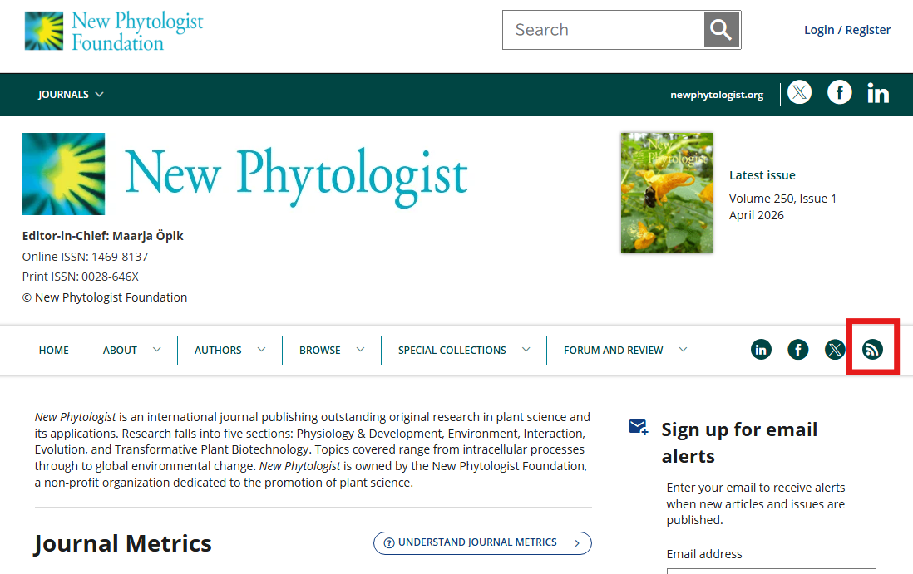
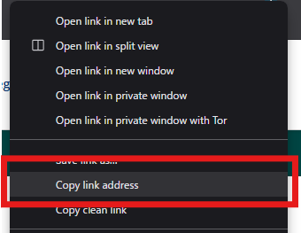
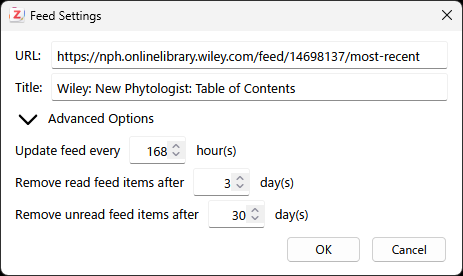
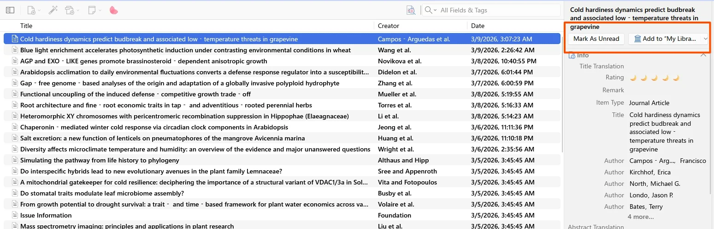

## Zoteroとは

Zoteroは、文献管理ツールの一つで、論文や書籍などの情報を整理するために広く使用されています。

## RSSフィードとは

RSSフィードは、ウェブサイトの更新情報を配信するためのフォーマットで、ユーザーが特定のウェブサイトの更新情報を受け取ることができます。
今回の場合は、論文雑誌のRSSフィードを作成することで、新しい論文が公開されたときに通知を受け取ることができます。

## 方法

### ジャーナルのRSSフィードを見つける

多くのジャーナルは、ウェブサイト上でRSSフィードを提供しています。
例えば、[New Phytologist](https://nph.onlinelibrary.wiley.com/journal/14698137)のHPに行ってみます。

右側に、RSSフィードのアイコンがあるので、これを右クリックします。

右クリックメニュー(コンテキストメニュー)が表示されるため、「リンクのアドレスをコピー (Copy link address)」を選択します。

## ZoteroでRSSフィードを購読する

Zoteroを開き、[File] > [New Feed] > [From URL...]を選択します。

現れたダイアログのURLの欄に、先ほどコピーしたRSSフィードのURLを貼り付けます。
もしRSSフィードのURLが正しい場合は、Titleの欄にジャーナルの名前が自動的に入力されます。

Advanced Optionsの欄は、以下のようになっています。

- フィードの更新頻度 (デフォルトは168時間、つまり1週間)
- 既読のフィードのアイテムを削除する間隔 (デフォルトでは3日)
- 未読のフィードのアイテムを削除する間隔 (デフォルトでは30日)

私は以下のように設定を変更しました。

- Title: New Phytologist (ジャーナル名のみ)
- フィードの更新頻度: 24時間 (毎日更新を確認するように設定)

そのほかはデフォルトのままです。

設定が完了したら、[OK]をクリックします。

左側のサイドバーにFeedsという項目ができ、その中にNew Phytologistというフィードが追加されていれば成功です。

## フィードアイテムを確認する

Feedsの欄からフィードアイテムを確認したいジャーナルを選択します。
中央のペインにフィードアイテムのリストが表示されます。

カーソルを合わせるとRead(既読)になり、行のフォントが太字から通常のものに変わります。
アイテムをダブルクリックすると、ジャーナルのウェブサイトにアクセスできます。

右側のペインでは、書誌情報が確認できるほか、[Mark As Unread]や[Mark As Read]をクリックして、アイテムの既読/未読を切り替えることができます。
[Add to "My Library..."]をクリックすると、任意のライブラリにアイテムを追加することができます。

一気にジャーナルごとに既読にしたい場合は、Feedsの欄のジャーナル名を右クリックして、**[Mark Feed as Read]**を選択します。

## まとめ

Zoteroを使って、ジャーナルのRSSフィードを購読する方法についてまとめました。
私はこれまで、RSSリーダーを使ってジャーナルの更新情報を確認していましたが、Zoteroを使うことで、フィードアイテムを簡単にライブラリに追加したり、書誌情報を管理したりすることができるようになりました。

漏れている機能などありましたら、追記したいと思います。