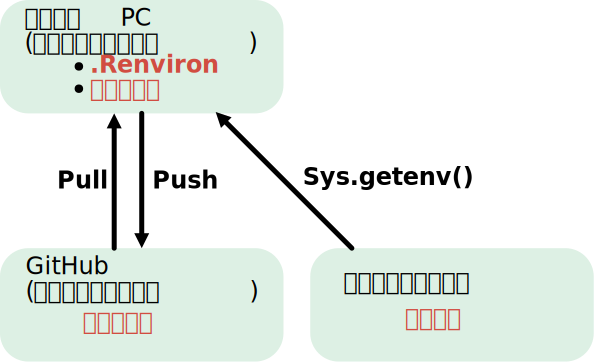

解析の生データをクラウドストレージから読み込む方法を紹介します。

この記事では、以下のような管理方法を前提とします。

- 解析の生データ: クラウドストレージ（[Google Drive](https://workspace.google.com/products/drive/)、[OneDrive(https://www.microsoft.com/en-us/microsoft-365/onedrive/online-cloud-storage)]、[Dropbox](https://www.dropbox.com/)など）に保存  
- 解析コード: [GitHub](https://github.com/)などのソースコード管理サービスに保存

このように分けることで、データとコードを分離して管理できます。
また、生データを Git管理下に置かなくても、クラウドストレージを使ってバックアップや共有をしやすくなります。

ただし、この方法はクラウドストレージそのものに依存するのではなく、**R から通常のファイルパスとして参照できる場所にデータがあること**を前提としています。
たとえば Google Drive for desktop や OneDrive、Dropbox などを使えば、クラウド上のデータをローカルのファイルと同じように扱うことができます。

概念図を示すと、以下のようになります。



## `.Renviron`ファイルの作成

解析コードをGit管理しつつ、データの保存場所をローカル環境ごとに切り替えたい場合は、`.Renviron`ファイルに環境変数として保存先を定義しておくと便利です。

たとえば、以下のように設定します。

```{.text filename=".Renviron"}
PROJECT_DATA_DIR=C:/Users/Username/Dropbox/GitHub/repository-name
```

## データの読み込み

`.Renviron`に環境変数を設定しておけば、Rでは`Sys.getenv()`を使ってその値を取得できます。

```{.r}
data_dir <- Sys.getenv("PROJECT_DATA_DIR")
```

このようにして取得したパスを使えば、クラウドストレージ上にあるデータを、ディレクトリ構造を保ったまま読み込めます。

必要に応じて、設定が存在するか確認しておくと安全です。

```{.r}
data_dir <- Sys.getenv("PROJECT_DATA_DIR")

if (identical(data_dir, "")) {
  stop("PROJECT_DATA_DIR is not set.")
}
```

::: {.callout-warning}
`.Renviron` ファイルを新しく作成・編集した場合は、**Rセッションを再起動して反映**させてください。
:::

## `.Renviron`ファイル使う際の注意点

### 保存場所

`.Renviron` は、**このプロジェクト専用の設定として使うなら、プロジェクトのルートディレクトリに置く**とわかりやすいです。  
一方で、複数のプロジェクトで共通して使いたい設定は、ユーザー単位の `.Renviron` に書く方法もあります。

### パスの書き方

`.Renviron` には、**絶対パス**を書いておくのが安全です。

### Gitで管理しない

`.Renviron` は、通常は **Git 管理下に置かない**方がよいです。  
そのため、`.gitignore` に `.Renviron` を追加して、誤ってコミットしないようにしておきます。

```{.text filename=".gitignore"}
.Renviron
```

ただし、`.gitignore` は未追跡ファイルを無視するための設定です。  
すでに Git にコミット済みの `.Renviron` には、そのままでは効果がありません。  
誤って追跡してしまった場合は、別途 Git 側で追跡対象から外す必要があります。

### 共有方法

`.Renviron` は各自のローカル環境で作成することになるため、リポジトリには含めません。  
その代わり、`README.md` などに `.Renviron` の作成方法を記載しておくと、共同研究者や将来の自分が環境を再構築しやすくなります。

## まとめ

生データをクラウドストレージに置き、解析コードをGitHubで管理し、両者を`.Renviron`の環境変数でつなぐことで、データとコードを分離しつつ、再現性のある解析環境を作ることができます。

クラウドストレージ上のデータをRから通常のファイルパスとして参照できる環境であれば、この方法は比較的簡単に導入できます。

## なぜこの方法をまとめたか

余談ですが、この方法は、私が最近のプロジェクトで実際に採用している管理方法です。
経緯としては、Cドライブ直下にGitHubフォルダを作り、そこにデータをすべて入れていたのですが、ある日そのPCが起動しなくなってしまい、データを失いかけました。

そこで、データはクラウドストレージに置いておき、コードはGitHubで管理する方法に切り替えました。
バックアップの重要性を痛感した経験から、データとコードの管理方法を見直すことにしました。
