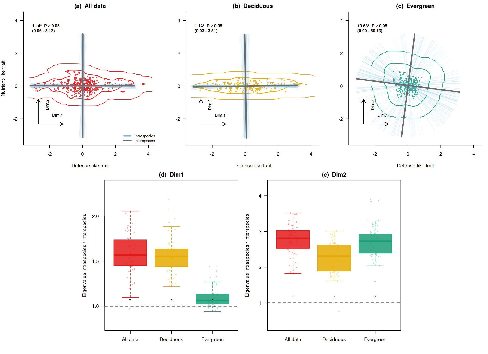

# RでPrincipal axis regressionを実装してみる

r

Principal axis regressionの実装方法について説明します

Published

2026-05-26

Modified

2026-05-26

Principal axis regression (PAR)は、主成分分析と似たような手法であり、データの主要な変動方向を捉えるために使用されます ([Bueno et al. 2023](#ref-bueno2023))。

## Principal axis regressionの概要

Principal axis regressionは、データの共分散行列を計算し、その固有値と固有ベクトルを求めることで、データの主要な変動方向を特定します。これにより、次元削減や特徴抽出が可能になります。

## Rでの実装

### データを作る

[`rnorm()`](https://rdrr.io/r/stats/Normal.html)関数を使用して、正規分布に従う乱数を生成し、2次元のデータセットを作成します。 このデータセットは、2つのグループ（落葉樹っぽいグループと常緑樹っぽいグループ）を含み、各グループ内で種ごとに個体値がばらつくように設計されています。

``` downlit
set.seed(123)

sim_group <- function(
  group,
  n_species = 40,
  n_ind = 5,
  sp_sd_x,
  sp_sd_y,
  ind_sd_x,
  ind_sd_y
) {
  out <- list()

  for (i in seq_len(n_species)) {
    sp <- paste0(group, "_sp", i)

    # 種平均
    sp_mean_x <- rnorm(1, mean = 0, sd = sp_sd_x)
    sp_mean_y <- rnorm(1, mean = 0, sd = sp_sd_y)

    # 個体値
    x <- sp_mean_x + rnorm(n_ind, mean = 0, sd = ind_sd_x)
    y <- sp_mean_y + rnorm(n_ind, mean = 0, sd = ind_sd_y)

    out[[i]] <- data.frame(
      group = group,
      species = sp,
      individual = seq_len(n_ind),
      x = x,
      y = y
    )
  }

  do.call(rbind, out)
}

# 落葉樹っぽい：個体差は大きいが、主にx方向
dat_D <- sim_group(
  group = "D",
  n_species = 40,
  n_ind = 5,
  sp_sd_x = 1.0,
  sp_sd_y = 0.15,
  ind_sd_x = 0.8,
  ind_sd_y = 0.15
)

# 常緑樹っぽい：全体のばらつきは小さめだが、個体差がy方向に効く
dat_E <- sim_group(
  group = "E",
  n_species = 40,
  n_ind = 5,
  sp_sd_x = 0.45,
  sp_sd_y = 0.05,
  ind_sd_x = 0.08,
  ind_sd_y = 0.35
)

dat <- rbind(dat_D, dat_E)
```

### 相関を確認する

それぞれのグループ内で、xとyの相関を確認してみましょう。 相関が小さいことを確認できます。

``` downlit
tapply(seq_len(nrow(dat)), dat$group, function(i) {
  cor(dat$x[i], dat$y[i])
})
```

              D           E 
     0.06807858 -0.09470179 

### principal axis を求める関数

``` downlit
principal_axis <- function(x, y) {
  X <- cbind(x, y)
  S <- cov(X)
  eg <- eigen(S)

  vectors <- eg$vectors

  # 表示を安定させるため、x方向が正になるようにそろえる
  for (j in seq_len(ncol(vectors))) {
    if (vectors[1, j] < 0) {
      vectors[, j] <- -vectors[, j]
    }
  }

  v1 <- vectors[, 1]

  list(
    covariance = S,
    eigenvalues = eg$values,
    vectors = vectors,
    first_vector = v1,
    first_eigenvalue = eg$values[1],
    center = colMeans(X),
    angle_from_x = atan2(v1[2], v1[1]) * 180 / pi
  )
}

angle_between_axes <- function(v1, v2) {
  cos_angle <- abs(sum(v1 * v2) / sqrt(sum(v1^2) * sum(v2^2)))
  acos(cos_angle) * 180 / pi
}
```

principal_axis() は、要するに以下の処理を行っています。

``` downlit
eigen(cov(cbind(x, y)))
```

### 種平均の trait space を作る

論文では、mean–variance effect を避けるために log変換後の中央値を使っているようですが、今回は単純に中央値をとってみます。

``` downlit
species_med <- aggregate(
  cbind(x, y) ~ group + species,
  data = dat,
  FUN = median
)
head(species_med)
```

      group species           x           y
    1     D   D_sp1 -0.19174268 -0.10137592
    2     D  D_sp10 -0.42467609  0.04174359
    3     D  D_sp11 -0.08722716 -0.13042706
    4     D  D_sp12  0.63319093 -0.27995850
    5     D  D_sp13 -1.05120276 -0.09755387
    6     D  D_sp14  0.26332485 -0.01113167

### 種平均ベースの主軸 interspecific axis

``` downlit
pa_inter_D <- with(
  subset(species_med, group == "D"),
  principal_axis(x, y)
)

pa_inter_E <- with(
  subset(species_med, group == "E"),
  principal_axis(x, y)
)

pa_inter_D$angle_from_x
```

    [1] 0.8899684

``` downlit
pa_inter_E$angle_from_x
```

    [1] -7.356261

これが、論文でいう interspecific eigenvector に相当します。

### 各種から1個体ずつランダムに選ぶ

論文では、種ごとのサンプル数の不均衡を避けるため、各反復で「各種から1個体」を選び、これを50回繰り返しています。

``` downlit
sample_one_per_species <- function(d) {
  sp_list <- split(d, d$species)

  sampled <- lapply(sp_list, function(z) {
    z[sample(seq_len(nrow(z)), 1), ]
  })

  do.call(rbind, sampled)
}
```

### 50回リサンプリングして rotation angle を計算する

``` downlit
run_resampling <- function(dat_group, species_med_group, n_iter = 50) {
  pa_inter <- principal_axis(
    species_med_group$x,
    species_med_group$y
  )

  angles <- numeric(n_iter)
  eig_ratio_dim1 <- numeric(n_iter)
  eig_ratio_dim2 <- numeric(n_iter)
  axes <- vector("list", n_iter)
  samples <- vector("list", n_iter)

  for (i in seq_len(n_iter)) {
    sampled <- sample_one_per_species(dat_group)

    pa_intra <- principal_axis(
      sampled$x,
      sampled$y
    )

    angles[i] <- angle_between_axes(
      pa_inter$first_vector,
      pa_intra$first_vector
    )

    eig_ratio_dim1[i] <- pa_intra$eigenvalues[1] /
      pa_inter$eigenvalues[1]

    eig_ratio_dim2[i] <- pa_intra$eigenvalues[2] /
      pa_inter$eigenvalues[2]

    axes[[i]] <- pa_intra
    samples[[i]] <- sampled
  }

  list(
    pa_inter = pa_inter,
    angles = angles,
    eig_ratio = eig_ratio_dim1,
    eig_ratio_dim1 = eig_ratio_dim1,
    eig_ratio_dim2 = eig_ratio_dim2,
    axes = axes,
    samples = samples
  )
}

res_all <- run_resampling(
  dat_group = dat,
  species_med_group = species_med,
  n_iter = 50
)

res_D <- run_resampling(
  dat_group = subset(dat, group == "D"),
  species_med_group = subset(species_med, group == "D"),
  n_iter = 50
)

res_E <- run_resampling(
  dat_group = subset(dat, group == "E"),
  species_med_group = subset(species_med, group == "E"),
  n_iter = 50
)
```

### 結果の確認

``` downlit
summary(res_all$angles)
```

        Min.  1st Qu.   Median     Mean  3rd Qu.     Max. 
    0.002421 0.460764 0.900226 1.138809 1.781228 3.882295 

``` downlit
summary(res_D$angles)
```

        Min.  1st Qu.   Median     Mean  3rd Qu.     Max. 
    0.003014 0.465808 0.906245 1.144036 1.591228 4.500748 

``` downlit
summary(res_E$angles)
```

       Min. 1st Qu.  Median    Mean 3rd Qu.    Max. 
     0.4565  8.9944 15.0752 19.6266 26.8715 80.2831 

``` downlit
summary(res_all$eig_ratio_dim1)
```

       Min. 1st Qu.  Median    Mean 3rd Qu.    Max. 
     0.9727  1.4537  1.5667  1.5778  1.7351  2.0567 

``` downlit
summary(res_D$eig_ratio_dim1)
```

       Min. 1st Qu.  Median    Mean 3rd Qu.    Max. 
      1.054   1.442   1.554   1.557   1.633   2.188 

``` downlit
summary(res_E$eig_ratio_dim1)
```

       Min. 1st Qu.  Median    Mean 3rd Qu.    Max. 
     0.9387  1.0238  1.0641  1.1008  1.1334  1.4466 

``` downlit
summary(res_all$eig_ratio_dim2)
```

       Min. 1st Qu.  Median    Mean 3rd Qu.    Max. 
      1.821   2.554   2.811   2.764   3.018   3.513 

``` downlit
summary(res_D$eig_ratio_dim2)
```

       Min. 1st Qu.  Median    Mean 3rd Qu.    Max. 
     0.7543  1.8854  2.3103  2.2677  2.6144  3.0142 

``` downlit
summary(res_E$eig_ratio_dim2)
```

       Min. 1st Qu.  Median    Mean 3rd Qu.    Max. 
      1.597   2.399   2.730   2.729   2.922   3.901 

### Fig. 4 のようにまとめて描く

Zhou et al. ([2025](#ref-zhou2025)) のFig. 4では、上段でtrait spaceの回転、下段でinterspecificな固有値に対するintraspecificな固有値の比を示しています。 ここでも同じ構成で、全データ、落葉樹っぽいグループ、常緑樹っぽいグループを並べてみます。

``` downlit
cols <- c(
  all = "#e41a1c",
  D = "#e6ab02",
  E = "#1b9e77",
  intra = "#6bb7de",
  inter = "#6b6b6b"
)

draw_axis <- function(pa, dim = 1, len = 2, col = "black", lwd = 3, lty = 1) {
  c0 <- pa$center
  v <- pa$vectors[, dim]

  segments(
    x0 = c0[1] - len * v[1],
    y0 = c0[2] - len * v[2],
    x1 = c0[1] + len * v[1],
    y1 = c0[2] + len * v[2],
    col = col,
    lwd = lwd,
    lty = lty
  )
}

draw_density <- function(x, y, col, xlim, ylim) {
  if (!requireNamespace("MASS", quietly = TRUE)) {
    return(invisible(NULL))
  }

  dens <- MASS::kde2d(x, y, n = 80, lims = c(xlim, ylim))
  z <- as.vector(dens$z)
  z <- z[z > 0]

  contour(
    dens,
    add = TRUE,
    levels = quantile(z, probs = c(0.75, 0.9), names = FALSE),
    drawlabels = FALSE,
    col = col,
    lwd = c(1, 1.4)
  )
}

draw_dim_arrows <- function(xlim, ylim) {
  x0 <- xlim[1] + 0.08 * diff(xlim)
  y0 <- ylim[1] + 0.13 * diff(ylim)
  x1 <- x0 + 0.20 * diff(xlim)
  y1 <- y0 + 0.20 * diff(ylim)

  arrows(x0, y0, x1, y0, length = 0.08, lwd = 1.4)
  arrows(x0, y0, x0, y1, length = 0.08, lwd = 1.4)
  text(x1, y0 + 0.06 * diff(ylim), "Dim.1", cex = 0.85, adj = c(1, 0))
  text(x0 + 0.06 * diff(xlim), y1, "Dim.2", cex = 0.85, srt = 90, adj = c(1, 1))
}

angle_label <- function(angles) {
  ci <- quantile(angles, probs = c(0.025, 0.975), names = FALSE)
  p_text <- if (ci[1] > 0) "P < 0.05" else "n.s."

  sprintf(
    "%.2f°  %s\n(%.2f - %.2f)",
    mean(angles),
    p_text,
    ci[1],
    ci[2]
  )
}

plot_trait_panel <- function(
  dat_group,
  res,
  main,
  panel,
  col,
  xlim,
  ylim,
  show_y_label = FALSE,
  show_legend = FALSE
) {
  plot(
    dat_group$x,
    dat_group$y,
    pch = 16,
    cex = 0.65,
    col = adjustcolor(col, alpha.f = 0.8),
    xlim = xlim,
    ylim = ylim,
    asp = 1,
    xlab = "Defense-like trait",
    ylab = if (show_y_label) "Nutrient-like trait" else "",
    main = paste0("(", panel, ")  ", main),
    bty = "l",
    las = 1
  )

  draw_density(
    dat_group$x,
    dat_group$y,
    col = col,
    xlim = xlim,
    ylim = ylim
  )

  axis_len <- 0.42 * min(diff(xlim), diff(ylim))

  for (pa in res$axes) {
    draw_axis(
      pa,
      dim = 1,
      len = axis_len,
      col = adjustcolor(cols["intra"], alpha.f = 0.16),
      lwd = 1
    )
    draw_axis(
      pa,
      dim = 2,
      len = axis_len,
      col = adjustcolor(cols["intra"], alpha.f = 0.08),
      lwd = 1
    )
  }

  draw_axis(res$pa_inter, dim = 1, len = axis_len, col = cols["inter"], lwd = 3)
  draw_axis(res$pa_inter, dim = 2, len = axis_len, col = cols["inter"], lwd = 3)
  draw_dim_arrows(xlim, ylim)

  text(
    xlim[1] + 0.03 * diff(xlim),
    ylim[2] - 0.06 * diff(ylim),
    angle_label(res$angles),
    adj = c(0, 1),
    cex = 0.85,
    font = 2
  )

  if (show_legend) {
    legend(
      "bottomright",
      legend = c("Intraspecies", "Interspecies"),
      col = c(cols["intra"], cols["inter"]),
      lwd = c(3, 3),
      bty = "n",
      cex = 0.8
    )
  }
}

plot_ratio_panel <- function(values, panel, main, colors, ylim = NULL) {
  if (is.null(ylim)) {
    ylim <- range(c(unlist(values), 1))
    ylim <- ylim + c(-0.12, 0.12) * diff(ylim)
  }

  boxplot(
    values,
    names = c("All data", "Deciduous", "Evergreen"),
    col = adjustcolor(colors, alpha.f = 0.85),
    border = colors,
    outline = FALSE,
    ylim = ylim,
    ylab = "Eigenvalue intraspecies / interspecies",
    main = paste0("(", panel, ")  ", main),
    las = 1
  )

  for (i in seq_along(values)) {
    stripchart(
      values[[i]],
      at = i,
      vertical = TRUE,
      method = "jitter",
      jitter = 0.12,
      pch = 16,
      cex = 0.6,
      col = adjustcolor(colors[i], alpha.f = 0.35),
      add = TRUE
    )
  }

  abline(h = 1, lty = 2, lwd = 1.4)
  text(seq_along(values), rep(1, length(values)), "*", pos = 3, cex = 1.2)
}

plot_cols <- c(cols["all"], cols["D"], cols["E"])
lim <- range(c(dat$x, dat$y))
lim <- lim + c(-0.08, 0.08) * diff(lim)

old_par <- par(no.readonly = TRUE)

layout(
  matrix(
    c(1, 1, 2, 2, 3, 3, 0, 4, 4, 5, 5, 0),
    nrow = 2,
    byrow = TRUE
  ),
  heights = c(1, 1.1)
)

par(mar = c(4, 4, 2, 1), oma = c(0, 0, 0, 0))

plot_trait_panel(
  dat,
  res_all,
  "All data",
  "a",
  cols["all"],
  lim,
  lim,
  TRUE,
  TRUE
)
plot_trait_panel(
  subset(dat, group == "D"),
  res_D,
  "Deciduous",
  "b",
  cols["D"],
  lim,
  lim
)
plot_trait_panel(
  subset(dat, group == "E"),
  res_E,
  "Evergreen",
  "c",
  cols["E"],
  lim,
  lim
)

plot_ratio_panel(
  list(res_all$eig_ratio_dim1, res_D$eig_ratio_dim1, res_E$eig_ratio_dim1),
  "d",
  "Dim1",
  plot_cols
)

plot_ratio_panel(
  list(res_all$eig_ratio_dim2, res_D$eig_ratio_dim2, res_E$eig_ratio_dim2),
  "e",
  "Dim2",
  plot_cols
)
```



``` downlit
par(old_par)
```

## References

Bueno, C. Guillermo, Aurele Toussaint, Sabrina Träger, et al. 2023. “Reply to: The Importance of Trait Selection in Ecology.” *Nature* 618 (7967): E31–34. <https://doi.org/10.1038/s41586-023-06149-7>.

Zhou, Guangkai, Daniel F. Petticord, Xingchang Wang, et al. 2025. “Intraspecific Variation in the Growth–Defense Trade-Off Among Deciduous and Evergreen Broadleaf Woody Plants.” *New Phytologist*, ahead of print, November 23. <https://doi.org/10.1111/nph.70781>.
