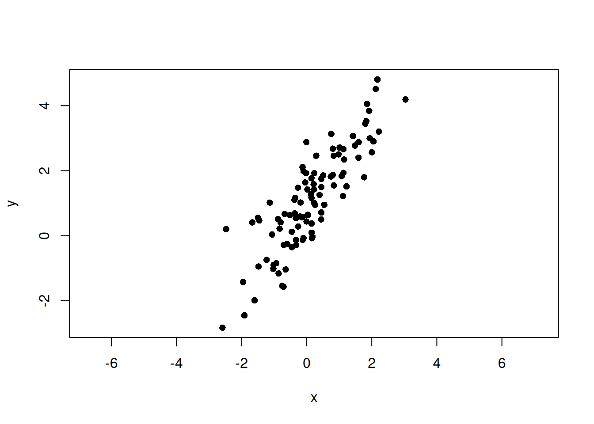
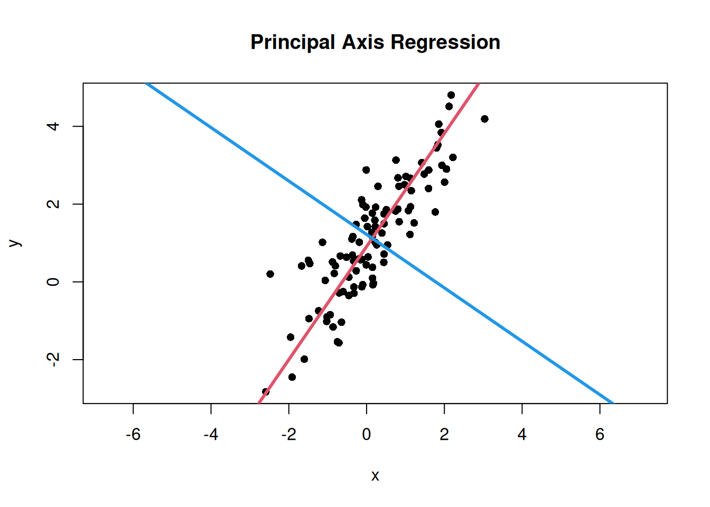
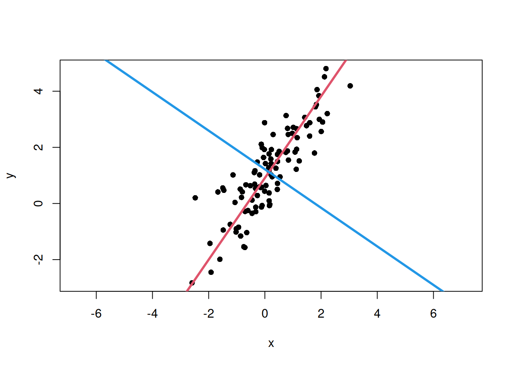

# Rで2変量PCAとPrincipal axis regressionの基礎を理解する

r

共分散行列・固有値・固有ベクトルから2変量データの主軸を求めます

Published

2026-05-26

Modified

2026-05-30

**Principal axis regression** (PAR)は、主成分分析 (PCA)と似たような考え方で、2変量データの主要な変動方向を直線として捉えるために使用されます。 文献では、関連する2変量のline-fitting方法として、major axis (MA) や standardised major axis (SMA) がよく扱われます ([Warton et al. 2006](#ref-warton2006))。本記事ではこのうち、共分散行列の第1固有ベクトルを主軸として使うMAに近い考え方を扱います。

本記事では、共分散行列の第1固有ベクトルを主軸として使う、major axis regressionに近い実装を扱います。 以下では、RでPrincipal axis regressionを実装してみます。

## Principal axis regressionの概要

Principal axis regressionは、データの**共分散行列**を計算し、その**固有値**と**固有ベクトル**を求めることで、データの主要な変動方向を特定します。 **第1固有ベクトルはもっとも分散が大きい方向**、**第2固有ベクトルはそれに直交する方向**を表します。

よく用いられるordinary least squares regression (OLS; 最小二乗回帰)では、目的変数と説明変数を分けて、目的変数方向の誤差が小さくなるように直線を当てはめます。 一方でPARでは、どちらか一方を目的変数として固定するのではなく、2変量の点群全体の変動方向を表す直線を求めます。

## Rでの実装

RでPrincipal axis regressionを実装するためには、以下の手順を踏む必要があります。

1.  データの準備
2.  共分散行列の計算
3.  固有値と固有ベクトルの計算
4.  主軸の傾きと切片の計算
5.  可視化

なお、ここでは\\x\\と\\y\\を同じスケールの模擬データとして扱います。 実データで2つの変数の単位やスケールが大きく異なる場合は、log変換や標準化を行うか、共分散行列ではなく相関行列を使うかを検討する必要があります。 共分散行列を使う方法と相関行列を使う方法では、推定される軸の向きが変わることがあります。

> **NOTE:**
>
> Rの実装のセクションでは、詳しい数式の説明は省略し、コードを中心に説明します。 数式を用いたメカニズムの説明は、次のセクションで行います。

### データの準備

まず、適当なデータセットを用意します。 ここでは、[`rnorm()`](https://rdrr.io/r/stats/Normal.html)関数を使用して、ランダムなデータを生成します。 主軸を \\y = \alpha + \beta x\\ として、ノイズを加えたデータを生成します。

``` downlit
set.seed(123)
n <- 100
beta <- 1.5
alpha <- 1

# 主軸方向のスコア
t <- rnorm(n, mean = 0, sd = 2)

# 主軸に直交するノイズ
e <- rnorm(n, mean = 0, sd = 0.5)

# 主軸方向ベクトルと直交方向ベクトル
v1 <- c(1, beta) / sqrt(1 + beta^2)
v2 <- c(-beta, 1) / sqrt(1 + beta^2)

x <- t * v1[1] + e * v2[1]
y <- alpha + t * v1[2] + e * v2[2]

plot(x, y, asp = 1, pch = 16)
```



### 共分散行列の計算

共分散行列は、以下のように表されます。

\\ \Sigma = \begin{bmatrix}\sigma\_{xx} & \sigma\_{xy} \\ \sigma\_{yx} & \sigma\_{yy}\end{bmatrix} \\

ここで、\\\sigma\_{xx}\\は\\x\\の分散、\\\sigma\_{yy}\\は\\y\\の分散、\\\sigma\_{xy}\\は\\x\\と\\y\\の共分散を表します。 なお、共分散とは、2つの変数がどの程度一緒に変動するかを示す指標です。 以下のように計算されます。

\\ \sigma\_{xy} = \frac{1}{n-1} \sum\_{i=1}^{n} (x_i - \bar{x})(y_i - \bar{y}) \\

Rでは、[`cov()`](https://rdrr.io/r/stats/cor.html)関数を使用して共分散行列を簡単に計算することができます。

``` downlit
cov_matrix <- cov(cbind(x, y))
cov_matrix
```

             x        y
    x 1.227713 1.447200
    y 1.447200 2.338984

### 固有値と固有ベクトルの計算

共分散行列の固有値と固有ベクトルを計算するためには、[`eigen()`](https://rdrr.io/r/base/eigen.html)関数を使用します。 ちなみに、固有値はデータの変動の大きさを表し、固有ベクトルはその変動の方向を表します。 Rの[`eigen()`](https://rdrr.io/r/base/eigen.html)は固有値を大きい順に返すため、`vectors`の1列目が第1主軸、2列目が第2主軸に対応します。

``` downlit
eigen_result <- eigen(cov_matrix, symmetric = TRUE)
eigen_result
```

    eigen() decomposition
    $values
    [1] 3.3335480 0.2331491

    $vectors
              [,1]       [,2]
    [1,] 0.5663796 -0.8241445
    [2,] 0.8241445  0.5663796

[`eigen()`](https://rdrr.io/r/base/eigen.html)関数は、固有値と固有ベクトルをリスト形式で返します。 固有値は`values`、固有ベクトルは`vectors`に格納されます。 \\x\\と\\y\\の2次元のデータの場合、2つの固有値と対応する固有ベクトルが得られます。

``` downlit
eigen_values <- eigen_result$values
eigen_vectors <- eigen_result$vectors

print(paste("第1主軸の固有値:", eigen_values[1]))
```

    [1] "第1主軸の固有値: 3.33354798737934"

``` downlit
print(paste("第2主軸の固有値:", eigen_values[2]))
```

    [1] "第2主軸の固有値: 0.233149107828597"

``` downlit
print(paste(
  "第1主軸の固有ベクトル: (",
  eigen_vectors[1, 1],
  ", ",
  eigen_vectors[2, 1],
  ")",
  sep = ""
))
```

    [1] "第1主軸の固有ベクトル: (0.566379566968877, 0.824144517739545)"

``` downlit
print(paste(
  "第2主軸の固有ベクトル: (",
  eigen_vectors[1, 2],
  ", ",
  eigen_vectors[2, 2],
  ")",
  sep = ""
))
```

    [1] "第2主軸の固有ベクトル: (-0.824144517739545, 0.566379566968877)"

> **NOTE:**
>
> 固有ベクトルの符号は任意です。例えば、\\(u_x, u_y)\\ と \\(-u_x, -u_y)\\ は同じ軸方向を表します。 そのため、直線の傾き \\u_y/u_x\\ は変わりませんが、次の記事で扱う「軸どうしの角度」を計算する場合には、この符号の任意性に注意する必要があります。

### 可視化

固有ベクトル、すなわち主要な変動方向をデータポイントとともにプロットしてみます。 データの中心をベクトルが通るようにします。 つまり、直線が\\y=a + bx\\のとき、\\a\\と\\b\\は以下のように計算されます。

\\ a = \bar{y} - b \bar{x} \\

ここで、\\\bar{x}\\と\\\bar{y}\\はそれぞれ\\x\\と\\y\\の平均値です。 また、\\b\\は固有ベクトルの比率で計算されます。 第1主軸を赤、第2主軸を青で描きます。

``` downlit
# 第1主軸と第2主軸の傾き
major_axis_slope <- eigen_vectors[2, 1] / eigen_vectors[1, 1]
minor_axis_slope <- eigen_vectors[2, 2] / eigen_vectors[1, 2]

# データの中心を通るように切片を計算
major_axis_intercept <- mean(y) - major_axis_slope * mean(x)
minor_axis_intercept <- mean(y) - minor_axis_slope * mean(x)

# データポイントと主要な変動方向をプロット
plot(x, y, asp = 1, pch = 16, main = "Principal Axis Regression")

# 第1主軸の線を追加
abline(
  a = major_axis_intercept,
  b = major_axis_slope,
  col = 2,
  lwd = 3
)

# 第2主軸の線を追加
abline(
  a = minor_axis_intercept,
  b = minor_axis_slope,
  col = 4,
  lwd = 3
)
```



## PCAとの関係

ここで行った計算は、2変量データに対するPCAと同じです。 PCAでは、共分散行列の固有値・固有ベクトルを求めることで、データのばらつきが大きい方向から順に新しい軸を定義します。

今回の例では、元の軸は \\x\\ と \\y\\ ですが、固有値分解によって新しく得られる軸は第1主軸と第2主軸です。

- 第1主軸：データが最も大きくばらつく方向
- 第2主軸：第1主軸に直交する方向
- 第1固有値：第1主軸方向の分散
- 第2固有値：第2主軸方向の分散

したがって、principal axis regression や major axis regression は、2変量PCAで得られる第1主軸を、2変量データを要約する直線として解釈したものと考えることができます。

## 共分散行列、固有値、固有ベクトルが表す意味

ここまで、共分散行列の固有値と固有ベクトルを使って、データの主要な変動方向を求めてきました。 ここでは、なぜこの手順で主軸が得られるのかを、もう少し丁寧に確認します。

直感的には、主軸とは**散布図の点群の中心を通り、点群が伸びている方向を表す直線**です。

この直線は、2つの見方で理解できます。 1つ目は、点から直線までの垂直距離に注目する見方です。 散布図にある直線を1本引き、各点からその直線へ垂線を下ろすと、点が直線からどれだけ外れているかを測ることができます。 点群の流れに沿った直線ほど、このずれは全体として小さくなります。

2つ目は、直線方向のばらつきに注目する見方です。 点群に沿った直線を選ぶと、点はその直線方向に大きく広がります。 逆に、点群に合っていない方向を選ぶと、直線方向の広がりは小さくなり、直線から外れた方向のずれが大きくなります。

したがって、主軸は**データをその方向に射影したとき、ばらつきが最も大きくなる方向**と考えることができます。

この「ある方向に射影したときのばらつき」を計算するために使うのが、**共分散行列**です。

2変量データの各点を、平均を中心にした形で

\\ x_i - \bar{x}, \quad y_i - \bar{y} \\

と置きます。 これは、各点をデータの平均から見た座標に直す操作で、平均中心化と呼ばれます。 このとき、平均中心化した座標ベクトルを \\\mathbf{z}\_i\\ として以下のように定義します。

\\ \mathbf{z}\_i = \begin{bmatrix} x_i - \bar{x} \\ y_i - \bar{y} \end{bmatrix} \\

\\\mathbf{z}\_i\\を視覚的に表すと、以下のようになります。

``` downlit
# 平均中心化した座標
z <- scale(cbind(x, y), center = TRUE, scale = FALSE)
plot(x, y, asp = 1, pch = 16)
abline(h = mean(y), v = mean(x), col = "#D55E00", lwd = 2, lty = 2)
# 平均点から各点へのベクトルを描画
for (i in 1:n) {
  segments(mean(x), mean(y), x[i], y[i], col = "gray70")
}
```


灰色の線は、平均点から各点へ伸びるベクトルを表しています。 これが\\\mathbf{z}\_i\\です。

ここで、ある方向を表すベクトル\\\mathbf{u}\\を以下のように定義します。

\\ \mathbf{u} = \begin{bmatrix} u_x \\ u_y \end{bmatrix} \\

このベクトルは、直線の向きを表します。 ここでは方向だけを扱いたいので、ベクトルの長さは1に正規化しておきます。 このようなベクトルを単位ベクトルと呼びます。 つまり、\\\\\mathbf{u}\\ = 1\\ となります。 式にすると、以下のようになります。

\\ \mathbf{u}^T\mathbf{u} = u_x^2 + u_y^2 = 1 \\

各点がこの方向にどれくらい離れているかは、内積を使って次のように計算できます。

\\ s_i = \mathbf{u}^T \mathbf{z}\_i = u_x (x_i - \bar{x}) + u_y (y_i - \bar{y}) \\

ここで、\\s_i\\ は、点 \\i\\ を方向 \\\mathbf{u}\\ に射影したときの座標です。 平均点を原点として見たとき、点 \\i\\ が \\\mathbf{u}\\ の方向にどれだけ進んでいるかを表す符号付きの値と考えられます。 この \\s_i\\ のばらつきが大きいほど、データはその直線方向に大きく広がっていることになります。

図で考えると、各点から \\\mathbf{u}\\ の方向に引いた直線へ垂線を下ろします。 その交点が、点を \\\mathbf{u}\\ 方向の直線上に射影した位置です。 \\s_i\\ は、データ全体の平均点からその射影点までの、\\\mathbf{u}\\ 方向に沿った距離を表します。

視覚的に表すと、以下のようになります。

``` downlit
# 平均中心化した座標
z <- scale(cbind(x, y), center = TRUE, scale = FALSE)

# 平均点
mx <- mean(x)
my <- mean(y)

u <- c(0.8, 0.6) # 方向ベクトル u
u <- u / sqrt(sum(u^2)) # 念のため単位ベクトルに正規化

# 各点の u 方向への射影スカラー s_i
s <- as.vector(z %*% u)
# 射影点：平均点 + s_i u
proj_x <- mx + s * u[1]
proj_y <- my + s * u[2]

# 描画
plot(x, y, asp = 1, pch = 16, type = "n")
usr <- par("usr") # 描画範囲

# 1刻みのグリッド
abline(
  v = seq(floor(usr[1]), ceiling(usr[2]), by = 1),
  col = "gray70",
  lty = "dotted"
)
abline(
  h = seq(floor(usr[3]), ceiling(usr[4]), by = 1),
  col = "gray70",
  lty = "dotted"
)

# 平均を通る縦横線
abline(h = my, v = mx, col = "#D55E00", lwd = 2, lty = 2)

# 方向 u を表す直線
if (abs(u[1]) < .Machine$double.eps) {
  abline(
    v = mx,
    col = adjustcolor("#0072B2", alpha.f = 0.5),
    lwd = 3,
    lty = "dashed"
  )
} else {
  abline(
    a = my - (u[2] / u[1]) * mx,
    b = u[2] / u[1],
    col = adjustcolor("#0072B2", alpha.f = 0.5),
    lwd = 3,
    lty = "dashed"
  )
}

# 各点の平均中心化ベクトル z_i
for (i in seq_along(x)) {
  segments(mx, my, x[i], y[i], col = "gray90")
}

# 各点から射影点への垂線：u 方向では説明できない残差
for (i in seq_along(x)) {
  segments(
    x[i],
    y[i],
    proj_x[i],
    proj_y[i],
    col = adjustcolor("#009E73", alpha.f = 0.5),
    lwd = 2
  )
}

# 平均点から射影点まで：s_i u
for (i in seq_along(x)) {
  segments(
    mx,
    my,
    proj_x[i],
    proj_y[i],
    col = adjustcolor("#CC79A7", alpha.f = 0.1),
    lwd = 4
  )
}

# 元の点
points(x, y, pch = 16, col = adjustcolor("black", alpha.f = 0.5))

# 方向ベクトル u の矢印
arrows(
  mx,
  my,
  mx + u[1],
  my + u[2],
  col = "#0072B2",
  lwd = 4,
  length = 0.2
)
```


青い矢印が方向 \\\mathbf{u}\\ を表しています。 青い破線は、その方向に平均点を通る直線です。 緑の線は、各点からこの直線へ下ろした垂線で、\\\mathbf{u}\\ 方向だけでは説明できないずれを表します。 ピンクの線は、平均点から射影点までの位置を表しています。 この位置を符号付きの値として表したものが \\s_i\\ です。 \\s_i\\ のばらつきが大きいほど、点は \\\mathbf{u}\\ の方向に沿って大きく広がっていることになります。 この**ばらつきが大きいほど、\\\mathbf{u}\\ の方向はデータの主要な変動方向に近い**と考えることができます。

### ばらつきを計算するための共分散行列

方向 \\\mathbf{u}\\ に沿ったばらつきを計算するために、共分散行列を使います。 共分散行列 \\\Sigma\\ は、各変数のばらつきと、変数どうしが一緒に変動する程度をまとめた行列です。 平均中心化したデータを方向 \\\mathbf{u}\\ に射影したスコアを \\s_i\\ とすると、その分散は次のように計算できます。

\\ \text{Var}(s) = \mathbf{u}^T \Sigma \mathbf{u} \\

2変量データの共分散行列 \\\Sigma\\ は、次のように表されます。

\\ \Sigma = \begin{bmatrix}\sigma\_{xx} & \sigma\_{xy} \\ \sigma\_{yx} & \sigma\_{yy}\end{bmatrix} \\

ここで、\\\sigma\_{xx}\\ は \\x\\ の分散、\\\sigma\_{yy}\\ は \\y\\ の分散、\\\sigma\_{xy}\\ は \\x\\ と \\y\\ の共分散を表します。 分散は、データが平均からどれだけ広がっているかを表す指標です。 共分散は、2つの変数がどの程度一緒に増減するかを表す指標です。

分散は以下のように計算されます。

\\ \sigma_x^2 = \frac{1}{n-1} \sum\_{i=1}^{n} (x_i - \bar{x})^2 \\

また、共分散は以下のように計算されます。

\\ \sigma\_{xy} = \frac{1}{n-1} \sum\_{i=1}^{n} (x_i - \bar{x})(y_i - \bar{y}) \\

つまり、共分散行列は、任意の方向 \\\mathbf{u}\\ に対して、**その方向に射影したときのばらつきがどれくらいかを計算するための情報を持っている**と考えることができます。

> **NOTE:**
>
> 平均中心化した点を
>
> \\ \mathbf{z}\_i = \begin{bmatrix} x_i-\bar{x} \\ y_i-\bar{y} \end{bmatrix} \\
>
> とし、方向\\\mathbf{u}\\への射影スコアを
>
> \\ s_i = \mathbf{u}^{\mathrm{T}}\mathbf{z}\_i \\
>
> とします。 平均中心化しているので、\\\bar{s}=0\\です。 したがって、射影スコアの分散は
>
> \\ \mathrm{Var}(s) = \frac{1}{n-1}\sum\_{i=1}^{n}s_i^2 \\
>
> と書けます。ここに \\s_i=\mathbf{u}^{\mathrm{T}}\mathbf{z}\_i\\ を代入すると、
>
> \\ \mathrm{Var}(s) = \frac{1}{n-1} \sum\_{i=1}^{n} (\mathbf{u}^{\mathrm{T}}\mathbf{z}\_i)^2 \\
>
> となります。内積の二乗は
>
> \\ (\mathbf{u}^{\mathrm{T}}\mathbf{z}\_i)^2 = \mathbf{u}^{\mathrm{T}} \mathbf{z}\_i \mathbf{z}\_i^{\mathrm{T}} \mathbf{u} \\
>
> と書けるので、
>
> \\ \mathrm{Var}(s) = \mathbf{u}^{\mathrm{T}} \left( \frac{1}{n-1} \sum\_{i=1}^{n} \mathbf{z}\_i\mathbf{z}\_i^{\mathrm{T}} \right) \mathbf{u} \\
>
> となります。括弧の中は共分散行列\\\Sigma\\なので、
>
> \\ \mathrm{Var}(s) = \mathbf{u}^{\mathrm{T}}\Sigma\mathbf{u} \\
>
> です。

### ばらつきを最大にする方向を求める

では、どの方向 \\\mathbf{u}\\ を選べば、射影したスコアのばらつきが最大になるのでしょうか。

ある方向を表す単位ベクトルを

\\ \mathbf{u} = \begin{bmatrix} u_x \\ u_y \end{bmatrix} \\

とします。

この方向に沿ったデータのばらつきは、共分散行列 \\\Sigma\\ を使って

\\ \mathbf{u}^{\mathrm{T}} \Sigma \mathbf{u} \\

と表すことができます。

ここで、\\\mathbf{u}^{\mathrm{T}} \Sigma \mathbf{u}\\ は1つの値になります。 この値が大きいほど、データは方向 \\\mathbf{u}\\ に射影したときに大きくばらついていることを意味します。

したがって、主軸を求めることは、

\\ \mathbf{u}^{\mathrm{T}} \Sigma \mathbf{u} \\

が最も大きくなる方向 \\\mathbf{u}\\ を探すことに対応します。 ただし、方向だけを考えるため、\\\mathbf{u}\\ の長さは1に固定します。 長さを自由にしてしまうと、同じ方向でもベクトルを長くするだけで値を大きくできてしまうからです。

\\ \mathbf{u}^{\mathrm{T}}\mathbf{u} = 1 \\

この条件のもとで \\\mathbf{u}^{\mathrm{T}} \Sigma \mathbf{u}\\ を最大にする問題を解くと、

\\ \Sigma \mathbf{u} = \lambda \mathbf{u} \\

という形の式が得られます。

これは、共分散行列 \\\Sigma\\ の**固有値・固有ベクトル**の式です。 ここで、\\\mathbf{u}\\ が固有ベクトル、\\\lambda\\ が固有値です。 固有ベクトルは、共分散行列をかけても向きが変わらない特別な方向です。 固有値は、その方向のばらつきの大きさに対応します。

> **NOTE:**
>
> この式は、線形代数の分野で「固有値問題」と呼ばれるものです。 この関係を導くには、制約付き最大化問題としてラグランジュの未定乗数法を使うのが一般的です。 ただし、実際の計算はRの [`eigen()`](https://rdrr.io/r/base/eigen.html) が行ってくれるため、ここでは詳しい導出は省略します。

つまり、共分散行列の固有ベクトルは「ばらつきが評価される軸の方向」を表し、固有値は「その方向にどれだけばらついているか」を表します。

特に、最も大きい固有値に対応する固有ベクトルが、データのばらつきが最大になる方向です。 これが第1主軸になります。

簡単にまとめると、以下のようになります。

- **共分散行列**：データのばらつき方をまとめたもの
- **固有ベクトル**：ばらつきを評価する軸の方向
- **固有値**：その方向に沿ったばらつきの大きさ

2変量データの場合、共分散行列の固有ベクトルは2つ得られます。

- **第1固有ベクトル**：最もばらつきが大きい方向
- **第2固有ベクトル**：第1固有ベクトルに直交する方向

このうち、第1固有ベクトルの方向を、データの中心を通る直線として描いたものが、今回のprincipal axis regressionにおける主軸です。

## Rによる視覚的な理解

今回の仮想データを使って、上の説明を図で確認します。 まずは、冒頭の散布図を再度表示します。

``` downlit
set.seed(123)
n <- 100
beta <- 1.5
alpha <- 1
t <- rnorm(n, mean = 0, sd = 2)
e <- rnorm(n, mean = 0, sd = 0.5)
v1 <- c(1, beta) / sqrt(1 + beta^2)
v2 <- c(-beta, 1) / sqrt(1 + beta^2)
x <- t * v1[1] + e * v2[1]
y <- alpha + t * v1[2] + e * v2[2]
plot(x, y, asp = 1, pch = 16)
```


次に、共分散行列を計算し、固有値と固有ベクトルを求めます。 固有ベクトルの符号は任意なので、ここでは第1主軸の \\x\\ 成分が正になるようにそろえておきます。

``` downlit
# 共分散行列と固有ベクトル
S <- cov(cbind(x, y))
eg <- eigen(S, symmetric = TRUE)

# 第1主軸の方向
u1 <- eg$vectors[, 1]
if (u1[1] < 0) {
  u1 <- -u1
}
```

> **NOTE:**
>
> 固有値や固有ベクトルは英語ではeigenvalueやeigenvectorと呼ばれます。 このため、Rの関数も[`eigen()`](https://rdrr.io/r/base/eigen.html)という名前になっています。

次に、比較用の方向を1つ用意し、それぞれの方向について、各点を直線上へ射影した点を計算します。 方向ベクトルは、向きだけを表すように単位ベクトルへ正規化しておきます。

``` downlit
# データの中心
center <- c(mean(x), mean(y))

u0 <- c(1, 0.4) # 比較用の方向ベクトル
u0 <- u0 / sqrt(sum(u0^2)) # 正規化して単位ベクトルにする

# 直線上の射影点を計算する関数
get_foot_points <- function(x, y, u, center) {
  X <- cbind(x - center[1], y - center[2])
  score <- as.vector(X %*% u) # 各点の射影スコアを計算
  foot_centered <- outer(score, u) # スコアに基づいて射影点を計算
  foot <- sweep(foot_centered, 2, center, "+") # 中心を足す
  foot
}

# 各点の射影点を計算
foot0 <- get_foot_points(x, y, u0, center)
foot1 <- get_foot_points(x, y, u1, center)
```

データの上に、比較用の直線と各点からその直線への射影点をプロットしてみます。

``` downlit
plot(x, y, asp = 1, pch = 16, xlab = "x", ylab = "y")
abline(
  a = center[2] - (u0[2] / u0[1]) * center[1],
  b = u0[2] / u0[1],
  col = "gray30",
  lwd = 2
)
segments(x, y, foot0[, 1], foot0[, 2], col = "gray70")
```


次に、ここに第1主軸の線と、各点から第1主軸への射影点を追加してみます。

``` downlit
plot(x, y, asp = 1, pch = 16, xlab = "x", ylab = "y")
# 比較用の方向の線と距離
abline(
  a = center[2] - (u0[2] / u0[1]) * center[1],
  b = u0[2] / u0[1],
  col = "gray30",
  lwd = 2
)
segments(x, y, foot0[, 1], foot0[, 2], col = "gray70")

# 第1主軸の線と距離
abline(
  a = center[2] - (u1[2] / u1[1]) * center[1],
  b = u1[2] / u1[1],
  col = 2,
  lwd = 3
)
segments(x, y, foot1[, 1], foot1[, 2], col = 3)
```



このときの各点から直線までの距離の二乗和を計算して比較します。

``` downlit
# 比較用の方向に対する、直線からの距離の二乗和
sum(rowSums((cbind(x, y) - foot0)^2))
```

    [1] 117.576

``` downlit
# 第1主軸の方向に対する、直線からの距離の二乗和
sum(rowSums((cbind(x, y) - foot1)^2))
```

    [1] 23.08176

第1主軸のほうが、比較用の方向よりも点から直線への距離の二乗和が小さくなっていることがわかります。 つまり、データのばらつきに沿った直線を選ぶと、直線から外れた方向のずれは全体として小さくなります。 第1主軸は、直線方向のばらつきを最大にし、それと直交する方向へのずれを小さくする方向です。

第2主軸も同様にプロットしてみます。

``` downlit
u2 <- eigen_vectors[, 2]
if (u2[1] < 0) {
  u2 <- -u2
}

plot(x, y, asp = 1, pch = 16, xlab = "x", ylab = "y")
# 第1主軸の線
abline(
  a = center[2] - (u1[2] / u1[1]) * center[1],
  b = u1[2] / u1[1],
  col = 2,
  lwd = 3
)
# 第2主軸の線
abline(
  a = center[2] - (u2[2] / u2[1]) * center[1],
  b = u2[2] / u2[1],
  col = 4,
  lwd = 3
)
```


第1主軸はデータのばらつきが最も大きい方向を表し、第2主軸はそれに直交する方向を表します。

## まとめ

- Principal axis regressionは、2変量データの主要な変動方向を直線として捉える方法です。
- 共分散行列の第1固有ベクトルは、データを射影したときのばらつきが最も大きい方向を表し、これが主軸になります。
- Rでは、[`cov()`](https://rdrr.io/r/stats/cor.html) で共分散行列を計算し、[`eigen()`](https://rdrr.io/r/base/eigen.html) で固有値と固有ベクトルを求めることができます。
- 主軸を散布図に重ねると、点群がどの方向に伸びているかを視覚的に確認できます。
- PCAとPrincipal axis regressionは、共分散行列の固有値・固有ベクトルから主要な変動方向を求める点で共通しています。

この記事では、2変量データから主軸を1本求める基本的な考え方を確認しました。 次の記事では、この第1固有ベクトルを使って、種ごとの代表値から求めた主軸と、種内変異を含めたときの主軸のずれを調べます。

- [RでPrincipal axis regressionをtrait spaceの回転に応用する](../2026-05-27-r-principle-axis-regression_example/)

## 参考文献

Warton, David I., Ian J. Wright, Daniel S. Falster, and Mark Westoby. 2006. “Bivariate Line-Fitting Methods for Allometry.” *Biological Reviews* 81 (2): 259–91. <https://doi.org/10.1017/S1464793106007007>.
