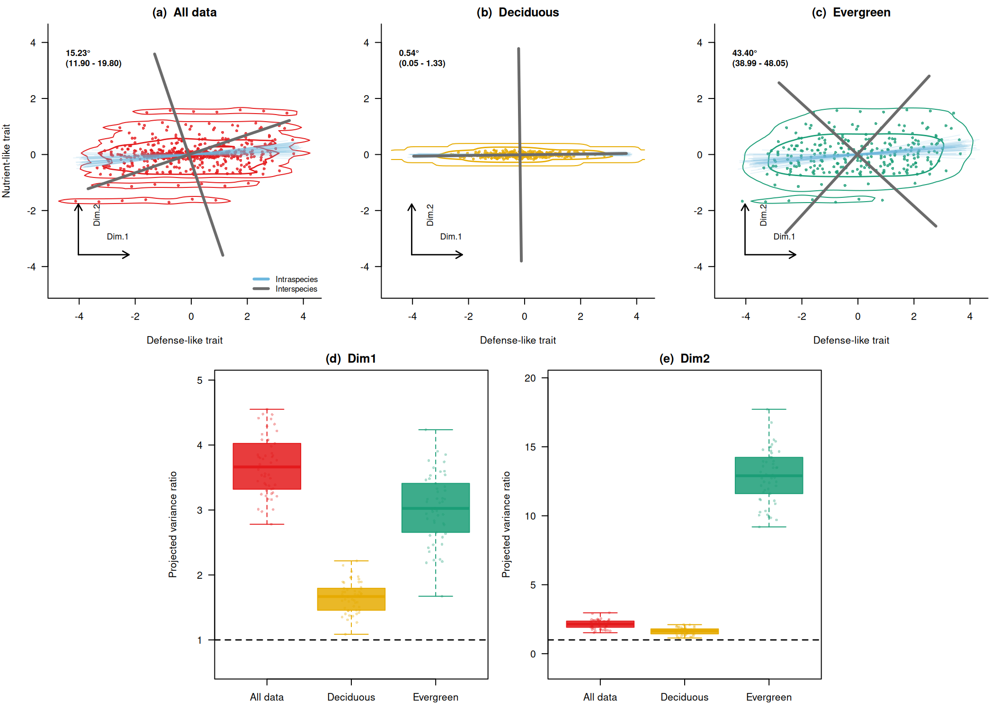

# RでPrincipal axis regressionをtrait spaceの回転に応用する

r

共分散行列の第1固有ベクトルを使って、種間軸と種内変異を含む軸のずれを調べます

Published

2026-05-27

Modified

2026-05-27

前回の記事 [Rで2変量PCAとPrincipal axis regressionの基礎を理解する](../2026-05-26-r-principle-axis-regression/) では、2変量データの共分散行列を固有値分解し、第1固有ベクトルを主軸として描くところまでを確認しました。 本記事では、その考え方を少し進めて、種ごとの代表値から求めた主軸と、種内変異を含めたときの主軸がどれくらいずれるかを調べます。

ここでいう principal axis regression (PAR) は、前回と同じく、共分散行列の第1固有ベクトルを2変量データの主軸として使う方法です。 文献上は、major axis (MA) や standardised major axis (SMA) などの2変量 line-fitting 方法として整理されることが多く、本記事の実装はこのうち共分散行列ベースのMAに近い考え方です ([Warton et al. 2006](#ref-warton2006))。

応用例の発想は、Zhou et al. ([2025](#ref-zhou2025)) が扱っている「種間レベルの trait space と、種内変異を含めた trait space の向きの違い」という問いにあります。 ただし、本記事は原著論文の図・文章・データを再現するものではありません。 本文中のデータはすべて教育目的で作成した架空データであり、原著論文の数値、図から読み取った座標、解析結果は使用していません。 原著論文の具体的な解析手順や生態学的解釈については、必ず原著論文を参照してください。

## Principal axis regressionの概要

Principal axis regressionは、データの共分散行列を計算し、その固有値と固有ベクトルを求めることで、データの主要な変動方向を特定します。 第1固有ベクトルは、データのばらつきが最も大きい方向を表します。 この方向を直線として描くと、点群の流れを要約する主軸として解釈できます。

ここでは、2つの軸を比較します。

- 種ごとの代表値から求める `interspecific axis`
- 各種から1個体ずつ選んだデータから求める、種内変異を含んだ軸

固有ベクトルの符号は任意なので、軸どうしの角度を計算するときは、反対向きの同じ軸を同じものとして扱います。 また、前回と同じく、`x` と `y` は同じスケールの説明用変数として扱います。 実データで単位やスケールが大きく異なる場合は、log変換、標準化、または相関行列を使うかを別途検討する必要があります。

## Rでの実装

今回の実装では、次の順番で処理します。

1.  種間差と種内差をもつダミーデータを作る
2.  種ごとの代表値を使って、種間レベルの主軸を求める
3.  各種から1個体ずつ取り出して、種内変異を含む主軸を繰り返し推定する
4.  種間レベルの主軸と、種内変異を含む主軸の角度差を計算する
5.  種間軸に沿った分散比を使って、種内変異を含めたときのばらつきの増え方を可視化する

ここで使う `x` と `y` は、実データのtrait名ではなく、説明用の2次元traitです。 `x` を防御形質、`y` を栄養獲得形質のようなものとして読み替えると、種間差と種内差が異なる向きを持つ状況を考えやすくなります。

### データを作る

[`rnorm()`](https://rdrr.io/r/stats/Normal.html)関数を使用して種ごとの中心位置を作り、そのまわりに種内変異を持つ2次元のデータセットを作成します。 種内変異は、種ごとの中央値が中心位置に戻るように、対称なスコアとして作ります。 このデータセットは、2つのグループ（落葉樹っぽいグループと常緑樹っぽいグループ）を含み、各グループ内で種ごとに個体値がばらつくように設計されています。 ここでは、種平均のばらつきと、同じ種の中での個体差を別々の標準偏差で指定できるようにしています。 さらに、種平均が並ぶ方向と種内変異が伸びる方向を別々に指定します。 このようにすると、「種間軸はある方向に伸びるが、種内変異を含めると主軸が別方向に回転する」という状況を、自作データで確認できます。

``` downlit
# 乱数を使うため、毎回同じ結果になるようにseedを固定します。
set.seed(123)

# major方向とminor方向の乱数を、指定した角度だけ回転させる補助関数です。
# angle_deg = 0ならx軸方向、angle_deg = 45なら右上がり45度方向になります。
rotate_xy <- function(major, minor, angle_deg) {
  theta <- angle_deg * pi / 180

  cbind(
    x = major * cos(theta) - minor * sin(theta),
    y = major * sin(theta) + minor * cos(theta)
  )
}

# 種内変異の値を、中央値が0になるように対称に作る関数です。
# こうしておくと、種ごとの中央値は種平均をよく反映します。
# その一方で、各種から1個体ずつ選ぶと、種内変異の方向が強く現れます。
balanced_scores <- function(n, target_sd) {
  if (target_sd == 0) {
    return(rep(0, n))
  }

  z <- seq(-1, 1, length.out = n)
  z <- z - mean(z)
  z / sd(z) * target_sd
}

sim_group <- function(
  group,
  n_species = 40,
  n_ind = 7,
  sp_major_sd,
  sp_minor_sd,
  sp_angle,
  ind_major_sd,
  ind_minor_sd,
  ind_angle
) {
  # 種ごとのデータを一時的に入れておくリストです。
  # 最後にrbindして、1つのdata.frameにまとめます。
  out <- list()

  # 1つのグループの中に、n_species個の種を作ります。
  for (i in seq_len(n_species)) {
    sp <- paste0(group, "_sp", i)

    # まず、種ごとの中心位置を決めます。
    # sp_major_sdは主方向の種間差、sp_minor_sdはそれに直交する方向のばらつきです。
    # sp_angleで、種平均がどの方向に並ぶかを決めます。
    sp_mean <- rotate_xy(
      major = rnorm(1, mean = 0, sd = sp_major_sd),
      minor = rnorm(1, mean = 0, sd = sp_minor_sd),
      angle_deg = sp_angle
    )

    # 次に、その種平均のまわりに個体値を発生させます。
    # ind_major_sdは主方向の種内差、ind_minor_sdはそれに直交する方向のばらつきです。
    # ここでは、各種内の値が種平均のまわりで対称になるようにしています。
    # これにより、種中央値は種間軸を保ちつつ、1個体サンプリングでは種内差が現れます。
    ind_major <- sample(balanced_scores(n_ind, ind_major_sd), size = n_ind)
    ind_minor <- sample(balanced_scores(n_ind, ind_minor_sd), size = n_ind)

    # ind_angleで、同じ種の中の個体差がどの方向に伸びるかを決めます。
    ind_dev <- rotate_xy(
      major = ind_major,
      minor = ind_minor,
      angle_deg = ind_angle
    )

    x <- as.numeric(sp_mean[, "x"]) + ind_dev[, "x"]
    y <- as.numeric(sp_mean[, "y"]) + ind_dev[, "y"]

    # group, species, individualを残しておくと、後で
    # 「種ごとの代表値」や「各種から1個体ずつサンプリング」がしやすくなります。
    out[[i]] <- data.frame(
      group = group,
      species = sp,
      individual = seq_len(n_ind),
      x = x,
      y = y
    )
  }

  # 種ごとのdata.frameを縦に結合します。
  do.call(rbind, out)
}

# 落葉樹っぽいグループです。
# 種間差も個体差も主にx方向に出るようにしています。
# そのため、種間軸と種内変異を含む軸はほとんど回転しません。
dat_D <- sim_group(
  group = "D",
  n_species = 40,
  n_ind = 7,
  sp_major_sd = 1.0,
  sp_minor_sd = 0.05,
  sp_angle = 0,
  ind_major_sd = 0.7,
  ind_minor_sd = 0.05,
  ind_angle = 0
)

# 常緑樹っぽいグループです。
# 種平均は斜め方向に並べ、個体差はx方向に強く出るようにしています。
# これにより、種間軸と種内変異を含む軸が意図的にずれます。
dat_E <- sim_group(
  group = "E",
  n_species = 40,
  n_ind = 7,
  sp_major_sd = 0.75,
  sp_minor_sd = 0.35,
  sp_angle = 55,
  ind_major_sd = 1.8,
  ind_minor_sd = 0.04,
  ind_angle = 0
)

# 2つのグループをまとめて、全データとして扱えるようにします。
dat <- rbind(dat_D, dat_E)
```

### 相関を確認する

それぞれのグループ内で、xとyの相関を確認してみましょう。 相関が小さいことを確認できます。 ここで相関を見ているのは、単純な「右上がり・右下がり」の関係が強くない場合でも、分散の向きとして主軸を求められることを示すためです。

``` downlit
tapply(seq_len(nrow(dat)), dat$group, function(i) {
  # tapply()でグループごとの行番号を取り出し、
  # その行だけを使ってxとyの相関係数を計算します。
  cor(dat$x[i], dat$y[i])
})
```

            D         E 
    0.1066764 0.2091585 

### principal axis を求める関数

この関数では、2次元データから共分散行列を作り、その固有ベクトルをprincipal axisとして取り出します。 第1固有ベクトルはもっとも分散が大きい方向、第2固有ベクトルはそれに直交する方向です。

``` downlit
principal_axis <- function(x, y) {
  # xとyを2列の行列にまとめます。
  # この行列の各行が1個体または1種、各列が1つのtraitです。
  X <- cbind(x, y)

  # 共分散行列です。
  # 対角成分はxとyそれぞれの分散、非対角成分はx-yの共分散です。
  S <- cov(X)

  # 固有値分解を行います。
  # eigen()は、分散が大きい順に固有値と固有ベクトルを返します。
  eg <- eigen(S, symmetric = TRUE)

  vectors <- eg$vectors

  # 表示を安定させるため、x方向が正になるようにそろえる
  # 固有ベクトルは向きを反転しても同じ軸を表すため、
  # 図示のたびに線の向きが反転しないように符号をそろえます。
  for (j in seq_len(ncol(vectors))) {
    if (vectors[1, j] < 0) {
      vectors[, j] <- -vectors[, j]
    }
  }

  v1 <- vectors[, 1]

  # 後の計算と作図で使う値をまとめて返します。
  list(
    covariance = S,
    eigenvalues = eg$values,
    vectors = vectors,
    first_vector = v1,
    first_eigenvalue = eg$values[1],
    center = colMeans(X),
    # x軸から見た第1主軸の角度です。
    # atan2()を使うと、ベクトルのx成分・y成分から角度を直接計算できます。
    angle_from_x = atan2(v1[2], v1[1]) * 180 / pi
  )
}

angle_between_axes <- function(v1, v2) {
  # 2つのベクトルのなす角を内積から計算します。
  # abs()を使うことで、向きが反対の同じ軸を0度として扱います。
  cos_angle <- abs(sum(v1 * v2) / sqrt(sum(v1^2) * sum(v2^2)))
  cos_angle <- min(1, max(0, cos_angle))
  acos(cos_angle) * 180 / pi
}

variance_along_axis <- function(x, y, axis) {
  # 指定した軸方向にデータを射影し、その方向の分散を計算します。
  # var()は平均からのずれを使うため、ここでは明示的な中心化は不要です。
  scores <- as.vector(cbind(x, y) %*% axis)
  var(scores)
}
```

principal_axis() は、要するに以下の処理を行っています。

``` downlit
eigen(cov(cbind(x, y)), symmetric = TRUE)
```

### 種平均の trait space を作る

実データでは、形質の分布やスケールに応じて、log変換や代表値の選び方を慎重に決める必要があります。 今回は説明用の架空データなので、単純に種ごとの中央値をとってみます。 ここで作る `species_med` は、種ごとに1点だけを持つデータです。 したがって、このデータから求める主軸は、種間差を反映した `interspecific axis` とみなせます。

``` downlit
species_med <- aggregate(
  # xとyを同時に集計します。
  cbind(x, y) ~ group + species,
  data = dat,
  # 平均ではなく中央値を使います。
  # 外れ値に少し強い代表値として扱えます。
  FUN = median
)
head(species_med)
```

      group species           x           y
    1     D   D_sp1 -0.56047565 -0.01150887
    2     D  D_sp10  0.54839696  0.01193659
    3     D  D_sp11  0.03768285  0.05881101
    4     D  D_sp12 -0.05556197  0.02597036
    5     D  D_sp13  1.87141801  0.03014352
    6     D  D_sp14 -0.42249683 -0.10266236

### 種平均ベースの主軸 interspecific axis

まずは落葉樹っぽいグループと常緑樹っぽいグループを分けて、種平均ベースの主軸を求めます。 この時点では、各種の中に複数個体があることは無視され、各種が1点で表されています。

``` downlit
pa_inter_D <- with(
  # 落葉樹っぽいグループの種中央値だけを使います。
  subset(species_med, group == "D"),
  principal_axis(x, y)
)

pa_inter_E <- with(
  # 常緑樹っぽいグループの種中央値だけを使います。
  subset(species_med, group == "E"),
  principal_axis(x, y)
)

# x軸から見た第1主軸の角度を確認します。
pa_inter_D$angle_from_x
```

    [1] 0.7338449

``` downlit
pa_inter_E$angle_from_x
```

    [1] 47.56799

これが、論文でいう interspecific eigenvector に相当します。

### 各種から1個体ずつランダムに選ぶ

ここでは、種ごとのサンプル数の影響をそろえるため、各反復で「各種から1個体」を選びます。 この処理により、種数はそのままにしつつ、種内変異を反映した個体レベルのtrait spaceを繰り返し作れます。

``` downlit
sample_one_per_species <- function(d) {
  # speciesごとにdata.frameを分割します。
  sp_list <- split(d, d$species)

  sampled <- lapply(sp_list, function(z) {
    # 各種の中から、ランダムに1行だけ選びます。
    z[sample(seq_len(nrow(z)), 1), ]
  })

  # 種ごとに選ばれた1個体を、1つのdata.frameに戻します。
  do.call(rbind, sampled)
}
```

### 50回リサンプリングして rotation angle を計算する

`run_resampling()` は、作図に使う値をまとめて計算する関数です。 入力は、個体レベルのデータ `dat_group` と、種代表値のデータ `species_med_group` です。 出力には、種間軸、リサンプリングごとの種内軸、軸の角度差、種間軸方向の分散比が入ります。

``` downlit
run_resampling <- function(dat_group, species_med_group, n_iter = 50) {
  # 種代表値から求める主軸です。
  # これを基準となるinterspecific axisとして使います。
  pa_inter <- principal_axis(
    species_med_group$x,
    species_med_group$y
  )

  # 反復ごとの結果を入れるベクトルとリストを用意します。
  angles <- numeric(n_iter)
  eig_ratio_dim1 <- numeric(n_iter)
  eig_ratio_dim2 <- numeric(n_iter)
  axes <- vector("list", n_iter)
  samples <- vector("list", n_iter)

  for (i in seq_len(n_iter)) {
    # 各種から1個体ずつ選びます。
    # この1セットが、種内変異を反映したtrait spaceになります。
    sampled <- sample_one_per_species(dat_group)

    # サンプリングされた個体データから主軸を求めます。
    # これをintraspecific variationを含んだ軸として扱います。
    pa_intra <- principal_axis(
      sampled$x,
      sampled$y
    )

    # 種間軸と、種内変異を含む軸の角度差です。
    # 種間軸からどれくらい回転したかを表す量です。
    angles[i] <- angle_between_axes(
      pa_inter$first_vector,
      pa_intra$first_vector
    )

    # 種間軸の第1軸方向に射影した分散が、
    # 種代表値だけの場合に比べてどれくらい大きいかを見ます。
    # 1より大きければ、その種間軸方向でばらつきが増えています。
    eig_ratio_dim1[i] <- variance_along_axis(
      sampled$x,
      sampled$y,
      pa_inter$vectors[, 1]
    ) / pa_inter$eigenvalues[1]

    # 種間軸の第2軸方向についても同じ比を計算します。
    eig_ratio_dim2[i] <- variance_along_axis(
      sampled$x,
      sampled$y,
      pa_inter$vectors[, 2]
    ) / pa_inter$eigenvalues[2]

    # 後で作図できるように、軸そのものとサンプルも保存します。
    axes[[i]] <- pa_intra
    samples[[i]] <- sampled
  }

  list(
    pa_inter = pa_inter,
    angles = angles,
    eig_ratio = eig_ratio_dim1,
    eig_ratio_dim1 = eig_ratio_dim1,
    eig_ratio_dim2 = eig_ratio_dim2,
    axes = axes,
    samples = samples
  )
}

res_all <- run_resampling(
  # 全データをまとめた場合です。
  dat_group = dat,
  species_med_group = species_med,
  n_iter = 50
)

res_D <- run_resampling(
  # 落葉樹っぽいグループだけで同じ処理を行います。
  dat_group = subset(dat, group == "D"),
  species_med_group = subset(species_med, group == "D"),
  n_iter = 50
)

res_E <- run_resampling(
  # 常緑樹っぽいグループだけで同じ処理を行います。
  dat_group = subset(dat, group == "E"),
  species_med_group = subset(species_med, group == "E"),
  n_iter = 50
)
```

### 結果の確認

まず、角度差と分散比の分布を数値で確認します。 `angles` は種間軸からどれくらい回転したかを表します。 `eig_ratio_dim1` と `eig_ratio_dim2` は、種間軸の第1軸・第2軸それぞれに沿った分散が、種内変異を含めたサンプリングでどれくらい増えたかを表します。

``` downlit
# 主軸の回転角です。
summary(res_all$angles)
```

       Min. 1st Qu.  Median    Mean 3rd Qu.    Max. 
      11.13   13.44   14.81   15.23   16.89   21.29 

``` downlit
summary(res_D$angles)
```

       Min. 1st Qu.  Median    Mean 3rd Qu.    Max. 
    0.03909 0.30727 0.50888 0.53914 0.69654 1.46247 

``` downlit
summary(res_E$angles)
```

       Min. 1st Qu.  Median    Mean 3rd Qu.    Max. 
      37.12   42.14   43.19   43.40   44.84   50.02 

``` downlit
# 種間第1軸方向の分散比です。
summary(res_all$eig_ratio_dim1)
```

       Min. 1st Qu.  Median    Mean 3rd Qu.    Max. 
      2.780   3.322   3.663   3.677   4.014   4.550 

``` downlit
summary(res_D$eig_ratio_dim1)
```

       Min. 1st Qu.  Median    Mean 3rd Qu.    Max. 
      1.087   1.465   1.668   1.659   1.792   2.217 

``` downlit
summary(res_E$eig_ratio_dim1)
```

       Min. 1st Qu.  Median    Mean 3rd Qu.    Max. 
      1.672   2.685   3.024   3.034   3.397   4.235 

``` downlit
# 種間第2軸方向の分散比です。
summary(res_all$eig_ratio_dim2)
```

       Min. 1st Qu.  Median    Mean 3rd Qu.    Max. 
      1.522   1.915   2.143   2.127   2.359   2.964 

``` downlit
summary(res_D$eig_ratio_dim2)
```

       Min. 1st Qu.  Median    Mean 3rd Qu.    Max. 
      1.139   1.446   1.644   1.627   1.796   2.106 

``` downlit
summary(res_E$eig_ratio_dim2)
```

       Min. 1st Qu.  Median    Mean 3rd Qu.    Max. 
      9.193  11.629  12.901  12.860  14.168  17.720 

### 自作データの結果をまとめて描く

最後に、種間軸と種内変異を含む軸のずれ、そして種間軸方向の分散比を1枚にまとめます。 この図は、Zhou et al. ([2025](#ref-zhou2025)) の論点を理解するための自作図であり、原著論文の図を複製したものではありません。 全データ、落葉樹っぽいグループ、常緑樹っぽいグループを並べてみます。

``` downlit
# 図全体で使う色です。
# all, D, Eは点と輪郭の色、intraとinterは主軸の色です。
cols <- c(
  all = "#e41a1c",
  D = "#e6ab02",
  E = "#1b9e77",
  intra = "#6bb7de",
  inter = "#6b6b6b"
)

# principal_axis()の結果から、指定した固有ベクトルの方向に線を描く関数です。
# dim = 1なら第1軸、dim = 2なら第2軸を描きます。
draw_axis <- function(pa, dim = 1, len = 2, col = "black", lwd = 3, lty = 1) {
  # 線の中心は、データ点の中心に置きます。
  c0 <- pa$center

  # 固有ベクトルは長さ1の方向ベクトルです。
  # lenをかけることで、図上で見やすい長さに伸ばします。
  v <- pa$vectors[, dim]

  segments(
    x0 = c0[1] - len * v[1],
    y0 = c0[2] - len * v[2],
    x1 = c0[1] + len * v[1],
    y1 = c0[2] + len * v[2],
    col = col,
    lwd = lwd,
    lty = lty
  )
}

# 散布図の点がどこに集中しているかを、輪郭線で示す関数です。
# MASS::kde2d()で2次元カーネル密度を推定し、その等高線を重ねます。
draw_density <- function(x, y, col, xlim, ylim) {
  # MASSが使えない環境でも本文の主要な計算は止めないようにします。
  if (!requireNamespace("MASS", quietly = TRUE)) {
    return(invisible(NULL))
  }

  # limsを指定して、3つのtrait panelで同じ座標範囲の密度を計算します。
  dens <- MASS::kde2d(x, y, n = 80, lims = c(xlim, ylim))
  z <- as.vector(dens$z)
  z <- z[z > 0]

  # 密度の高い部分だけを輪郭線として描きます。
  # 点の分布のかたまりを示すための補助線です。
  contour(
    dens,
    add = TRUE,
    levels = quantile(z, probs = c(0.75, 0.9), names = FALSE),
    drawlabels = FALSE,
    col = col,
    lwd = c(1, 1.4)
  )
}

# 各trait panelの左下に、Dim.1とDim.2の方向を示す小さな矢印を描きます。
# これは実際の推定軸ではなく、図の読み方を助けるための模式的な矢印です。
draw_dim_arrows <- function(xlim, ylim) {
  # パネルの座標範囲から、矢印の開始位置と長さを相対的に決めます。
  x0 <- xlim[1] + 0.08 * diff(xlim)
  y0 <- ylim[1] + 0.13 * diff(ylim)
  x1 <- x0 + 0.20 * diff(xlim)
  y1 <- y0 + 0.20 * diff(ylim)

  arrows(x0, y0, x1, y0, length = 0.08, lwd = 1.4)
  arrows(x0, y0, x0, y1, length = 0.08, lwd = 1.4)
  text(x1, y0 + 0.06 * diff(ylim), "Dim.1", cex = 0.85, adj = c(1, 0))
  text(x0 + 0.06 * diff(xlim), y1, "Dim.2", cex = 0.85, srt = 90, adj = c(1, 1))
}

# リサンプリングで得た角度分布を、図中ラベルに整形します。
# ここでは簡易的に、2.5%点と97.5%点を範囲として表示しています。
angle_label <- function(angles) {
  ci <- quantile(angles, probs = c(0.025, 0.975), names = FALSE)

  sprintf(
    "%.2f°\n(%.2f - %.2f)",
    mean(angles),
    ci[1],
    ci[2]
  )
}

# 上段のtrait space panelを1枚描く関数です。
# 点、密度輪郭、種内軸、種間軸、角度ラベルをまとめて描きます。
plot_trait_panel <- function(
  dat_group,
  res,
  main,
  panel,
  col,
  xlim,
  ylim,
  show_y_label = FALSE,
  show_legend = FALSE
) {
  # まず個体値の散布図を描きます。
  # asp = 1にして、x方向とy方向の1単位が同じ長さになるようにしています。
  plot(
    dat_group$x,
    dat_group$y,
    pch = 16,
    cex = 0.65,
    col = adjustcolor(col, alpha.f = 0.8),
    xlim = xlim,
    ylim = ylim,
    asp = 1,
    xlab = "Defense-like trait",
    ylab = if (show_y_label) "Nutrient-like trait" else "",
    main = paste0("(", panel, ")  ", main),
    bty = "l",
    las = 1
  )

  # 点の分布のかたまりを輪郭線で重ねます。
  draw_density(
    dat_group$x,
    dat_group$y,
    col = col,
    xlim = xlim,
    ylim = ylim
  )

  # 主軸の線の長さです。
  # 座標範囲に対する相対値として決めると、パネル間で見た目がそろいます。
  axis_len <- 0.42 * min(diff(xlim), diff(ylim))

  # 各リサンプリングで推定された種内の第1軸を薄い青で重ねます。
  # 50本重ねることで、種内変異を含む主軸がどの方向に固まるかが見えます。
  for (pa in res$axes) {
    draw_axis(
      pa,
      dim = 1,
      len = axis_len,
      col = adjustcolor(cols["intra"], alpha.f = 0.16),
      lwd = 1
    )
  }

  # 種代表値から求めた種間軸を灰色の太線で描きます。
  # dim = 1がrotation angleの比較対象で、dim = 2はそれに直交する軸です。
  # 薄青の第1軸と灰色の第1軸のずれが、rotation angleの直感的な意味です。
  draw_axis(res$pa_inter, dim = 1, len = axis_len, col = cols["inter"], lwd = 3)
  draw_axis(res$pa_inter, dim = 2, len = axis_len, col = cols["inter"], lwd = 3)

  # 左下のDim.1 / Dim.2の補助矢印を描きます。
  draw_dim_arrows(xlim, ylim)

  # 左上に角度と範囲を表示します。
  text(
    xlim[1] + 0.03 * diff(xlim),
    ylim[2] - 0.06 * diff(ylim),
    angle_label(res$angles),
    adj = c(0, 1),
    cex = 0.85,
    font = 2
  )

  # 最初のpanelだけ凡例を表示します。
  if (show_legend) {
    legend(
      "bottomright",
      legend = c("Intraspecies", "Interspecies"),
      col = c(cols["intra"], cols["inter"]),
      lwd = c(3, 3),
      bty = "n",
      cex = 0.8
    )
  }
}

# 下段の分散比のboxplotを描く関数です。
# valuesは、All data, Deciduous, Evergreenの3つの数値ベクトルを入れたlistです。
plot_ratio_panel <- function(values, panel, main, colors, ylim = NULL) {
  # y軸範囲が指定されていない場合は、データと基準線1が入る範囲を自動で決めます。
  if (is.null(ylim)) {
    ylim <- range(c(unlist(values), 1))
    ylim <- ylim + c(-0.12, 0.12) * diff(ylim)
  }

  # 箱ひげ図で、分散比の分布をグループ間で比較します。
  boxplot(
    values,
    names = c("All data", "Deciduous", "Evergreen"),
    col = adjustcolor(colors, alpha.f = 0.85),
    border = colors,
    outline = FALSE,
    ylim = ylim,
    ylab = "Projected variance ratio",
    main = paste0("(", panel, ")  ", main),
    las = 1
  )

  # 箱ひげ図の上に、個々のリサンプリング結果を点で重ねます。
  # ばらつきの大きさを見やすくするため、横方向に少しjitterします。
  for (i in seq_along(values)) {
    stripchart(
      values[[i]],
      at = i,
      vertical = TRUE,
      method = "jitter",
      jitter = 0.12,
      pch = 16,
      cex = 0.6,
      col = adjustcolor(colors[i], alpha.f = 0.35),
      add = TRUE
    )
  }

  # ratio = 1は、種代表値だけの場合と同じ分散であることを表す基準線です。
  # 1より上に分布すれば、その種間軸方向でばらつきが増えていると読めます。
  abline(h = 1, lty = 2, lwd = 1.4)
}

# 下段の3グループに対応する色です。
plot_cols <- c(cols["all"], cols["D"], cols["E"])

# 上段3panelで同じxlim/ylimを使うため、全データの範囲から共通範囲を作ります。
lim <- range(c(dat$x, dat$y))
lim <- lim + c(-0.08, 0.08) * diff(lim)

# par()を変更するので、最後に元へ戻せるように保存しておきます。
old_par <- par(no.readonly = TRUE)

# layout()で5枚のpanel配置を作ります。
# 上段は3枚、下段は中央寄せで2枚です。
layout(
  matrix(
    c(1, 1, 2, 2, 3, 3, 0, 4, 4, 5, 5, 0),
    nrow = 2,
    byrow = TRUE
  ),
  heights = c(1, 1.1)
)

# 余白をやや詰めて、複数panelを1枚の図として見やすくします。
par(mar = c(4, 4, 2, 1), oma = c(0, 0, 0, 0))

# 上段: trait spaceの回転を示す3panelです。
plot_trait_panel(
  dat,
  res_all,
  "All data",
  "a",
  cols["all"],
  lim,
  lim,
  TRUE,
  TRUE
)
plot_trait_panel(
  subset(dat, group == "D"),
  res_D,
  "Deciduous",
  "b",
  cols["D"],
  lim,
  lim
)
plot_trait_panel(
  subset(dat, group == "E"),
  res_E,
  "Evergreen",
  "c",
  cols["E"],
  lim,
  lim
)

# 下段左: 種間第1軸方向の分散比です。
plot_ratio_panel(
  list(res_all$eig_ratio_dim1, res_D$eig_ratio_dim1, res_E$eig_ratio_dim1),
  "d",
  "Dim1",
  plot_cols
)

# 下段右: 種間第2軸方向の分散比です。
plot_ratio_panel(
  list(res_all$eig_ratio_dim2, res_D$eig_ratio_dim2, res_E$eig_ratio_dim2),
  "e",
  "Dim2",
  plot_cols
)
```



``` downlit
# 変更した作図設定を元に戻します。
par(old_par)
```

## References

Warton, David I., Ian J. Wright, Daniel S. Falster, and Mark Westoby. 2006. “Bivariate Line-Fitting Methods for Allometry.” *Biological Reviews* 81 (2): 259–91. <https://doi.org/10.1017/S1464793106007007>.

Zhou, Guangkai, Daniel F. Petticord, Xingchang Wang, et al. 2025. “Intraspecific Variation in the Growth–Defense Trade-Off Among Deciduous and Evergreen Broadleaf Woody Plants.” *New Phytologist*, ahead of print, November 23. <https://doi.org/10.1111/nph.70781>.
